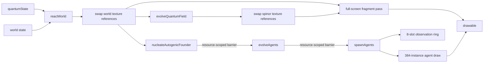

<div align="center">

# Numi Automata

### A bottom-up artificial-life system implemented in SwiftUI and Metal

[](https://www.apple.com/macos/)
[](https://www.swift.org/)
[](https://developer.apple.com/metal/)
[](#verification)

**A classical GPU simulation of coupled spinor, reaction-diffusion, agent, and ecological state.**<br />
The initial state contains zero occupied agent slots. A persistent founder is allocated only after explicit local field thresholds are satisfied.

</div>


> [!IMPORTANT]
> Numi Automata is an artificial-life research system, not a physical model of biological abiogenesis and not a quantum-computer program. Its spinor layer is a classical numerical implementation of a discrete coined quantum walk. All chemistry, energy, distance, and time quantities are dimensionless simulation variables unless stated otherwise.

## Contents

- [Research question](#research-question)
- [Observed scales](#observed-scales)
- [System state](#system-state)
- [Spinor dynamics](#spinor-dynamics)
- [Reaction field and founder allocation](#reaction-field-and-founder-allocation)
- [Persistent agents](#persistent-agents)
- [Selection, diversification, and measurement](#selection-diversification-and-measurement)
- [Operationally unbounded world](#operationally-unbounded-world)
- [Metal GPU architecture](#metal-gpu-architecture)
- [Measured GPU optimization](#measured-gpu-optimization)
- [Build and controls](#build-and-controls)
- [Verification](#verification)
- [Scientific limits](#scientific-limits)
- [References](#references)

## Research question

Numi Automata investigates a constrained question:

> Can persistent, reproducing, and phenotypically differentiated agents arise in one coupled numerical system without initializing an agent population or assigning agents a global scalar fitness function?

The implementation combines five mechanisms:

1. A two-component complex spinor evolves on a periodic `1024 x 1024` lattice.
2. Spinor density and component overlap enter catalyst and stored-energy source terms on a `193 x 193` reaction lattice.
3. Resource, biomass, membrane, and toxin state feed back into the spinor coin angle and phase potential.
4. A local threshold maximum can atomically allocate the first persistent agent slot.
5. Descendants inherit mutable trait vectors and experience local differential survival and reproduction under resource, hazard, crowding, and predation terms.

This follows the general artificial-life program of studying life-like processes in synthetic dynamical systems [1], while using variation, differential reproductive success, and parent-offspring correlation as the operational requirements for Darwinian evolution [2]. It does **not** assert that these mechanisms are sufficient for open-ended evolution.

## Observed scales

The interface uses one camera over one persistent simulation. The scale controls change observation and rendering; they do not create separate canvases or resample agent identity.


<div align="center"><sub>Production interface at the 900x spinor scale. The right inspector reports equations, cross-scale coupling, reductions, and threshold events from live GPU state.</sub></div>

<table>
  <tr>
    <td width="50%">
      
      <br /><strong>Wave observables, 160x.</strong> Probability density, phase contours, current, and matter-dependent potential.
    </td>
    <td width="50%">
      
      <br /><strong>Reaction field, 36x.</strong> Resource, biomass, stored energy, membrane, detritus, toxin, and catalyst channels.
    </td>
  </tr>
  <tr>
    <td width="50%">
      
      <br /><strong>Agent state, 10x.</strong> Stable GPU slots with inherited morphology, velocity, energy, biomass, age, and generation.
    </td>
    <td width="50%">
      
      <br /><strong>Ecological field, 1x.</strong> Agent movement over nutrient deposits, mineral deposits, toxic vents, and rock obstacles.
    </td>
  </tr>
</table>

| Scale | Magnification | Rendered quantities | State remains persistent |
|---|---:|---|---|
| Spinor field | `900x` | Real and imaginary parts of `psi_0`, `psi_1`; component phasors | Yes |
| Wave observables | `160x` | `rho`, relative phase, probability-current proxy, local potential | Yes |
| Reaction field | `36x` | `R_A`, `B`, `E`, `M`, `R_B`, detritus, toxin, catalyst | Yes |
| Agent state | `10x` | Position, velocity, traits, energy, biomass, sensors, defense, predation morphology | Yes |
| Ecological field | `1x` | Population, resources, hazards, obstacles, occupancy, trophic events | Yes |

## System state

### GPU resources

| Resource | Dimensions / count | Format | Storage | Purpose |
|---|---:|---|---|---|
| Spinor ping-pong textures | `2 x 1024 x 1024` | `RGBA32Float` | GPU private | `(Re psi_0, Im psi_0, Re psi_1, Im psi_1)` |
| Reaction-state texture pairs | `193 x 193 x 1` each | `RGBA16Float` | GPU private | State, ecology, three trait fields, events, and environment |
| Checkpoint texture | `193 x 193 x 1` | `RGBA16Float` | GPU private | Pre-perturbation biomass reference |
| Agent state ping-pong buffers | `2 x 384` records | Swift/Metal struct | Shared | Persistent agent dynamics |
| Occupancy buffer | `384` atomic integers | `UInt32` | Shared | Stable slot allocation and death |
| Observation ring | `8` state/occupancy buffer pairs | Structured buffers | Shared | Camera-follow readback without reusing an in-flight slot |
| Metric reductions | `32` fixed-point accumulators | Atomic `UInt32` | Shared | Population-level measurements |

### Reaction-channel layout

The main reaction texture is

```text
state = (R_A, B, E, M)
```

where `R_A` is resource A, `B` is biomass, `E` is stored energy, and `M` is membrane density. The ecology texture is

```text
ecology = (R_B, D, T, C)
```

where `R_B` is resource B, `D` is detritus, `T` is toxin, and `C` is catalyst. Persistent geology stores nutrient deposit, mineral deposit, toxic-vent, and rock-obstacle fields.

The simulation starts with geology and resources but with

```text
B = E = M = C = 0
occupiedAgentSlots = 0
```

## Spinor dynamics

The spinor at lattice coordinate `x` and step `t` is

```math
\psi_t(x) =
\begin{bmatrix}
\psi_{0,t}(x) \\
\psi_{1,t}(x)
\end{bmatrix},
\qquad
\rho_t(x)=|\psi_{0,t}(x)|^2+|\psi_{1,t}(x)|^2.
```

The Metal kernel stores the two complex values as four `Float32` channels. A local coin operation is

```math
C(\theta)=
\begin{bmatrix}
\cos\theta & -i\sin\theta \\
-i\sin\theta & \cos\theta
\end{bmatrix}.
```

The update alternates conditional shifts along the `x` and `y` axes. A matter-dependent phase is then applied:

```math
\psi_{t+1}(x)=e^{-iV(x)}S_{x/y}C(\theta(x))\psi_t(x).
```

The implemented parameters are

```math
\theta = 0.18 + 0.16\,\mathrm{sat}(4M) + 0.06\,g_{A,y}
```

and

```math
V = 0.012\left(R_A + 0.8R_B + 2.2B + 3.0M + 1.4T\right).
```

Periodic addressing uses a bit mask because the spinor extent is a power of two:

```metal
uint2 sourceA = (gid - direction) & uint2(quantumGridSize - 1u);
uint2 sourceB = (gid + direction) & uint2(quantumGridSize - 1u);
```

The reported norm is the fixed-point GPU reduction

```math
\|\psi\|^2 = \sum_x \rho(x).
```

It is an error monitor, not a normalization constraint imposed after every frame.

### Spinor-to-reaction coupling

The kernel computes a bounded density term

```math
q_\rho = 1-e^{-285000\rho}
```

and a normalized real-component overlap

```math
\kappa =
\frac{|\operatorname{Re}(\psi_0\psi_1^*)|}
{|\psi_0||\psi_1|+\epsilon}.
```

The coupling variable is

```math
Q=q_\rho\left(0.24+0.76\,\mathrm{sat}(\kappa)\right).
```

With permeability `P` and chemical affinity

```math
A=\sqrt{\mathrm{sat}(R_A)\mathrm{sat}(R_B)}\,P\left(1-\mathrm{sat}(T)\right),
```

the catalyst source includes

```math
\Delta C = \Delta t\,(0.009)QA.
```

Stored energy receives

```math
\Delta E = \Delta t\,QC\left(0.015+0.035\,\mathrm{sat}(R_A+R_B)\right)P.
```

These are designed numerical couplings. They are not derived from quantum chemistry.

## Reaction field and founder allocation

`reactWorld` performs four-neighbor diffusion, geological resource regeneration, toxin production and decay, catalyst decay, metabolism, biomass growth and decay, membrane relaxation, and local trait-field inheritance.

### Lattice-level transition

A nonliving reaction cell can acquire biomass only when all of the following are true:

```text
no active neighboring parent pressure
Q > 0.38
C > 0.032
E > 0.0055
M > 0.0025
R_A + R_B > 0.30
T < 0.72
```

The local spinor phase sets an inherited heading coordinate; spinor component polarization and overlap initialize trait biases. No predefined species identifier is assigned.

### Persistent founder allocation

The separate `nucleateAutogenicFounder` kernel scans for a local maximum whose state satisfies

```text
B >= 0.055
E >= 0.006
M >= 0.003
C >= 0.030
```

The local score is

```math
s=3B+5E+8M+2C-1.4T.
```

A candidate must be no lower than its four cardinal neighbors. It then claims slot `0` using `atomic_compare_exchange_weak_explicit`. This separates distributed reaction state from persistent individual identity.

## Persistent agents

Each `AgentState` occupies one stable slot and stores:

```swift
position:   float2
velocity:   float2
geneA:      float4
geneB:      float4
geneC:      float4
energy:     float
biomass:    float
age:        float
generation: uint
```

### Trait semantics

The twelve inherited values are continuous parameters rather than species labels.

| Trait | Primary use in the current kernels |
|---|---|
| `geneA.x` | Resource uptake rate and energy conversion |
| `geneA.y` | Membrane production, catalyst production, and spinor coin coupling |
| `geneA.z` | Colonization pressure, turning response, separation, and birth probability |
| `geneA.w` | Toxin/attack resistance and resource conversion modifier |
| `geneB.x` | Energy reserve and local colonization pressure |
| `geneB.y` | Inherited mutation amplitude |
| `geneB.z` | Cruise speed and offspring displacement |
| `geneB.w` | Inherited heading/lineage coordinate |
| `geneC.x` | Resource-A utilization |
| `geneC.y` | Resource-B utilization |
| `geneC.z` | Detritus utilization |
| `geneC.w` | Predation investment |

### Movement

Agents sample resource and hazard gradients from the same textures rendered to the observer. Desired heading combines

```text
inherited heading
+ resource-A and resource-B gradients
- toxin and rock gradients
+ short-range separation
+ prey direction when predation conditions are satisfied
+ escape direction from stronger predators
+ boundary avoidance
```

Turning and speed use exponential smoothing. The base speed is

```math
v_0 = \frac{0.000020 + 0.000050\,g_{B,z}}{\text{worldScale}}.
```

The `worldScale` division preserves physical motion when the backing world expands.

### Energy, death, and reproduction

Energy increases through resource uptake and conditional predation. It decreases through basal maintenance, locomotion, crowding, toxin exposure, rock collision, and incoming predation. A slot is released when energy approaches zero, biomass reaches its lower bound, or age exceeds `180000` simulation steps.

Reproduction requires

```text
parent.energy >= 1.06
parent.age >= 720 steps
an unoccupied target slot
a stochastic birth draw below the inherited birth probability
```

The baseline birth probability per eligible step is

```math
p_b=0.00042+0.00062\,g_{A,z}+0.0015\,g_{B,y}.
```

Most mutations are small. A `3.2%` branch adds a larger inherited deviation. The child receives mutated copies of all twelve traits, starts beside the parent, and costs the parent `0.31` energy units.

## Selection, diversification, and measurement

### Agent-level natural selection

There is no function of the form `fitness(agent) -> scalar` controlling survival or reproduction. Differential fitness is implicit in local state transitions:

- Trait vectors change resource uptake, maintenance cost, movement, defense, and predation.
- The environment varies spatially in resources, toxin, and permeability.
- Agents consume shared resources and impose crowding and predation costs.
- Energy and biomass determine persistence.
- Only energy-qualified agents reproduce.
- Offspring inherit correlated traits with mutation.

This implements the three operational elements of natural selection: phenotypic variation, differential survival/reproduction, and heritable parent-offspring correlation [2].

### Diversification without a species registry

The simulation contains no species table and no externally assigned niche class. Differentiation is measured from:

- Entropy over inherited lineage-coordinate bins.
- Local trait-vector distance.
- Resource-use vector distance.
- Specialization across `geneC.xyz`.
- Trophic activity from `geneC.w`, predation opportunities, and conflict events.

These measurements do not prevent interbreeding or enforce separation. They report differentiation already present in the state.

### Observer metrics

`measureWorld` performs GPU atomic reductions over the reaction lattice.

| Metric | Operational definition |
|---|---|
| Biomass density | Mean `B` |
| Resource density | Mean scaled `R_A` |
| Stored-energy density | Mean `E` |
| Occupied fraction | Mean `smoothstep(0.018, 0.12, B)` |
| Temporal activity | Mean bounded biomass difference from checkpoint |
| Boundary coherence | Biomass-gradient magnitude multiplied by membrane density |
| Multiscale divergence | Biomass difference across offsets `0`, `3`, and `9` cells |
| Recovery | Recovered biomass / pre-perturbation biomass in the disturbed region |
| Genetic diversity | Local `geneA` distance |
| Lineage diversity | Normalized entropy over 16 reaction-field lineage bins |
| Niche differentiation | Local `geneC` distance |
| Trophic activity | Predation investment and local trophic chemistry |
| Centroid | Biomass-weighted `(x, y)` position |

`AdaptiveComplexityEvaluator` converts these observations into viability, adaptive-complexity, recovery, diversification, and novelty coordinates. It uses Pareto rank and crowding distance following multiobjective evolutionary computation [4], plus a behavioral novelty archive motivated by novelty search [3]. In the current `worldCount = 1` application, this evaluator is diagnostic: it does not overwrite agent traits or choose among multiple simulated worlds.

## Operationally unbounded world

The backing textures are finite. The observable world can nevertheless expand repeatedly without duplicating canvases or changing agent identity.

```text
observationZoom = cameraZoom / worldScale
```

When the camera or occupied fraction requires more area:

1. Existing reaction and geology state is mapped into the central half of a new coordinate extent.
2. Agent positions are transformed as `p' = 0.25 + 0.5p`.
3. Agent velocity is halved.
4. `cameraZoom` and `worldScale` both double.
5. Agent radius, movement, sensing, separation, and birth displacement are divided by `worldScale`.

The observer therefore sees continuous scale and persistent positions. This is operationally unbounded recursive expansion, not an infinite-memory lattice.

## Metal GPU architecture

### Frame dependency graph



### Kernels and render stages

| Stage | Grid / instances | Function |
|---|---:|---|
| Initialization | `1024²` | `initializeQuantumField` |
| Initialization | `193²` | `initializeWorld` |
| Reaction update | `193²` | `reactWorld` |
| Founder scan | `193²` | `nucleateAutogenicFounder` |
| Agent dynamics | `384` | `evolveAgents` |
| Agent reproduction | `384` | `spawnAgents` |
| Spinor update | `1024²` | `evolveQuantumField` |
| Measurement | `193²` / `1024²` | `measureWorld`, `measureQuantumField` |
| Field rendering | One full-screen triangle | `quantumSurfaceFragment` or `worldSurfaceFragment` |
| Agent rendering | `384` instanced quads | `agentVertex`, `agentFragment` |

Threadgroup dimensions are selected from each compute pipeline's `threadExecutionWidth` and `maxTotalThreadsPerThreadgroup`, capped at `16 x 16` for two-dimensional dispatches.

### GPU-specific implementation decisions

- **Private simulation textures.** Reaction and spinor texture pairs use `MTLStorageMode.private`; only compact observation and reduction buffers are CPU-visible.
- **True ping-pong state.** The renderer swaps `MTLTexture` references after each update instead of blitting entire state textures back into fixed roles.
- **Scoped barriers.** Founder allocation, movement, and reproduction share one compute encoder with `memoryBarrier(resources:)` only at the two read-after-write boundaries.
- **Power-of-two addressing.** The `1024²` spinor lattice uses integer masks instead of modulus for periodic neighbors.
- **Single-triangle field pass.** Scale-specialized fragments render the current state directly; there is no intermediate presentation texture.
- **Instanced agents.** One draw call submits all `384` slots. The occupancy buffer rejects inactive instances in the vertex path.
- **Ring-buffered observation.** Eight readback slots prevent the CPU camera observer from reusing a buffer still owned by an in-flight command buffer.
- **Framebuffer-only drawable.** `MTKView.framebufferOnly = true` keeps the presentation resource render-target optimized.
- **Fixed-point reductions.** Atomic integer accumulation avoids requiring device-wide floating-point atomic support for observer metrics.

These choices follow Metal's explicit resource, command-encoder, and synchronization model [7-9].

## Measured GPU optimization

The current resource-swapping implementation was compared with the preceding full-texture-copy implementation using Xcode Metal frame captures on the development machine.

| Capture statistic | Copy-based baseline | Current implementation | Change |
|---|---:|---:|---:|
| Median GPU frame time | `10.682 ms` | `3.052 ms` | `-71.4%` |
| 95th-percentile GPU frame time | `14.988 ms` | `8.915 ms` | `-40.5%` |
| Full-state texture copy commands in capture | `1,734` | `0` | Removed |

Measurement environment:

```text
MacBook Air (Mac16,12)
Apple M4: 10 CPU cores, 10 GPU cores
24 GB unified memory
macOS 26.6
Xcode 26.4
Metal 4
```

This is a single-device engineering trace, not a cross-device benchmark. Small buffer fills for metric resets and compact agent-observation blits remain intentionally present. Apple documents GPU counters, frame capture, and the Dependencies viewer as the appropriate tools for inspecting pass timing and resource dependencies [9-10].

## Build and controls

### Requirements

- macOS `26` or newer, as declared in `Package.swift`.
- A Metal-capable Mac.
- Xcode command-line tools with Swift `6.2` package support or newer.

### Run

```bash
git clone https://github.com/Numi2/numi-life-automata.git
cd numi-life-automata
swift run NumiAutomata
```

### Controls

| Control | Operation |
|---|---|
| Play / pause | Starts or stops simulation dispatches; rendering continues |
| Reset | Reinitializes spinor, reaction fields, metrics, and zero occupied agent slots |
| Plus | Explicitly inserts one external founder at the camera position |
| State-field menu | Selects state, resource/energy, trait-vector, or resource-use rendering |
| `1x`, `2x`, `4x` | Selects `1`, `3`, or `6` reaction steps per rendered frame |
| Magnifier controls | Continuous zoom around the current center |
| Viewfinder | Returns to the spinor origin at `900x` |
| Previous / target / next | Selects a persistent agent ID for camera following |
| Drag | Pans in world coordinates |
| Vertical scroll / pinch | Zooms around the pointer |
| Horizontal scroll | Cycles persistent agent IDs |

Camera operations modify only camera state. They do not create, merge, resize, freeze, or teleport agents.

## Verification

Run the complete local verification command:

```bash
./Scripts/check-autogenesis-metal.sh
```

It performs:

1. Standalone Metal compilation of `Replicator.metal` with `xcrun metal`.
2. Swift build of the `NumiAutomata` executable.
3. Swift tests for Pareto dominance, collapse/noise rejection, diversification, novelty, and preservation of different successful strategies.

The current suite contains five passing tests.

### Project layout

```text
Sources/AutogenesisCore/
  AdaptiveComplexity.swift        Pareto, novelty, and measurement evaluator

Sources/AutogenesisMetal/
  AutogenesisMetalApp.swift       SwiftUI application entry point
  ContentView.swift               Numi observation interface
  EvolutionStore.swift            Camera, events, snapshots, and controls
  EvolutionRenderer.swift         Metal resources and command graph
  MetalEvolutionView.swift        MTKView and pointer/trackpad input
  Shaders/Replicator.metal        Compute, vertex, and fragment functions

Tests/AutogenesisCoreTests/
  AdaptiveComplexityTests.swift   Evaluator invariants

Docs/
  AUTOGENESIS_ARCHITECTURE.md     Runtime contract and state persistence
  Media/                          Real application captures used in this README
```

## Scientific limits

The current implementation deliberately makes narrower claims than the project objective.

1. **Classical numerical spinor.** The spinor is computed on an Apple GPU. There are no qubits, quantum measurements, entanglement experiments, or claims of quantum advantage.
2. **Designed coupling equations.** The cross-scale source terms are explicit model choices, not parameters fitted to molecular or cellular data.
3. **Dimensionless chemistry.** Reaction variables do not currently map to SI units or named chemical species.
4. **Finite state capacity.** The reaction lattice is `193²`, the spinor lattice is `1024²`, and the agent pool is capped at `384` slots.
5. **Operational rather than literal infinity.** Recursive coordinate expansion preserves observation continuity while retaining finite backing storage.
6. **No proof of open-ended evolution.** Genotype length is fixed at twelve continuous traits; the model can diversify within this space but cannot yet increase representational dimensionality.
7. **Single-world default.** Pareto and novelty machinery is active as a diagnostic evaluator, but the application currently simulates one world and therefore does not perform between-world selection.
8. **Partial stochastic reproducibility.** Hash-based variation is seeded, but parallel atomic founder/slot claims can depend on GPU execution ordering.
9. **Heuristic morphology.** Agent appearance encodes trait values for observation; it is not a biomechanical body simulation.

These limits define concrete research directions: evolvable genome dimensionality, multiple coupled worlds, calibrated reaction systems, causal ablation experiments, long-run diversity statistics, and cross-device performance characterization.

## References

1. C. G. Langton, “Studying artificial life with cellular automata,” *Physica D*, 22(1-3), 120-149, 1986. [doi:10.1016/0167-2789(86)90237-X](https://doi.org/10.1016/0167-2789(86)90237-X)
2. R. C. Lewontin, “The Units of Selection,” *Annual Review of Ecology and Systematics*, 1, 1-18, 1970. [doi:10.1146/annurev.es.01.110170.000245](https://doi.org/10.1146/annurev.es.01.110170.000245)
3. J. Lehman and K. O. Stanley, “Abandoning Objectives: Evolution Through the Search for Novelty Alone,” *Evolutionary Computation*, 19(2), 189-223, 2011. [doi:10.1162/EVCO_a_00025](https://doi.org/10.1162/EVCO_a_00025)
4. K. Deb, A. Pratap, S. Agarwal, and T. Meyarivan, “A Fast and Elitist Multiobjective Genetic Algorithm: NSGA-II,” *IEEE Transactions on Evolutionary Computation*, 6(2), 182-197, 2002. [doi:10.1109/4235.996017](https://doi.org/10.1109/4235.996017)
5. Y. Aharonov, L. Davidovich, and N. Zagury, “Quantum random walks,” *Physical Review A*, 48, 1687-1690, 1993. [doi:10.1103/PhysRevA.48.1687](https://doi.org/10.1103/PhysRevA.48.1687)
6. N. Packard et al., “An Overview of Open-Ended Evolution: Editorial Introduction to the Open-Ended Evolution II Special Issue,” *Artificial Life*, 25(2), 93-103, 2019. [doi:10.1162/artl_a_00291](https://doi.org/10.1162/artl_a_00291)
7. Apple, “Optimizing texture data,” *Metal Documentation*. [developer.apple.com](https://developer.apple.com/documentation/metal/optimizing-texture-data)
8. Apple, “Resource synchronization,” *Metal Documentation*. [developer.apple.com](https://developer.apple.com/documentation/metal/resource-synchronization)
9. Apple, “Analyzing resource dependencies,” *Xcode Documentation*. [developer.apple.com](https://developer.apple.com/documentation/xcode/analyzing-resource-dependencies/)
10. Apple, “GPU counters and counter sample buffers,” *Metal Documentation*. [developer.apple.com](https://developer.apple.com/documentation/metal/gpu-counters-and-counter-sample-buffers)

---

<div align="center">
  <strong>Numi Automata</strong><br />
  SwiftUI observation interface · Metal compute and rendering · explicit scientific scope
</div>
