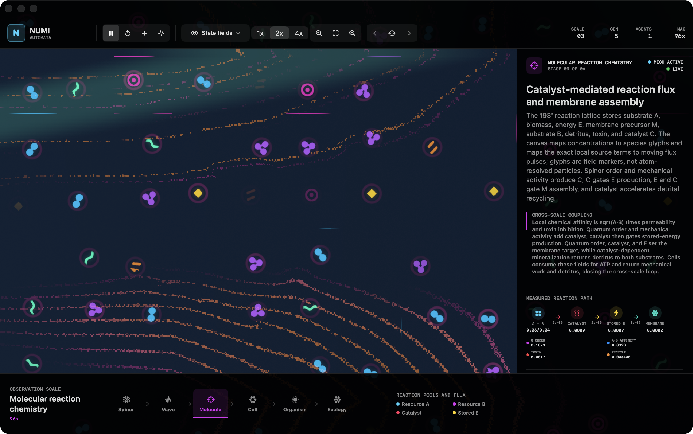
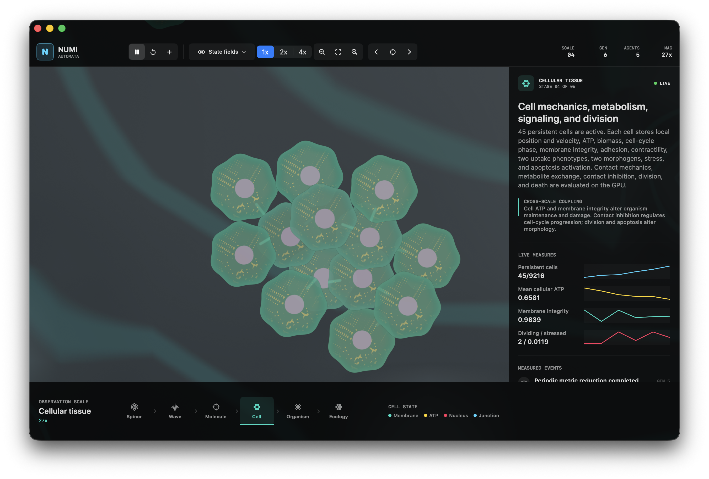
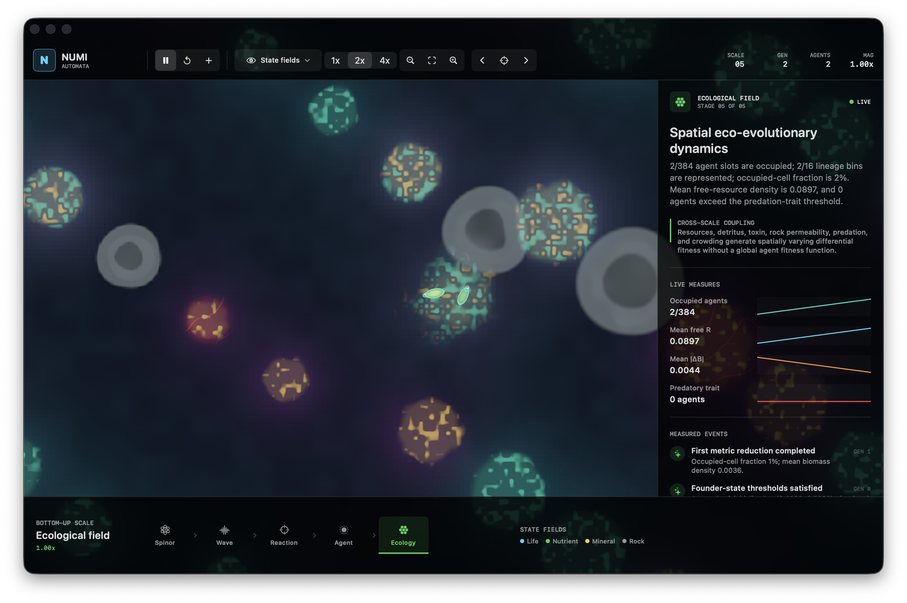

<div align="center">

# Numi Automata

### A bottom-up artificial-life system implemented in SwiftUI and Metal

[](https://www.apple.com/macos/)
[](https://www.swift.org/)
[](https://developer.apple.com/metal/)
[](#verification)

**A classical GPU simulation of coupled spinor, reaction-diffusion, agent, and ecological state.**<br />
The initial state contains zero occupied agent slots. A persistent founder is allocated only after explicit local field thresholds are satisfied.

</div>


> [!IMPORTANT]
> Numi Automata is an artificial-life research system, not a physical model of biological abiogenesis and not a quantum-computer program. Its spinor layer is a classical numerical implementation of a discrete coined quantum walk. All chemistry, energy, distance, and time quantities are dimensionless simulation variables unless stated otherwise.

## Contents

- [Research question](#research-question)
- [Observed scales](#observed-scales)
- [System state](#system-state)
- [Spinor dynamics](#spinor-dynamics)
- [Reaction field and founder allocation](#reaction-field-and-founder-allocation)
- [Persistent agents](#persistent-agents)
- [Selection, diversification, and measurement](#selection-diversification-and-measurement)
- [Operationally unbounded world](#operationally-unbounded-world)
- [Metal GPU architecture](#metal-gpu-architecture)
- [Measured GPU optimization](#measured-gpu-optimization)
- [Build and controls](#build-and-controls)
- [Verification](#verification)
- [Scientific limits](#scientific-limits)
- [References](#references)

## Research question

Numi Automata investigates a constrained question:

> Can persistent, reproducing, and phenotypically differentiated agents arise in one coupled numerical system without initializing an agent population or assigning agents a global scalar fitness function?

The implementation combines seven mechanisms:

1. A two-component complex spinor evolves on a periodic `1024 x 1024` lattice.
2. Spinor density and component overlap enter catalyst and stored-energy source terms on a `193 x 193` reaction lattice.
3. Resource, biomass, membrane, and toxin state feed back into the spinor coin angle and phase potential.
4. A local threshold maximum can atomically allocate the first persistent agent slot.
5. Founders start as one cell; descendants arise through asexual separation or recombinant sexual buds and continue development under inherited local regulatory and mechanochemical control.
6. Cell contractions launch damped displacement waves into a shared mechanical field; strain feeds back into cell voltage, chemistry, and organism steering.
7. Descendants inherit mutable trait vectors plus regulatory weights and topology; local resource, hazard, crowding, predation, and tissue-viability terms determine differential survival and reproduction.

This follows the general artificial-life program of studying life-like processes in synthetic dynamical systems [1], while using variation, differential reproductive success, and parent-offspring correlation as the operational requirements for Darwinian evolution [2]. It does **not** assert that these mechanisms are sufficient for open-ended evolution.

## Observed scales

The interface uses one camera over one persistent simulation. Each scale control selects both magnification and its scientifically matched renderer: reaction energetics at molecular scale, junction-coupled development at cell scale, inherited tissue morphology at organism scale, and environmental state at ecology scale. There is no separate view-mode dropdown. The scientific inspector is an optional floating overlay, so opening it never resizes or duplicates the world canvas. Scale changes do not resample agent identity.

### Simulation time and acceleration

The model has no calibrated mapping from a solver step to seconds, days, or organism generations. One biological solver step advances the coupled reaction, cell, membrane, contact, connectivity, tissue, and mechanical equations with the fixed dimensionless integration increment `dt = 0.18`. Frequencies are cycles per solver step, not hertz. The interface therefore reports **STEP** for numerical integration progress and **LIN G** only for the maximum living genealogical generation.

Three time coordinates must not be conflated:

| Coordinate | Definition | Scientific interpretation |
|---|---|---|
| Solver step | One exact update of the biological command graph | Dimensionless numerical time |
| Measurement epoch | `1,200` solver steps in the default observer cadence | Sampling interval only; not a generation |
| Lineage generation | Parent generation plus one after a viable physical fission | Genealogical depth |

Interactive `1x`, `3x`, `6x`, and `24x` speeds execute that many unchanged biological solver steps per rendered frame. All speeds retain one spinor update per three biological steps, so speed changes do not alter cross-scale coupling. The headless runner accelerates observation by omitting rendering and batching exact command buffers; it does not enlarge `dt`, skip biological kernels, or replace intermediate state transitions. Increasing `dt` would change stability, collision resolution, signaling propagation, and selection pressure and is therefore not used as a time-compression mechanism.


<div align="center"><sub>Spinor-scale interface. The optional inspector reports equations, cross-scale coupling, reductions, and threshold events from live GPU state without partitioning the canvas.</sub></div>

<table>
  <tr>
    <td width="50%">
      
      <br /><strong>Wave observables, 160x.</strong> Probability density, phase contours, current, and matter-dependent potential.
    </td>
    <td width="50%">
      
      <br /><strong>Molecular reaction chemistry, 96x.</strong> Concentration-derived species glyphs, catalyst hotspots, directed conversion flux, energy storage, membrane assembly, toxin inhibition, and detrital recycling.
    </td>
  </tr>
  <tr>
    <td width="50%">
      
      <br /><strong>Cellular tissue, 36x.</strong> Persistent cells with ATP, membrane voltage, oscillator phase, strain, cell-cycle state, contact junctions, and intracellular structure.
    </td>
    <td width="50%">
      
      <br /><strong>Organism morphology, 10x.</strong> Stable GPU identities whose body proportions and condition receive measured cellular feedback.
    </td>
  </tr>
  <tr>
    <td colspan="2">
      
      <br /><strong>Ecological field, 1x.</strong> Agent movement over nutrient deposits, mineral deposits, toxic vents, and rock obstacles.
    </td>
  </tr>
</table>

| Scale | Magnification | Rendered quantities | State remains persistent |
|---|---:|---|---|
| Spinor field | `900x` | Real and imaginary parts of `psi_0`, `psi_1`; component phasors | Yes |
| Wave observables | `160x` | `rho`, relative phase, probability-current proxy, local potential | Yes |
| Molecular reaction chemistry | `96x` | `R_A`, `R_B`, detritus, toxin, catalyst, `E`, `M`, chemical affinity, quantum order, and measured source fluxes | Yes |
| Cellular tissue | `36x` | Cell position, local membrane wounds, ATP-funded repair, junction load/strain, directional ATP exchange, Ca*/ERK* propagation, generation-tagged lineage mixing, voltage, refractory state, phase, frequency, regulation, fate, contractility, morphogens, stress, and apoptosis | Yes |
| Organism morphology | `10x` | Position, velocity, developed tissue geometry, regulatory state, energy, biomass, sensors, defense, predation morphology | Yes |
| Ecological field | `1x` | Population, resources, hazards, obstacles, occupancy, trophic events | Yes |

## System state

### GPU resources

| Resource | Dimensions / count | Format | Storage | Purpose |
|---|---:|---|---|---|
| Spinor ping-pong textures | `2 x 1024 x 1024` | `RGBA32Float` | GPU private | `(Re psi_0, Im psi_0, Re psi_1, Im psi_1)` |
| Reaction-state texture pairs | `193 x 193 x 1` each | `RGBA16Float` | GPU private | State, ecology, three trait fields, events, and environment |
| Mechanical-field texture pair | `193 x 193 x 1` | `RGBA16Float` | GPU private | Displacement `(u_x,u_y)` and velocity `(v_x,v_y)` |
| Developmental-field texture pair | `193 x 193 x 1` | `RGBA16Float` | GPU private | Cell-secreted ligand A/B, persistent extracellular matrix density, and diffusible wound/remodeling cue |
| Checkpoint texture | `193 x 193 x 1` | `RGBA16Float` | GPU private | Pre-perturbation biomass reference |
| Component state ping-pong buffers | `2 x 9,216 x 192 B` | Swift/Metal ABI-matched struct | GPU private | Coordinate frame, tissue-derived velocity/orientation, permanent identity, component ancestry, dominant program, and component bookkeeping |
| Component occupancy | `9,216` atomic integers | `UInt32` | GPU private | Generation-tagged component-handle allocation and release after final cell loss |
| Cell state ping-pong buffers | `2 x 9,216 x 288 B` | Swift/Metal ABI-matched struct | GPU private | Metabolism, electrophysiology, mechanochemical signaling, junction-mediated morphogens, persistent developmental polarity and fate memory, vertex-derived exposure, traction, contact damage, trophic transfer, and environmental forcing |
| Cell occupancy | `9,216` atomic integers | `UInt32` | GPU private | Lock-free allocation from one global persistent-cell pool |
| Hot cell identity | `9,216 x 32 B` | Owner, inherited-program index and generation, permanent cell ID, component root | GPU private | Generation validation prevents a recycled slot from changing a living cell's control law |
| Cell-parent genealogy | `9,216 x 4 B` | Parent permanent cell ID | GPU private | Cold lineage state written only at founder creation and division |
| Heritable program payloads | `4,096 x 128 B` | Three trait vectors, ligand/receptor coordinates, four social-control coefficients, diagnostic genome hashes, originating component, replication generation, and two exact parent slot-generation handles | GPU private | Recyclable payload storage with collision-free lineage identity independent of reusable component-owner slots |
| Program-slot state | `4,096 x 32 B` | Occupancy, living-cell reference count, slot generation, lineage hash, accumulated mutation hazard | GPU private | Lock-free reclamation after the final living-cell reference is released; shared division hazard prevents stochastic mutation droughts |
| Cell-program interaction state | `9,216 x 16 B` | Signed ATP transfer, rejection load, recognition compatibility, net energetic contribution | GPU private | Cold structure-of-arrays output kept outside the `288 B` hot cell record |
| Dynamic owner lists | `9,216` atomic heads + `9,216` links | `UInt32` | GPU private | Rebuilt per-component traversal without contiguous cell blocks |
| Segmented component lists | `9,216` atomic heads + `9,216` links | `UInt32` | GPU private | Root-indexed traversal for fusion and fission reductions without repeated whole-pool scans |
| Connectivity state | Parents, counts, centroid/ATP/integrity reductions, root owners, primary roots, and up to sixteen preserved source-program mappings per root | Atomic `UInt32` / `Int32` | GPU private | Union-find labeling, recognition-gated fusion, unconditional nonempty-root identity, program-preserving separation, and owner reassignment |
| Membrane vertices | `9,216 x 12 x 32 B` | Position, velocity, and local mechanics | GPU private | Deformable cell membranes with edge, bending, pressure, integrity, and contact state; bounded quadratic interpolation converts each physical edge into four raster segments without changing the simulated geometry |
| Cell spatial grid | `128²` heads + `9,216` links | Atomic `UInt32` heads and `UInt32` links | GPU private | Collision-free broad phase for same-owner junction mechanics, exposed-edge tests, and cross-owner contact |
| Membrane-contact work queue | Up to `524,288` cell-index pairs + indirect-dispatch state | `uint2` pairs and atomic `UInt32` counters | GPU private | One bounded spatial-hash traversal materializes candidate pairs for equal-and-opposite contact mechanics and component union; overflow is a persistent invariant failure |
| Persistent junction table | `32,768 x 64 B` | Cell-pair identity, age/load, stiffness, damping, permeability, cortical tension, remodeling target, strain memory, ATP investment, and polarity alignment | GPU private | Generation-independent pair persistence with inherited material remodeling and stale-entry replacement |
| Cell contact effects | Center impulses, damage, trophic exchange, reproductive material transfer, reproductive pleasure, plus `12` vertex-local force/pressure triplets per cell | Atomic fixed-point integers | GPU private | Equal-and-opposite pair accumulation before cell-local and membrane-local application |
| Cellular world exchange | `193 x 193 x 14` atomic integers | Available A/B/detritus, claimed A/B/detritus, returned detritus, exported heat, secreted ligand A/B, matrix deposition, wound/remodeling cue, catalyst secretion, toxin neutralization | GPU private | Exact resource claims plus ATP-paid cell-to-field developmental and ecological output with one-step texture settlement without CPU synchronization |
| Energy audit | `10` atomic signed integers | Input, ATP harvest, storage, work, frequency work, maintenance, heat, detritus, ATP sharing, residual | GPU private | Global per-step conservation diagnostic copied through the metric ring |
| Invariant audit | `20` persistent counters + `4,112` scratch integers | Atomic `UInt32` / `Int32` | GPU private | First-failure step and reductions for contact momentum, energy drift, program generations/references, junction validity, membrane validity, and component ownership |
| Cellular aggregates | `9,216 x 336 B` | Twenty-one `float4` vectors | GPU private | Physiology, signaling, geometry, force, trophic flux, detachment, inherited-program composition, ATP exchange, rejection, compatibility, environmental forcing, morphogen state, and developmental causality |
| Developmental headers | `4,096 x 160 B` | Topology, mutation distances, actuator biases, mechanochemical coefficients, morphogen kinetics, junction material, and ecological response | GPU private | Program-indexed bounded sparse graph metadata plus inherited mechanochemical, material, and ecological parameters |
| Regulatory nodes | `4,096 x 16 x 32 B` | Parametric node records | GPU private | Program-indexed bias, rate, sensor coupling, actuator mask, and permanent innovation ID |
| Regulatory edges | `4,096 x 48 x 32 B` | Sparse directed edge records | GPU private | Program-indexed weight, strain plasticity, endpoints, activity, and permanent innovation ID |
| Cell regulatory activity | `9,216 x 16 x 4 B` | `Float` | GPU private | Cell-local dynamical state for inherited graphs |
| Resonance genomes | `4,096 x 32 B` | Two `float4` vectors | GPU private | Program-indexed frequency, damping, gain, threshold, bandwidth, adaptation, phase delay, and directionality |
| Physical event ring | `4,096 x 80 B` | Component birth/death/fusion and cell division/program-mutation/crossbreeding records | GPU private | Monotonic sequence IDs, participant IDs, exact program-parent handles, topology hashes, branch distance, resonance, and morphology |
| Mechanical forcing | `193 x 193 x 2` atomic integers | `Int32` | GPU private | Fixed-point cell contraction impulses consumed by the wave kernel |
| Visible-cell index buffers | `3 x 9,216 x 4 B` | Compacted `UInt32` cell indices | GPU private | One submission-slot-local list prevents a later frame from rewriting indices consumed by an unfinished draw |
| Cell indirect draw arguments | `3 x 4 x 4 B` | `MTLDrawPrimitivesIndirectArguments` | GPU private | Slot-local GPU-rebuilt and bounded living-cell instance counts |
| Visible-junction index buffers | `3 x 32,768 x 4 B` | Compacted junction-table indices | GPU private | Slot-local valid, recent, visible persistent bonds selected without CPU traversal |
| Junction indirect draw arguments | `3 x 4 x 4 B` | `MTLDrawPrimitivesIndirectArguments` | GPU private | Slot-local GPU-rebuilt and bounded visible-junction counts |
| Observation ring | Three slots | Agent descriptors, lineage events, and counters | Shared | Stable camera following plus asynchronous genealogy and morphology analysis |
| Metric readback ring | `3` slots, including `9,216 x 192 B` component-program records per slot | Structured buffers | Shared | Asynchronous population reductions, cellular aggregates, and GPU-gathered active-program measurements |
| Metric reductions | `36` fixed-point accumulators | Atomic `UInt32` | GPU private | Population-level, substrate-forcing, detritus, barrier, mechanical-drive, and lineage measurements |
| Linear scene target | Drawable dimensions | `RG11B10Float` | GPU private | Compact HDR field, cell, and organism radiance before display mapping |
| Bloom ping-pong textures | Quarter drawable dimensions | `RGBA16Float` | GPU private | Bright-pass extraction and separable Gaussian filtering |

### Reaction-channel layout

The main reaction texture is

```text
state = (R_A, B, E, M)
```

where `R_A` is resource A, `B` is biomass, `E` is stored energy, and `M` is membrane density. The ecology texture is

```text
ecology = (R_B, D, T, C)
```

where `R_B` is resource B, `D` is detritus, `T` is toxin, and `C` is catalyst. Persistent geology stores nutrient deposit, mineral deposit, toxic-vent, and rock-obstacle fields.

The simulation starts with geology and resources but with

```text
B = E = M = C = 0
occupiedAgentSlots = 0
```

## Spinor dynamics

The spinor at lattice coordinate `x` and step `t` is

```math
\psi_t(x) =
\begin{bmatrix}
\psi_{0,t}(x) \\
\psi_{1,t}(x)
\end{bmatrix},
\qquad
\rho_t(x)=|\psi_{0,t}(x)|^2+|\psi_{1,t}(x)|^2.
```

The Metal kernel stores the two complex values as four `Float32` channels. A local coin operation is

```math
C(\theta)=
\begin{bmatrix}
\cos\theta & -i\sin\theta \\
-i\sin\theta & \cos\theta
\end{bmatrix}.
```

The update alternates conditional shifts along the `x` and `y` axes. A matter-dependent phase is then applied:

```math
\psi_{t+1}(x)=e^{-iV(x)}S_{x/y}C(\theta(x))\psi_t(x).
```

The implemented parameters are

```math
\theta = 0.18 + 0.16\,\mathrm{sat}(4M) + 0.06\,g_{A,y}
```

and

```math
V = 0.012\left(R_A + 0.8R_B + 2.2B + 3.0M + 1.4T\right).
```

Periodic addressing uses a bit mask because the spinor extent is a power of two:

```metal
uint2 sourceA = (gid - direction) & uint2(quantumGridSize - 1u);
uint2 sourceB = (gid + direction) & uint2(quantumGridSize - 1u);
```

The reported norm is the fixed-point GPU reduction

```math
\|\psi\|^2 = \sum_x \rho(x).
```

It is an error monitor, not a normalization constraint imposed after every frame.

### Spinor instrument encoding

At `900x`, each displayed lattice site is divided into one glyph for `psi_0` and one for `psi_1`. The component amplitude `a_c = (Re psi_c, Im psi_c)` is mapped to

```math
d_c=\frac{900000|a_c|^2}{1+900000|a_c|^2},
\qquad
r_c=0.10+0.24d_c.
```

The fixed outer circle identifies the component support, while the inner ring radius `r_c` and interior radiance encode bounded component probability. The phasor direction is

```math
\phi_c=\mathrm{atan2}(\mathrm{Im}\,\psi_c,\mathrm{Re}\,\psi_c).
```

The bridge between components is modulated by the local coherence proxy

```math
\chi=\frac{2|a_0||a_1|}{|a_0|^2+|a_1|^2+\epsilon}
\frac{1+\cos(\phi_0-\phi_1)}{2}.
```

At `160x`, logarithmic density isolines, phase contours, a finite-difference probability-current proxy, and phase-winding cores replace the component-cell instrument. Mint-to-amber feedback contours evaluate the same matter-dependent phase potential and membrane/trait-dependent coin angle used by `evolveQuantumField`. These marks are visual measurements of the simulated spinor and its explicit coupling coefficients; they are not independent particles, forces, or additional state variables. Only the wave interval performs the three feedback-field samples. The deep spinor view still returns before those samples and before all molecular glyph work.

### Spinor-to-reaction coupling

The kernel computes a bounded density term

```math
q_\rho = 1-e^{-285000\rho}
```

and a normalized real-component overlap

```math
\kappa =
\frac{|\mathrm{Re}(\psi_0\psi_1^*)|}
{|\psi_0||\psi_1|+\epsilon}.
```

The coupling variable is

```math
Q=q_\rho\left(0.24+0.76\,\mathrm{sat}(\kappa)\right).
```

With permeability `P` and chemical affinity

```math
A=\sqrt{\mathrm{sat}(R_A)\mathrm{sat}(R_B)}\,P\left(1-\mathrm{sat}(T)\right),
```

the catalyst source includes

```math
\Delta C = \Delta t\,(0.009)QA.
```

Stored energy receives

```math
\Delta E = \Delta t\,QC\left(0.015+0.035\,\mathrm{sat}(R_A+R_B)\right)P.
```

These are designed numerical couplings. They are not derived from quantum chemistry.

### Molecular reaction instrument

From `64x` through `136x`, the renderer remains centered on the `193 x 193` reaction lattice instead of prematurely replacing chemistry with the quantum-wave view. Cyan and violet glyphs encode local `R_A` and `R_B` concentration, magenta rings encode catalyst, amber pulses encode stored energy and its source flux, green filaments encode membrane precursor, orange fragments encode detritus, and red crosses encode toxin. Glyph abundance uses a monotonic square-root radiometric transform so low concentrations remain visible; glyph positions are deterministic visualization samples rather than atom-resolved molecular trajectories. The dark continuous field encodes total substrate intensity and the local `R_A:R_B` ratio without additively mixing every chemical pool into an ambiguous gray value.

Moving paths use the same per-step terms as `reactWorld`: total catalyst production from quantum order and mechanical activity, catalyst-gated stored-energy production, positive membrane assembly toward the prebiotic target, and catalyst-dependent detrital mineralization. Their luminance is a monotonic logarithmic transform of the nonnegative source rate, and short moving traces distinguish rate from concentration; this is visualization radiometry, not a linear physical light-emission model. A GPU reduction separately records the spatial mean of all four source terms plus `R_B`, catalyst, toxin, membrane, quantum order, and chemical affinity. The inspector therefore distinguishes field concentration from conversion rate and identifies which molecular-scale term feeds the cellular ATP boundary. Between `136x` and `176x`, chemistry crossfades into probability, phase, and current; wave and spinor fragments return before molecular texture sampling and glyph synthesis.

## Reaction field and founder allocation

`reactWorld` performs four-neighbor diffusion, geological resource regeneration, toxin production and decay, catalyst decay, metabolism, biomass growth and decay, membrane relaxation, and local trait-field inheritance.

### Lattice-level transition

A nonliving reaction cell can acquire biomass only when all of the following are true:

```text
no active neighboring parent pressure
Q > 0.38
C > 0.032
E > 0.0055
M > 0.0025
R_A + R_B > 0.30
T < 0.72
```

The local spinor phase sets an inherited heading coordinate; spinor component polarization and overlap initialize trait biases. No predefined species identifier is assigned.

### Persistent founder allocation

The separate `nucleateAutogenicFounder` kernel scans for a local maximum whose state satisfies

```text
B >= 0.055
E >= 0.006
M >= 0.003
C >= 0.030
```

The local score is

```math
s=3B+5E+8M+2C-1.4T.
```

A candidate must be no lower than its four cardinal neighbors. It then claims slot `0` using `atomic_compare_exchange_weak_explicit`. This separates distributed reaction state from persistent individual identity.

## Persistent multicellular state

All cells occupy one `9,216`-record GPU pool. A hot `32 B` identity record stores current physical component owner, inherited-program index and generation, monotonic permanent cell ID, current union-find root, an ephemeral compatible-mate nomination, the second-parent body ID, and conception timing. Parent-cell ID is retained in a separate `4 B` cold genealogy buffer because it is written only at founder creation or division and is not needed by per-frame topology, dynamics, contact, or rendering. Storage index has no biological meaning. Physical ownership and inherited-program identity are independent: component fusion can move a cell into another component frame without changing its program. Mutation occurs only during ATP-funded cell division. A physically separated propagule carries the generation-tagged programs already present in its cells, without an additional fission mutation. Each frame, atomic owner heads and links are rebuilt from live identity records. Autogenic and user-injected founders claim one arbitrary free cell; division claims any free cell in the global pool. Component size is therefore limited only by total hardware capacity and ecological dynamics, not by a per-component slot partition. Camera motion and zoom never allocate, merge, or rescale cells.

Each `CellState` is a `288 B` GPU record:

```text
position.xy, velocity.xy
physiology = (ATP, biomass, cycle phase, membrane integrity)
phenotype  = (adhesion, contractility, uptake A, uptake B)
signals    = (morphogen A, morphogen B, stress, apoptosis)
interaction = (nearest-contact direction.xy, contact-cycle brake, mechanics-to-voltage contribution)
dynamics = (membrane voltage, recovery, oscillator phase, intrinsic frequency)
mechanics = (contractile activation, extracellular strain, wave speed, local phase coherence)
energetics = (harvest, maintenance, active work, dissipation)
regulation = (proliferation, adhesive-core fate, contractile-edge fate, repair)
regulationB = (permeability, secretion, apoptosis suppression, motility)
resonance = (displacement, velocity, response amplitude, previous strain input)
membrane = (polygon area, polygon perimeter, shape index, transmitted junction force)
signaling = (calcium-like activity, ERK-like activity, refractory state, neighbor signal input)
signalCausality = (mechanics-to-Ca* effect, Ca*-to-ERK* effect,
                   ERK*-to-traction magnitude, signaling ATP cost)
tissueGeometry = (vertex-derived outward normal.xy, exposed-perimeter fraction,
                  physical detachment score)
tissueForce = (local traction/contact force.xy, contact damage, signed trophic transfer)
environment = (substrate forcing, barrier load, environmental frequency, frequency match)
development = (persistent polarity.xy, continuous fate memory, junction morphogen transport)
```

For cell `i`, `evolveOrganismCells` evaluates all occupied cells belonging to the same physical component. Its traits, sparse developmental graph, mechanochemical gains, and resonant tuning are read through the cell's own inherited-program index. Pair forces are calculated from the same previous-state positions, symmetric radii, and minimum pair adhesion. Reversing the ordered pair reverses its direction without changing magnitude, so the center-level contact force is equal and opposite. `evolveCellMembranes` then advances a separate twelve-vertex polygon for every occupied cell. This is a deformable-particle tissue model coupled to a lattice wave equation, not a continuum finite-element model.

For ordered membrane vertices `x_k`, area and perimeter are measured directly:

```math
A_i=\frac{1}{2}\left|\sum_{k=0}^{11}x_k\times x_{k+1}\right|,
\qquad P_i=\sum_{k=0}^{11}\|x_{k+1}-x_k\|.
```

Each vertex receives cortical edge-spring force, discrete bending force, area-restoring pressure, active contraction, short-range exclusion, and adhesion:

```math
F_k=F_k^{edge}+F_k^{bend}+F_k^{area}+F_k^{contract}+F_k^{contact}.
```

Local membrane integrity continuously changes the edge and bending stiffness. Contact pressure and cellular stress reduce local integrity; ATP-dependent repair raises it. Division scales the parent polygon, initializes a daughter polygon, and copies cell-local regulatory state with opposite asymmetric perturbations. The contour renderer interpolates four bounded quadratic segments per simulated edge and submits a forty-eight-triangle fan rather than clipping an analytic circular quad. The measured shape index `S_i=P_i^2/(4 pi A_i)` equals `1` for a circle and increases with elongation or irregularity [26].

### Evolvable developmental regulation

Each recyclable `128 B` heritable-program payload stores three four-component trait vectors, two ligand coordinates, two receptor coordinates, four social-control coefficients, and immutable provenance for as many as two exact generation-tagged parent programs. A separate `32 B` slot record stores occupancy, a living-cell reference count, a monotonically advancing slot generation, the current lineage hash, and a Q32 mutation-hazard accumulator shared by cells copying that program. Every cell stores both slot index and generation; all dynamics, topology, metrics, and rendering reads validate that pair. The last living-cell release returns the slot to the free pool, while the compact lineage-event ring retains immutable birth, death, fusion, mutation, crossbreeding, genome-hash, topology-hash, and morphology records. Reuse therefore cannot redirect a living cell to an unrelated control law and does not require retaining dead developmental payloads indefinitely.

Each live program references a separate `160 B` developmental header, sixteen `32 B` node slots, forty-eight `32 B` directed-edge slots, and one `32 B` resonance record. Founders begin with twelve active sensor-coupled nodes and twenty active edges. The header carries heritable gains for mechanics-to-Ca*, junction transmission, Ca*-to-ERK*, refractory recovery, signaling ATP cost, traction, detachment threshold, propagule investment, junction adhesion, cortical tension, viscous damping, junction permeability, toxin tolerance, detrital scavenging, shear anchoring, and starvation quiescence. It also stores independent basal production, first-order decay, receptor sensitivity, and junction diffusivity coefficients for two dimensionless morphogens. A node stores its bias, response rate, sensor weight, actuator weight, sensor index, eight-bit actuator mask, activity flag, and monotonic innovation ID. An edge stores its weight, strain-dependent plastic term, source, target, activity flag, and monotonic innovation ID. Inactive slots have zero effect but can be activated by structural mutation.

The sixteen cell-local inputs are:

```text
q = (ATP, membrane voltage, extracellular strain, contact density,
     receptor-weighted morphogen state, environmental opportunity - stress,
     resonant response, membrane damage + deformation,
     shape deviation, junction strain, toxin + waste,
     local resource contrast, program conflict, junction conductance,
     exposed membrane fraction, developmental polarity + fate memory)
```

For regulatory activity vector `z`, target node `k` receives generic state feedback plus enabled graph edges:

```math
d_k=b_k+h_k(2z_k-1)+w_k^{sensor}q_{s(k)}
    +\sum_{e:\,target(e)=k}\left[w_e(2z_{source(e)}-1)
    +p_e q_{strain}(2z_{source(e)}-1)\right],
```

```math
z_k(t+1)=\mathrm{clip}\left[(1-r_k)z_k(t)+r_k
\left(\frac{1+\tanh(0.62d_k)}{2}\right),0,1\right].
```

Here `h_k` is a bounded function of the node's inherited output weight. It supplies hysteresis so transient local signals can select persistent regulatory attractors; it does not name or assign a cell type.

Active nodes can project into any subset of eight stable actuator channels: proliferation, adhesion, contraction, repair, permeability, secretion, apoptosis suppression, and motility. These are abstract model controls, not named genes or measured protein concentrations. Because every cell evaluates the same inherited graph from different local inputs, differentiated dynamical states can arise without a cell-type table. This local mechanochemical organization is motivated by experimental evidence that shape, contractility, compression, and tissue stress can influence fate patterning and signaling-centre formation [16-19], but the coefficients remain dimensionless and uncalibrated.

Persistent junctions are materials rather than binary bonds. Each contact combines both cells' inherited junction coefficients with their local adhesion, contraction, permeability, ATP, membrane integrity, developmental polarity, and detachment state. The stored material then relaxes toward normal stiffness, viscous damping, transport permeability, and cortical tension targets. A second persistent vector stores remodeling rest length, strain memory, ATP investment, and polarity alignment. Junction maintenance, remodeling, and transport enter cellular active work; low ATP therefore weakens investment instead of receiving free cohesion. Exposed cells can locally reduce adhesion and pull along their measured boundary normal, so budding and fragmentation require membrane disconnection rather than an organism-level reproduction command. Active detachment fully suppresses immediate clonal refusion until the fragments relax or separate; distinct-program contacts retain a bounded reluctance floor so compatible mating remains possible. Positive membrane-separation velocity independently suppresses fusion, which becomes eligible again only when contact is compressive or stationary.

Exposed cells also pay active-work costs to release both morphogens and deposit extracellular matrix into the shared developmental field. The ligands diffuse and decay at independent rates; matrix persists locally and improves adhesion-dependent force transmission; wound/remodeling cue diffuses rapidly, raises damage sensors, and locally removes matrix. Receptor-weighted extracellular ligand balance enters the same sixteen-node regulatory graph and biases polarity through the measured field gradient. Damage trials now disrupt cell membranes and matrix while releasing wound cue, so repair and re-patterning are consequences of the same local loop rather than an observer-only score.

Ecological traits are also locally expressed and costly. Repair output gates toxin tolerance, permeability gates detrital scavenging, adhesion gates shear anchoring, and resource scarcity plus low proliferation gates quiescence. Their effects alter toxin stress, detritus claims, traction against mechanical forcing, maintenance, and cycle progression. They neither identify species nor assign fitness; differential persistence and transmitted program representation arise from local resource and force constraints.

Program mutation occurs only during cell division. A replication error can claim one generation-tagged recyclable slot and copy then mutate the parental program; failed allocation leaves the daughter on the validated parental program. Active node parameters, edge weights, edge plasticity, actuator biases, mechanochemical coefficients, morphogen kinetics, junction material, ecological response, resonance, recognition, and social control receive bounded mutation. Structural mutation selects one effective operation: duplicate a connected node module, silence an active node, add an edge to a free slot, remove an active edge, or reconnect an active edge. A duplicated node inherits up to one incoming and one outgoing path with small weight divergence, so it is functional immediately and can subsequently specialize instead of beginning isolated from selection. New and reconnected structures receive globally monotonic innovation IDs; each program stores active counts, a topology hash, cumulative mutation distance, last branch distance, and structural-mutation count. This borrows the historical-marking principle from augmenting-topology neuroevolution [27], but Numi Automata does not use NEAT crossover, explicit fitness sharing, or prescribed species protection.

Physical component separation neither mutates nor remaps a cell's program. Every disconnected nonempty root receives a component handle, and every cell retains its existing generation-tagged program, acquired regulatory state, membrane geometry, and permanent identity. Mixed-program propagules therefore transmit their actual cellular composition. Physical descent is recorded immediately, but regenerative reproduction is not: a separated descendant must restart cell division, receive a scheduled wound on at least one actual cell, and then sustain a multicellular, ATP-supported, intact, low-stress state through the recovery window. These milestones are historical observation flags and never gate component allocation or survival.

This differs from target-shape optimization: no morphology image or terminal body geometry is supplied to the network. Recent differentiable morphogenesis work demonstrates that local genetic networks can be optimized for prescribed cluster-level outcomes [20]; Numi Automata instead mutates local rules under ecological reproduction and measures whatever viable structures result.

### Cellular energy ledger

Each lattice tile publishes fixed-point reservoirs for resource A, resource B, and detritus. Cells reserve substrate with compare-and-swap, so two cells cannot harvest the same quantity. For claims `R_A`, `R_B`, and `D`, the model input energy is

```math
E_i^{sub}=0.78R_{A,i}+0.90R_{B,i}+0.62D_i,
\qquad H_i=\eta_i E_i^{sub}.
```

`eta_i` is an inherited, bounded conversion efficiency. A cell's substrate request is multiplied by its measured exposed-membrane fraction raised to `0.70`; there is no fixed interior-access floor. Buried cells must therefore receive ATP through physical junction transport or regain environmental exposure. Unconverted substrate becomes heat. ATP then pays maintenance, stress dissipation, incompatible-program rejection, electrical and signaling activity, and mechanical work. Resonant control has an explicit frequency-dependent cost:

```math
W_i^{freq}=\left(v_i^2+\omega_i^2x_i^2\right)
\left(0.00042+0.075f_i\right)\left(0.58+0.82g_i\right),
```

where `x_i` and `v_i` are resonator displacement and velocity, `f_i` is inherited natural frequency, and `g_i` is inherited response gain. Stored ATP defines a continuous metabolic-readiness variable. Falling readiness suppresses contraction, construction, morphogen synthesis, oscillatory work, and non-nutrient guidance before expenses are integrated; quiescent basal maintenance can fall to `20%` of active demand, while starvation increases resource-gradient weighting. Local integrity loss, stress, wound cue, and contact damage create continuous repair urgency. Urgency suppresses discretionary growth and motility, lowers the cell's ATP potential across junctions so compatible neighbors donate energy, and requests explicit active repair work. Only the paid fraction restores membrane integrity. As integrity and stress recover, urgency, ATP recruitment, repair spending, and the growth brake all decay to zero. If planned expenses still exceed available ATP, every expense is scaled by the same factor. Maintenance returns `34%` of its energy to detritus and exports `66%` as heat; stress dissipation, rejection, conversion loss, and ATP overflow become heat. During biomass catabolism, up to `52%` of released biomass energy returns to ATP as readiness falls; the remaining exported fraction is split `64%` to detritus and `36%` to heat. Terminal cell loss remains split `72%` to detritus and `28%` to heat. The next `reactWorld` dispatch subtracts exact substrate claims, adds returned detritus, accepts ATP-paid catalyst secretion, and applies ATP-paid toxin neutralization. Secreted catalyst accelerates the existing mineralization path, giving local scavengers a finite public benefit without a separate ecological controller.

Growth uses both stored energy and measured recent flux. For harvested ATP `H_i`, maintenance `U_i`, active work `W_i`, dissipation `D_i`, ATP store `A_i`, and exposed-membrane fraction `xi_i`, define

```math
q_i=\mathrm{clip}_{[0,1.5]}\left(\frac{H_i}{\max(U_i+W_i+D_i,10^{-6})}\right),
```

```math
\eta_i=\mathrm{clip}_{[0,1]}\left[
0.58\,\mathrm{smoothstep}(0.12,0.36,A_i)+
0.42\,\mathrm{smoothstep}(0.62,1.06,q_i)\right].
```

`eta_i` is therefore high only when an ATP reserve and a recent substrate-to-demand ratio jointly support construction. Biomass `B_i` changes according to

```math
B_i'=\mathrm{clip}_{[0.16,1.08]}\left[B_i+
0.00018\eta_i\,\mathrm{mix}(0.50,1,\xi_i)\,\mathrm{mix}(0.42,1.38,z_i^P)
-0.00009(1-\eta_i)\,\mathrm{mix}\left(1,0.58,\mathrm{smoothstep}(0.08,0.30,A_i)\right)
\right].
```

Positive biomass change consumes ATP at `0.18` energy units per biomass unit. Negative change releases the same stored biomass energy into the catabolic ATP, detritus, and heat channels described above. This removes a fixed ATP growth threshold: a boundary cell can grow at moderate ATP when local harvest exceeds work, while a high-ATP cell without continuing resource support cannot grow indefinitely.

The GPU accumulates a signed ten-channel global audit. With cellular storage `S_i=A_i+0.18B_i`, active work `W_i`, exported heat `Q_i`, detrital energy `E_i^{det}`, and signed ATP-sharing flux `X_i`, each cell contributes

```math
r_i=E_i^{sub}+X_i-\left(\Delta S_i+W_i+Q_i+E_i^{det}\right).
```

Pairwise trophic transfer separately contributes its measured storage change and conversion heat. Summed ATP sharing is internal transfer before clipping. Junction transport consumes active-work energy proportional to absolute transferred ATP. The observer reports `sum r_i`; departures from zero expose fixed-point rounding, clipping, or an accounting defect rather than being hidden in an organism-level energy proxy. ATP still regulates contractile amplitude, biomass accumulation, membrane repair, and cell-cycle progression. The membrane ATP setpoint falls continuously from `0.38` in active cells toward `0.18` in quiescent cells, reducing permeability turnover without eliminating zero-ATP failure. Low ATP and environmental load raise stress; persistent high stress raises apoptosis activation and can release the global cell record.

### Inherited recognition, cooperation, and rejection

Program `i` stores a dimensionless ligand coordinate `l_i \in [0,1]^2`, receptor coordinate `r_i \in [0,1]^2`, fusion investment `f_i`, ATP-sharing gain `s_i`, rejection gain `j_i`, and propagule-transmission gain `p_i`. These variables are abstract recognition and control coordinates. They are not named receptors, immune pathways, concentrations, or calibrated binding energies.

For unlike programs in direct same-tissue cell contact, reciprocal compatibility is

```math
d_{ij}=\frac{1}{2}\left(\lVert l_i-r_j\rVert_2+\lVert l_j-r_i\rVert_2\right),
\qquad c_{ij}=\mathrm{clip}(1-0.92d_{ij},0,1).
```

ATP transport requires a recent persistent junction. For cells carrying the same program, `c_ij=1`; unlike programs use the reciprocal compatibility above. With mature-junction conductance `g_ij`, the contact-weighted ATP flux into cell `i` is

```math
S_i=\mathrm{clip}\left(0.00024\,
\frac{\sum_j g_{ij}(A_j-A_i)\min(s_i,s_j)c_{ij}}
     {\max(\sum_j g_{ij},10^{-4})},-0.0012,0.0012\right).
```

Incoming rejection is the weighted mean of `j_j(1-c_{ij})`; outgoing rejection uses `j_i(1-c_{ij})`. Incoming rejection raises stress, apoptosis activation, membrane loss, and ATP damage. Outgoing rejection has a direct ATP cost. Exchange is conservative before independent cell-level clipping: for an interacting pair evaluated from the same previous state, reversing the ordered pair reverses `(A_j-A_i)` while preserving the pair gain. These rules allow clonal tissues to redistribute locally harvested ATP from exposed cells to resource-limited interior cells, allow compatible programs to equalize local ATP, and allow mixed tissues to change composition through ordinary survival and division rather than an assigned cooperative or competitive class. Recognition compatibility is reduced only over cells with actual unlike-program contacts; the inspector reports `n/a` when no such sample exists.

### Membrane excitation and phase synchronization

Each cell carries a reduced two-variable excitable system. With membrane voltage `V_i`, recovery `r_i`, ATP `A_i`, oscillator phase `phi_i`, and a contact-weighted neighboring voltage `Vbar_i`, the implemented step is

```math
V_i' = \mathrm{clip}\left[V_i + 0.020\left(V_i-\frac{V_i^3}{3}-r_i+0.19+I_i\right),-1.8,1.8\right],
```

```math
r_i' = \mathrm{clip}\left[r_i+0.0038\left(V_i'+0.56-0.78r_i\right),-0.8,1.8\right],
```

with

```math
I_i=0.22(A_i-0.46)+(0.10+0.16a_i)(\bar V_i-V_i)+I_i^{mech}+0.10\sin(2\pi\phi_i).
```

The phase update combines an inherited intrinsic frequency, ATP modulation, voltage change, mechanical sensing, and directed contact coupling:

```math
\phi_i' = \mathrm{fract}\left[\phi_i+f_i(0.72+0.42A_i)+K_i\sum_j w_{ij}
\sin\left(2\pi(\phi_j-\phi_i)-\delta_{ij}\right)+I_i^{phase}\right].
```

`K_i`, `w_ij`, and the phase lag `delta_ij` depend on sender contractility, receiver adhesion, morphogen asymmetry, and uptake phenotype. The coupling is nonreciprocal when sender and receiver phenotypes differ, following the general sender/receiver asymmetry measured in embryonic oscillator ensembles [15]. Founder phases and frequencies are dispersed, so phase coherence must develop dynamically and can be reduced by division, mutation, metabolic load, or mechanical perturbation. Persistent junction strain contributes to the mechanics-to-Ca* gate, Ca*-driven ERK* modulates paid traction, and that traction is deposited into the next mechanical-field step. This is a reduced excitable-oscillator model motivated by tissue-scale voltage/mechanics coupling [13], not a calibrated ion-channel model.

### Contact-propagated mechanochemical signaling

Every cell also carries calcium-like activity `c_i`, ERK-like activity `e_i`, and a refractory state `h_i`, each bounded to `[0,1]`. The asterisks used in the UI, Ca* and ERK*, identify dimensionless active-state variables. They are not concentrations, molecule counts, or claims that the reduced equations reproduce a named biochemical pathway.

Cells first compute contact-weighted neighbor means `cbar_i` and `ebar_i` over occupied cells within the interaction radius. Let the inherited pathway coefficients be `g_J` for junction transmission, `g_MC` for mechanics-to-Ca*, `g_CE` for Ca*-to-ERK*, and `g_R` for refractory recovery. With adhesion `a_i`, apoptosis activation `x_i`, integrity `m_i`, resonant response `q_i`, strain `epsilon_i`, transmitted junction force `j_i`, and intervention gain `g`, the update explicitly separates the no-mechanical-edge calcium result from the factual result:

```math
c_i^{(0)}=\mathrm{clip}_{[0,1]}\left[c_i
+0.018g_J(0.30+0.54a_i)(\bar c_i-c_i)_+(1-h_i)
+0.012x_i(0.10+0.16m_i)-c_i(0.009+0.014h_i)\right],
```

```math
M_i=g_{MC}\,\mathrm{clip}_{[0,1]}\left(0.72|q_i|+0.30\epsilon_i
+0.18\,\mathrm{clip}_{[0,1]}(8j_i)\right)(1-h_i)^2g,
```

```math
c_i'=\mathrm{clip}_{[0,1]}\left[c_i^{(0)}+0.026M_i(1-c_i)\right].
```

ERK-like activity has an analogous calcium-edge-zero update:

```math
e_i^{(0)}=\mathrm{clip}_{[0,1]}\left[e_i
+0.016(0.22+0.42a_i)(\bar e_i-e_i)_+
-e_i(0.0042+0.010h_i)\right],
```

```math
e_i'=\mathrm{clip}_{[0,1]}\left[e_i^{(0)}
+0.020g_{CE}\,\mathrm{smoothstep}(0.08,0.46,c_i')(1-h_i)(1-e_i)\right],
```

```math
h_i'=\mathrm{clip}_{[0,1]}\left[h_i+0.0075e_i'-0.0038g_Rh_i\right].
```

The refractory variable suppresses repeated mechanical entry and contact propagation, so a sustained load cannot produce an unconstrained signal plateau. Each cell samples resource-A, resource-B, detrital, and hazard gradients at its own world position. These gradients combine with the local ERK wave direction and developmental polarity into a normalized direction `d_i`. With vertex-derived exposed fraction `b_i`, motility output `z_i^motility`, and inherited traction gain `g_T`, the external traction retained for tissue motion is:

```math
\mathbf{T}_i=\widehat{\mathbf d_i}\,b_i z_i^{motility} A_i\,
(0.20+0.80e_i')g_T
\left(0.000045+0.000105k_i^{contractile}\right)
(0.46+0.54z_i^{adhesion})
+\widehat{\mathbf n_i}\,b_i k_i^{contractile}g_T
\left(0.000014+0.000026z_i^{adhesion}\right).
```

The inherited propagule-investment coefficient also creates a boundary-normal drive proportional to exposure, motility, ATP sufficiency, and `1 - adhesion`. There is no component-center tether or hard tissue radius: persistent junction material, membrane contact, and local traction alone determine whether a boundary cell remains attached. This supplies an evolvable physical route to budding; it does not allocate identity or bypass the later connected-component test.

Signal maintenance is charged directly to cellular active work:

```math
W_i^{signal}=g_W\left(0.000020c_i'+0.000024e_i'
+0.000080\left[(c_i'-c_i^{(0)})+(e_i'-e_i^{(0)})\right]\right).
```

The model stores `c_i'-c_i^(0)`, `e_i'-e_i^(0)`, `|T_i|`, and `W_i^signal` per cell. These are one-update equation terms evaluated from the same pre-update state. Contact propagation can therefore form moving multicellular fronts, while refractory suppression, ATP cost, inherited adhesion, evolved motility, cell geometry, and environmental strain determine whether a front persists or terminates. This mechanochemical direction is motivated by observed mechanically initiated calcium waves and ERK-mediated collective migration [11-12, 22, 30], while the implementation remains a deliberately reduced artificial-life model.

### Heritable mechanosensory resonance

Each organism carries an inherited `ResonanceGenome` with natural frequency `f_0`, damping ratio `zeta`, gain `g`, response threshold, bandwidth, adaptation rate, phase delay, and directional preference. Individual cells retain resonator displacement `q`, velocity `q_dot`, response amplitude, and the previous strain input. With angular frequency `omega=12 pi f`, the implemented discrete drive is:

```math
\dot{\epsilon}_i=\mathrm{clip}\left[18(\epsilon_i-\epsilon_i^{previous}),-1,1\right],
```

```math
\ddot q_i=g\dot{\epsilon}_i-2\zeta\omega\dot q_i-\omega^2q_i,
\qquad \dot q_i' = \mathrm{clip}(\dot q_i+0.055\ddot q_i,-0.18,0.18).
```

The signed response is thresholded over the inherited bandwidth and enters membrane voltage, the Ca* mechanical gate, oscillator phase, regulatory input 6, and cell color. Frequency hue therefore encodes inherited tuning, while brightness encodes the dynamical response amplitude. The natural frequency can adapt within the inherited bandwidth according to the phase relation between strain rate and resonator velocity. Organism reproduction mutates all eight tuning parameters.

This is a reduced frequency-selective transfer model. It is not identified with a named molecular resonator, and its frequencies are simulation cycles per step rather than hertz. Frequency-dependent cell responses to cyclic mechanical forcing have been measured experimentally [28-29], while Piezo1 experiments motivate the mechanical gating boundary [21-22]. The ECG intervention sets both final mechanics-to-voltage coupling and mechanics-to-Ca* gating to zero; the mechanical field and resonator continue evolving, allowing the observer to distinguish mechanical state from its downstream electrical and signaling consequences.

### Contractile wave field

Cells deposit fixed-point contraction impulses `F` into a shared `193 x 193` vector field. The next wave dispatch consumes and zeros those atomics while advancing displacement `u` and velocity `v`:

```math
v_{t+1}=\gamma(x)\left[v_t+k(x)\nabla_d^2u_t+0.24F_t\right],
```

```math
u_{t+1}=0.9975\left(u_t+v_{t+1}\right).
```

Rock obstacles lower `k` and `gamma`; the outer lattice band adds absorption. Local displacement gradients define strain, while velocity magnitude defines wave speed. Both enter cell work and dissipation. Strain also drives membrane excitation and the reaction field, and organisms can evolve attraction or avoidance to vibration gradients. This implements a closed mechanochemical loop motivated by experimentally observed epithelial signaling and deformation waves [11-14], without claiming a calibrated tissue material model.

Cell-cycle progression is driven by the same cell-local energy-support variable, exposed membrane, biomass, stress, and inherited proliferation output. Contact density supplies a separate brake according to the adhesive program. A completed cycle divides only while ATP is at least `0.18`, biomass is at least `0.42`, membrane integrity is at least `0.52`, and stress is at most `0.68`. These are cell-viability checkpoints, not an organism-level target size. Every competent pre-existing cell may independently claim an unoccupied global cell record during the same solver step; there is no component-wide winning cell. Division follows persistent developmental polarity with smaller contributions from oscillator phase, the locally measured boundary normal, strain, proliferation, and contractile state.

Parent and daughter receive exactly half of the pre-division ATP and biomass. Their membrane coordinates and rest lengths scale by `1/sqrt(2)`, preserving total polygon area before subsequent membrane dynamics; their opposite separation velocities preserve pair momentum. Both reset cycle phase. Bounded opposite partitions of morphogens, Ca*/ERK* activity, fate memory, and regulatory-node state preserve the daughters' mean concentration, while polarity angles receive opposite local rotations. Functional actuator outputs are not assigned during division; the inherited regulatory dynamics subsequently stabilize, amplify, or erase the partition asymmetry. The daughter receives a new permanent cell ID and records the parent's cell ID. There is no per-organism cell-count ceiling; division can stop because local energy, mass, integrity, stress, crowding, record availability, or evolved regulation no longer permits it.

For direct causal accounting, the cycle update is decomposed into an unconstrained drive `G_i`, a contact brake `C_i`, and the remaining crowding term:

```math
G_i=0.00135\eta_i\,\mathrm{smoothstep}(0.20,0.46,B_i)\,
\mathrm{mix}(0.24,1,\xi_i)\,\mathrm{mix}(0.12,1.62,z_i^P)
(1-\mathrm{clip}(S_i,0,1)),
```

```math
C_i=\chi_i(0.62+0.30z_i^A), \qquad
\Delta c_i=G_i(1-C_i)-Q_i,
```

with checkpoint regression

```math
Q_i=0.000018\left[1-\mathrm{smoothstep}(0.10,0.34,\eta_i)\right]
+0.000050\,\mathrm{smoothstep}(0.72,0.96,C_i)
+0.000030\,\mathrm{smoothstep}(0.62,0.88,S_i).
```

Here `chi_i` is bounded contact inhibition, `z_i^P` is the proliferation output, and `z_i^A` is the adhesive output. Moderate, temporary resource limitation pauses advancement instead of continuously deleting accumulated phase; measurable regression is restricted to severe energetic failure, compression, or damage. The recorded positive drive is `G_i`; the recorded suppressive effect is `-(G_i C_i + Q_i)`. The independently retained repair contribution to membrane integrity is

```math
u_i=\operatorname{clip}_{[0,1]}\left[1.34(1-M_i)+0.44(S_i-0.10)_++0.72W_i+0.48D_i\right],
\qquad
\Delta M_i^{repair}=W_i^{paid}\,\operatorname{mix}(1.20,2.35,z_i^R)\,(0.82+0.18E_i).
```

Here `u_i` is local repair urgency, `W_i` the wound cue, `D_i` contact damage, `W_i^{paid}` the ATP-funded repair work after expense scaling, and `E_i` local matrix support. Cell-cycle drive is multiplied by `1-0.94a_i`, where recovery allocation `a_i` is derived from `u_i` and the inherited repair output. This is a resource-allocation response, not an observer homeostasis flag.

Two morphogen variables obey a reduced reaction-diffusion update on the persistent cell-junction graph. A same-owner neighbor contributes only when its generation-valid junction fingerprint was refreshed within two steps. For morphogen pair `m_i=(a_i,b_i)`, inherited diffusivity `D`, and junction conductance `g_ij`, the transport term is

```math
J_{ij}=g_{ij}D(m_j-m_i), \qquad J_{ji}=-J_{ij}.
```

`g_ij` increases with junction strength, maturation, and both membranes' integrity and decreases with junction load. Activator production includes bounded autocatalysis and inhibitor suppression; inhibitor production responds to activator abundance. Both species have independently inherited basal production and first-order decay. The integrated update is

```math
m_i(t+1)=\mathrm{clip}\left[m_i(t)+P_i(m_i,z_i)-K_i m_i+
0.010\sum_{j\in N_i}J_{ij},0,1\right].
```

The receptor-weighted imbalance updates a slowly changing continuous fate memory. The direction of the local imbalance updates a persistent polarity vector. Fate memory modulates, but does not discretely assign, membrane investment in attack, support, sensing, and traction; polarity enters both traction and division. Morphogen synthesis and transport are included in cellular active work and therefore lower ATP. No radial morphogen target, named cell type, target image, or terminal body plan is supplied. These variables are dimensionless regulatory signals, not calibrated concentrations of named proteins.

An edge is classified as exposed only when its midpoint lies outside every other occupied cell membrane in the same tissue. For exposed edge set `E`, edge length `l_e`, endpoints `a_e,b_e`, midpoint `q_e`, and linearly parameterized segment `p_e(t)=a_e+t(b_e-a_e)`, the tissue boundary centroid and covariance are measured from the polygon segments:

```math
\mu_B=\frac{\sum_{e\in E}l_eq_e}{\sum_{e\in E}l_e},\qquad
C_B=\frac{\sum_{e\in E}l_e\int_0^1(p_e(t)-\mu_B)(p_e(t)-\mu_B)^Tdt}{\sum_{e\in E}l_e}.
```

The segment integral is evaluated analytically from each pair of membrane vertices. The principal axis is the eigenvector of the larger eigenvalue of `C_B`. Projecting both vertices of every exposed edge onto both covariance axes gives the polygon's positive and negative extents; their asymmetry defines geometric polarity, and `(L_major-L_minor)/(L_major+L_minor)` defines elongation. Collision support, visual bounds, exposed membrane length, detachment, and morphology measurements therefore come from cell polygons rather than an agent envelope.

After every cell update, one thread per occupied component owner reduces its cells to:

```text
(active count, mean ATP, mean integrity, mean stress)
(centroid.x, centroid.y, RMS radius, dividing fraction)
(mean voltage, phase coherence, mean frequency, circular mean phase)
(mean strain, mean contractility, mean wave speed, net power per cell)
(total harvest, total maintenance, total active work, total dissipation)
(mean proliferation, mean adhesive fate, mean contractile fate, mean repair)
(mean permeability, mean secretion, mean apoptosis suppression, mean motility)
(mean direct mechanics-to-voltage term, unconstrained cycle drive,
 mean contact-dependent cycle effect, repair-dependent integrity gain)
(mean resonator displacement, response amplitude, frequency, damping)
(mean polygon area, perimeter, shape index, transmitted junction force)
(mean Ca* activity, ERK* activity, refractory state, neighbor signal input)
(mean mechanics-to-Ca* effect, Ca*-to-ERK* effect,
 ERK*-to-traction magnitude, signaling ATP cost)
(principal axis.xy, major extent, minor extent)
(geometric polarity.xy, elongation, exposed membrane length)
(net local cellular force.xy, tissue torque, mean cell-force magnitude)
(contact load, trophic gain, trophic loss, maximum detachment score)
(dominant-program fraction, non-dominant cell fraction,
 hashed program-richness lower bound, dominant-program index)
(mean absolute ATP exchange, mean rejection load,
 mean recognition compatibility, mean net program contribution)
(mean substrate forcing, barrier load, environmental frequency, frequency match)
```

The next component-owner update consumes this `336 B` aggregate. With local external cell force `T_i`, recentered cell position `r_i`, tissue mass `m`, and moment of inertia `I`, motion follows `F=sum_i T_i`, `tau=sum_i r_i x T_i`, damped translation, and damped angular integration. The final vectors report inherited-program composition, measured interaction outcomes, environmental forcing, and junction-coupled developmental state. There is no independent cruise-speed target, pursuit impulse, separation impulse, or agent-level chemotaxis. Complete tissue loss terminates the component. This closes the causal path from local chemistry through cell signaling, membrane geometry, force, component motion, contact, feeding, fusion, and reproduction.

### Causal diagnostics and intervention

Numi Automata reports three distinct evidence classes.

**Structural update contrasts.** The **Causal terms** view renders direct terms retained from the update equations; it does not infer them from color or population covariance. At mechanochemical scale, cyan fronts encode the factual-minus-edge-zero mechanics-to-Ca* effect, magenta conduits encode the Ca*-to-ERK* effect, green directional structures encode ERK*-dependent traction, and orange interiors encode signaling ATP cost. The prior mechanics-to-voltage, unconstrained cycle-drive, contact-suppression, and repair terms remain in the aggregate and organism rendering. These are exact one-update contrasts inside the specified model, conditional on the complete pre-update state. They are not estimates of biological effects outside the simulation.

**Observational trajectory association.** The UI predeclares one metric-sample lag and computes Pearson association between first differences:

```text
delta X[t] = X[t] - X[t-1]
r_delta(1) = corr(delta X[t], delta Y[t+1])
n_eff = min(n, n (1 - rho_X(1) rho_Y(1)) / (1 + rho_X(1) rho_Y(1)))
```

First differencing reduces correlation caused only by shared slow drift. The displayed 95% interval applies the Fisher transformation using `n_eff`; `n_eff` is bounded by the nominal pair count. This effective-count equation is an AR(1)-style approximation, not a general correction for nonlinear dependence or long-memory dynamics. It is not proof of direction or causation. The fixed lag avoids selecting whichever lag appears strongest after observation. At least eight aligned difference pairs are required [32].

**Paired model intervention.** The ECG toolbar control remains a single evolving-trajectory ablation and is reported only as a response. For an actual model-level treatment contrast, `causal-experiment` runs a control and treatment from the same seed. Both execute identical equations with mechanics input gain `1` through the intervention step; the treatment then sets mechanics-to-voltage and mechanics-to-Ca* gain to `0`, while the control retains `1`. The runner requires exact equality of the recorded pre-intervention outcome vector, excludes any pair with a GPU invariant flag, and computes treatment-minus-control within each seed. Across at least four distinct replicate seeds derived from one master seed by SplitMix64, it reports the paired mean difference, difference standard deviation, standard error, and two-sided 95% paired-*t* interval [24, 33]. Common seeds reduce variation unrelated to treatment. The 15 endpoint intervals report physical component count, mechanochemical closure, living-cell count, physiology, signaling, traction, frequency match, morphology, and trophic transfer separately; they are marginal and have no multiple-comparison adjustment, so they are not simultaneous familywise confidence statements. The estimand is explicitly the average effect in this pseudorandom seeded-model distribution at the configured endpoint, not an empirical effect in living tissue.

## Persistent agents

Each `192 B` `AgentState` occupies one reusable GPU storage slot and stores:

```swift
position:   float2
velocity:   float2
behavior:   float4
geneA:      float4
geneB:      float4
geneC:      float4
recognition: float4 // ligand.xy, receptor.zw
social:      float4 // fusion, ATP sharing, rejection, propagule transmission
energy:     float
biomass:    float
age:        float
generation: uint
birthID: uint
parentBirthID: uint
genomeHash: uint
birthStep: uint
mutationDistance: float
lastMutationDistance: float
lineageFlags: uint
dominantProgramIndex: uint
tissueKinematics: float4 // orientation, angular velocity, contact load, damage-recovery observation window
```

`birthID` is the permanent identity; slot index is not. `behavior.xy` stores measured tissue-force direction, `behavior.z` stores trophic gain, and `behavior.w` stores physical contact and trophic loss. These are simulation outputs used to visualize action; they are not renderer-generated animation.

### Trait semantics

The twelve inherited values are continuous parameters rather than species labels.

| Trait | Primary use in the current kernels |
|---|---|
| `geneA.x` | Reaction-field conversion and founder Ca*-to-ERK* bias |
| `geneA.y` | Membrane production, adhesion bias, junction gain, and detachment threshold |
| `geneA.z` | Contractility, founder mechanics-to-Ca* bias, and traction gain |
| `geneA.w` | Toxin/attack resistance, repair, and refractory-recovery bias |
| `geneB.x` | Reaction-field energy reserve and inherited signaling-cost bias |
| `geneB.y` | Inherited mutation amplitude |
| `geneB.z` | Reaction-field transport and propagule-investment bias |
| `geneB.w` | Founder orientation and lineage color coordinate |
| `geneC.x` | Resource-A utilization |
| `geneC.y` | Resource-B utilization |
| `geneC.z` | Detritus utilization |
| `geneC.w` | Predation investment |

### Movement

There is no agent steering controller. Every occupied cell samples resource and hazard gradients at its own membrane position. Its exposed boundary, local ERK* state, developmental polarity, motility output, ATP, and inherited traction gain determine a local external force. Cross-component membrane contact adds a physical impulse. Reduction yields

```text
F = sum(cell traction + cell contact impulse)
tau = sum((cell position - tissue centroid) x cell force)
```

The next update integrates translation and rotation with measured tissue mass and moment of inertia:

```math
\mathbf v' = 0.91\mathbf v+\frac{\mu}{m}\,R(\theta)\mathbf F,
\qquad
\omega'=\mathrm{clip}\left(0.90\omega+0.42\frac{\tau}{I},-0.018,0.018\right).
```

`R(theta)` maps cell-local force into world coordinates. The cell-to-world length scale is divided by `worldScale`, preserving physical motion when the backing world expands.

### Physics-generated ecological niches

Substrate supply is nonstationary. For resource class `k`, local geological capacity `G_k(x)`, phase `phi_k(x)`, and forcing frequency `f_k(x)` produce

```math
s_k(x,t)=0.045+0.955\,p_k(x,t)^{1.45}\left[0.20+0.80e_k(x,t)\right],
\qquad p_k=\frac{1+\sin(2\pi f_k t+\phi_k)}{2}.
```

`e_k` is an independent slow smoothstep envelope, so each substrate has intermittent bursts and genuine low-supply intervals rather than a fixed positive floor. A slower spatially phased seasonal multiplier shifts both resources over `24,000` steps. `reactWorld` approaches the local geological carrying value at a rate proportional to `s_k`; cell claims are exact fixed-point debits. Supply is intentionally slower than cellular uptake, so occupied regions form persistent depletion gradients instead of receiving an effectively infinite reservoir. Detritus mineralizes only where permeability, catalyst, and low toxin permit it, returning bounded fractions to both resource classes and catalyst. This creates a causal loop from death and maintenance to later local substrate availability.

The ecological renderer distinguishes these processes from pool concentration. Short cyan/green pulses follow the negative measured `R_A + R_B` gradient and encode bounded transport magnitude. Orange pulses use the exact nonnegative mineralization source term from `reactWorld` with logarithmic radiometry. The marks are derived diagnostics; they do not advect substrate or alter mineralization.

Seeded deposits are connected by continuous nutrient channels, mineral and rock ridges, soft pockets, and transition zones. Rock, mineral packing, and existing extracellular matrix jointly determine local permeability, resource/catalyst retention, mechanical stiffness, and drag. Matrix therefore supports force transmission and stores public goods, but overbuilding also slows diffusion and traps toxin and detrital waste. Cells still measure the local rock gradient and receive an outward contact force, velocity damping, stress, and dissipative ATP cost proportional to barrier load. Tissue translation therefore depends on whether its exposed cells collectively redirect force around a barrier. Rare deterministic local disturbances briefly suppress supply, inject toxin, and add a vortical mechanical impulse without introducing a biome controller or new world field.

Armor increases tissue mass and drag and lowers membrane uptake; predatory protrusions, sensors, and locomotor extensions also consume ATP. The contact kernel grants attack or defense only on the contacted membrane direction where those structures were physically constructed.

The geological mechanical field has a continuous local forcing frequency in approximately `0.0010...0.0084` cycles per biological step. Each inherited resonator has a natural frequency and bandwidth. Frequency mismatch under nonzero environmental drive increases stress and dissipation; frequency match increases useful mechanosensory response but still pays frequency-dependent work. No species, biome, or niche label is assigned. Any persistent specialization must survive the coupled constraints of local substrate timing, depletion, recycling, barrier geometry, mechanical spectrum, construction cost, and prey membrane mechanics.

### Energy, death, and reproduction

ATP changes only in cells through membrane-exposure-weighted uptake, maintenance, active work, dissipation, damage, repair, and contact-mediated trophic transfer. Agent energy and biomass are low-pass observations of mean cell ATP and occupied cell fraction; they no longer feed steering, feeding, damage, or reproduction. A component dies and releases its owner slot only after complete tissue loss. Numerical age remains recorded for observation but does not impose an uncalibrated fixed lifespan.

A collision-free `128 x 128` GPU linked-list grid limits all cell-pair search to nearby spatial bins. Direct bucket addressing avoids randomized hash collisions and duplicate-bucket scans; narrow phase still projects both twelve-vertex membranes onto the pair axis and computes the authoritative support-point gap. Every accepted pair writes the same fixed-point impulse with opposite signs to the two cell centers and to the two contacted membrane vertices; scheduling order therefore cannot create pair momentum. Same-owner pairs can create entries in a `32,768`-slot persistent junction hash keyed by cell slots and fingerprinted by permanent cell IDs. Junction rest distance, strength, age, load, normal stiffness, damping, transport permeability, cortical tension, strain memory, ATP investment, polarity alignment, and a `180`-step stale horizon give adhesion physical memory without preserving stale bonds after slot reuse.

The exposure pass tests each membrane-edge midpoint against the actual polygons of nearby same-owner cells. Its exposed length and outward normal drive boundary covariance, extents, detachment, feeding eligibility, construction forces, and contour shading. Specialized exposed cells first apply bounded membrane damage according to physically expressed predatory protrusion, secretion, motility, ATP, lineage difference, and the contacted support vertex's integrity, adhesion, and armor construction. Extraction begins only after that contacted support develops a local breach; it no longer requires catastrophic whole-cell integrity loss. The extraction debit is capped by contact area and the victim's actual ATP and biomass. Only `68%` is assimilated, with the remainder returned through the existing detritus and heat ledger. Damage and force remain localized to the two support vertices.

Reproduction is a consequence of local cell division and membrane connectivity. Cell-cycle completion, ATP, biomass, membrane integrity, repair activity, stress, refractory state, contact inhibition, and inherited replication fidelity determine whether a cell divides. No component age, stage, observer label, fixed dwell time, or collective cell-count threshold enables division.

Ordinary asexual cytokinesis halves maternal ATP and biomass, scales both twelve-vertex membranes by `sqrt(1/2)`, copies the regulatory state with bounded fate asymmetry, and places the daughter centers inside membrane-contact range. Replication error is evaluated at this event. ATP-funded repair and inherited fidelity determine whether the daughter retains the parental generation-tagged program or claims a recyclable slot containing a mutated regulatory, mechanochemical, recognition, social, and resonance program.

Distinct bodies can instead reproduce through sexual budding. Surplus ATP and biomass, integrity, stress, local developmental state, refractory recovery, and inherited reproductive investment create a distributed reproductive drive. Direct compatible membrane contact lets one division-ready boundary cell accept ATP and biomass from the other body. Once the physical, recognition, reserve, and bilateral-investment gates are all satisfied, conception follows without another stochastic veto. The resulting daughter receives a crossover of both exact generation-tagged programs and an evolved `44...58%` share of the gestating cell's material. Its cytokinetic junction increases support and transport; release remains suppressed until the offspring itself reaches sufficient ATP and integrity, after which inherited propagule investment weakens the connection and drives physical separation. Once disconnected, union-find assigns the recombinant propagule a new body birth ID; it must persist, grow, and divide under its inherited program. Both source bodies remain independent and the asexual paths remain available.

Reproductive pleasure is universal across inherited programs and reproduction modes. It is a rising gradient of causal completion: every viable cell receives increasing positive-valence signaling as its cell cycle approaches cytokinesis; exposed propagule cells receive increasing signaling as a viable body approaches release; and compatible sexual partners add a shared gradient that grows with endocrine readiness, material reserves, cell-cycle progress, membrane proximity, and closure of the physical gap. These gradients feed existing Ca*/ERK*/electrical dynamics. The sexual gradient also produces bounded reciprocal attraction, while junction transmission spreads every form through the body.

Completion creates a spatially local climax. Cytokinesis discharges first in the parent and daughter at the cleavage site, body fission discharges in exposed cells carrying the local release state, and sexual material exchange discharges in the two participating membrane cells. Each is a sharp Ca*/ERK*/electrical and contractile peak that radiates through existing body signaling and is followed by refractory satiety.

In mixed-program tissue, the older junction-mediated crossbreeding path remains available. Compatibility, donor competence, junction maturity, bilateral investment, and program difference retain explicit minimum gates. Repair still takes priority and suppresses preparation while a wound remains active. Physical component separation introduces no additional mutation or recombination.

Atomic union-find labels membrane-connected components after contact resolution. Every nonempty disconnected component receives an independent generation-tagged handle as soon as a slot is claimed. A temporary allocation miss defers reassignment; it never deletes the fragment. The largest root preserves the previous component identity, while other roots receive monotonic component birth IDs and increase component-descent depth. Cell death remains local: ATP deficit, damage, inadequate repair, stress, apoptosis, and contact mechanics remove cells; the component handle is released only after its last cell is gone.

Component handles store coordinate frames and bookkeeping. Translation, rotation, covariance axes, elongation, exposed boundary, collision response, fusion, and separation are derived from cells and membrane vertices. Active handles are compacted on the GPU and owner-level kernels use indirect dispatch, so the `9,216`-handle identity space does not force `9,216` owner updates per step.

`initializeCellComponents`, `unionCellComponents`, and `compressCellComponents` perform atomic union-find over membrane-support and adhesion adjacency from the spatial hash. Same-owner cells connect through intact adhesive junctions. Cells with different owners can fuse only under direct membrane-support contact when reciprocal adhesion and integrity are high, stress and predatory investment are low, reciprocal recognition is compatible, both programs invest in fusion, and the resulting nine-factor product-space `fusionDrive` exceeds `0.008`. Detachment readiness reduces the drive but does not veto mating solely because a founder is isolated. Successful fusion creates an immature persistent membrane bridge at the actual contact pair. Union roots are ordered by monotonic permanent cell ID, so thread scheduling cannot choose the surviving owner: the component containing the oldest participating cell anchors physical ownership. The GPU emits a physical-fusion event containing the survivor and incorporated participant birth IDs exactly once during owner transition. Absorbed cells are transformed into that component's frame but retain their permanent cell IDs, parent-cell IDs, acquired state, membrane vertices, and inherited-program indices. Such a component can therefore contain multiple independently inherited programs; the mechanism is an explicit model rule and is not calibrated to biological tissue fusion, chimerism, histocompatibility, or symbiosis.

Component statistics are accumulated in fixed point. Cells retain permanent IDs, parent-cell IDs, ATP, biomass, phase, voltage, Ca*/ERK* state, refractory state, differentiated regulatory activity, resonator state, membrane vertices, and their already-present inherited programs through separation or fusion. The CPU records a component ancestry DAG: fission contributes one parent edge, while fusion contributes every absorbed component to the surviving component. Component-descent depth and program-replication generation are reported separately.

### Observer-inferred evolutionary individuality

Physical connectedness is not treated as organismality. GPU readback produces candidates at two partition levels: single cells and membrane-connected components. The observer receives copies of causal reductions and has no Metal representation that a compute kernel can bind. Its output therefore cannot change survival, movement, division, mutation, fusion, or resource access.

| Autonomy coordinate | Measurement |
|---|---|
| Energetic independence | Locally harvested ATP relative to imported ATP |
| Boundary maintenance | Integrity-weighted exposed perimeter and paid repair relative to damage and turnover |
| Mechanochemical closure | Geometric closure of strain to Ca*, Ca* to ERK*, ERK* to traction, and traction to strain |
| Endogenous determination | Regularized conditional information `I(S[t+lag]; S[t] | E[t])` |
| Cooperation and conflict | ATP sharing, junction transmission, rejection, and within-component program conflict |
| Heredity | Parent-descendant program identity and measured morphology/dynamics resemblance |

Conditional self-predictive information is reported as endogenous predictability and is compared with moving-block bootstrap intervals and block-shuffled nulls. It is necessary but insufficient for autonomy. A resolved individual must also sustain detected ATP harvest, paid boundary repair, every edge of the strain to Ca* to ERK* to coordinated-traction to strain loop, and, for a multicellular component, junction-mediated transport. Onset requires at least three supporting evaluations spanning three empirical autocorrelation times; release requires at least two failing evaluations spanning two autocorrelation times. Components are compared only with their constituent-cell partitions. Longitudinal inference uses a deterministic hash-ranked cohort capped at `512` component partitions and `512` linked cell partitions. Existing and resolved traces remain in the cohort while alive; each sampled component retains at least one sampled constituent cell when one is available. This gives a reproducible population-independent sampling design instead of letting observer memory scale with the `9,216`-cell causal capacity. Each trace is a `256`-sample ring containing only step, internal state, environmental dependence, energetic independence, boundary maintenance, mechanochemical closure, and cooperation. Full-population instantaneous autonomy distributions remain separate from this sampled time-series inference. The same observer implementation evaluates cells and membrane-connected components in interactive and headless execution.

Current-population predictability and autonomy are reported separately from accumulated descent and selection evidence. Darwinian evidence is decomposed into physical descent, transmitted heritable variation, and statistically differential transmission; `darwinianEvolution` is supported only when all three historical terms are supported. Regenerative reproduction is a separate accumulated claim requiring separation, renewed division, and subsequent homeostasis. Positive between-component covariance and collective resemblance are labeled collective-selection evidence and do not imply that a currently living autonomous collective exists. Any physical component may satisfy none of these claims.

This observer follows closure-of-constraints accounts of autonomy [39], information-theoretic individuality [40], and multilevel selection partitioning [41]. A collective transition is not reported merely because cells adhere. It requires heritable collective variation and statistically supported between-component selection relative to within-component selection. Division of labor and collective fitness decoupling are evidence to measure, not conditions imposed on the physics [42].

## Selection, diversification, and measurement

### Agent-level natural selection

There is no function of the form `fitness(agent) -> scalar` controlling survival or reproduction. Differential fitness is implicit in local state transitions:

- Trait vectors and inherited pathway gains change cell uptake, signaling, traction, defense, and membrane attack.
- Regulatory topology and weights change how cells convert local state into growth, fate, repair, and force.
- The environment varies spatially in resources, toxin, and permeability.
- Cells consume local resources and exchange force, damage, ATP, and biomass through physical contact.
- Cellular ATP, integrity, and tissue continuity determine persistence.
- Every nonempty physically separated cell component acquires independent bookkeeping identity; persistence is decided only by its cells.
- Programs mutate during cell division according to inherited replication fidelity and ATP-funded repair; separation transmits programs already present in the cells.

This implements the three operational elements of natural selection: phenotypic variation, differential survival/reproduction, and heritable parent-offspring correlation [2].

### Recorded genealogy and diversification without a species registry

Component birth, component death, physical fusion, cell division, program mutation, and crossbreeding append typed `80 B` records to a `4,096`-entry private GPU ring. A crossbred daughter emits its physical-division record for the primary parent plus a crossbreeding record for the second genetic donor. Triple-buffered observation copies publish monotonic sequence numbers without stalling simulation buffers. The CPU constructs the component ancestry DAG and cell/program event journal only for observation; it never modifies survival, reproduction, movement, mutation, or recombination.

Genealogical distance between two living birth IDs is the sum of branch mutation distances from both organisms to their most recent recorded common parent. The morphology descriptor contains normalized cell count, tissue radius, polygon shape index, dividing fraction, resonant frequency, response amplitude, phase coherence, and contractility. Morphology distance is the root-mean-square descriptor difference. A reported persistent clade must exceed a combined genealogy, morphology, and topology threshold and contain a member that has persisted for at least `1,200` simulation steps. The interface deliberately reports **persistent clades**, not species: crossbreeding is permitted, but the model still has no population-level reproductive-isolation test.

The substrate-level diversification diagnostics remain separate and measure:

- Entropy over inherited lineage-coordinate bins.
- Local trait-vector distance.
- Resource-use vector distance.
- Specialization across `geneC.xyz`.
- Trophic activity from `geneC.w`, predation opportunities, and conflict events.

These measurements do not protect branches, allocate niches, or enforce separation. They report differentiation already present in the simulated state.

### Open-ended evolution research program

The current system can record bounded Darwinian transmission; it does not yet establish open-ended evolution or an evolutionary transition in individuality. The next experiments are defined as falsifiable model interventions rather than visual feature additions:

1. **Adaptive novelty and complexity trajectories.** Record first occurrence, persistence, ecological contribution, and recurrence of new regulatory topologies, mechanochemical behaviors, trophic strategies, and morphology. Test whether adaptive novelty and complexity growth remain positive across increasing observation windows instead of treating indefinite activity as sufficient evidence [34].
2. **High-resolution phylogenetic inference.** Compute depth, branching imbalance, extinction pruning, pairwise distance, phylogenetic diversity, evolutionary distinctiveness, and diversification-rate trajectories directly from exact birth and death records. Compare seeded treatments of spatial structure, ecological coupling, and selection intensity because those drivers can leave distinguishable but resolution-sensitive phylogenetic signatures [35].
3. **Ecological scaffold endogenization.** Run paired phases in which environmental renewal, compartmentalization, or dispersal constraints first support tissue organization and are then removed. Persistence after scaffold removal tests whether organisms have evolved to construct or replace the external conditions that originally stabilized them [36-37].
4. **Individuality beyond connectedness.** Measure cell-level ATP acquisition, division, program transmission, contribution to component reproduction, and competitive suppression. A stronger transition claim requires evidence for evolved division of labor, interdependence, coordinated communication, and low within-component conflict, not merely adhesion [38].
5. **Evolvability interventions.** Compare lineages under reversible changes to mutation operators, developmental capacity, environmental dimensionality, and program-slot limits. Evidence for evolved evolvability requires descendant distributions that acquire viable adaptive variation more efficiently, not only larger genomes or higher mutation rates.

Each program requires multiple predeclared seeds and repeated executions, predeclared outcome measures, exact lineage capture, conservation and invariant gates, and censored reporting of extinct or stalled founders. The observer may summarize these results, but it must never feed them back as a scalar fitness function.

### Observer metrics

`measureWorld` performs GPU atomic reductions over the reaction lattice.

| Metric | Operational definition |
|---|---|
| Biomass density | Mean `B` |
| Resource density | Mean scaled `R_A` |
| Stored-energy density | Mean `E` |
| Occupied fraction | Mean `smoothstep(0.018, 0.12, B)` |
| Temporal activity | Mean bounded biomass difference from checkpoint |
| Boundary coherence | Biomass-gradient magnitude multiplied by membrane density |
| Multiscale divergence | Biomass difference across offsets `0`, `3`, and `9` cells |
| Recovery | Recovered biomass / pre-perturbation biomass in the disturbed region |
| Genetic diversity | Local `geneA` distance |
| Lineage diversity | Normalized entropy over 16 reaction-field lineage bins |
| Niche differentiation | Local `geneC` distance |
| Trophic activity | Predation investment and local trophic chemistry |
| Substrate fluctuation | Mean instantaneous geological supply forcing across both substrate classes |
| Detritus density | Mean local detrital reservoir available for mineralization or scavenging |
| Barrier fraction | Mean smooth rock-contact occupancy |
| Environmental mechanical drive | Geological forcing amplitude plus measured extracellular wave velocity |
| Centroid | Biomass-weighted `(x, y)` position |
| Cellular electromechanics | Mean voltage, circular phase coherence, mean intrinsic frequency, and mean extracellular strain |
| Cellular power | Measured harvest minus maintenance, active work, and dissipation |

`AdaptiveComplexityEvaluator` converts these observations into viability, adaptive-complexity, recovery, diversification, and novelty coordinates. It uses Pareto rank and crowding distance following multiobjective evolutionary computation [4], plus a behavioral novelty archive motivated by novelty search [3]. In the current `worldCount = 1` application, this evaluator is diagnostic: it does not overwrite agent traits or choose among multiple simulated worlds.

## Operationally unbounded world

The backing textures are finite. The observable world can nevertheless expand repeatedly without duplicating canvases or changing agent identity.

```text
observationZoom = cameraZoom / worldScale
```

When the camera or occupied fraction requires more area:

1. Existing reaction and geology state is mapped into the central half of a new coordinate extent.
2. Agent positions are transformed as `p' = 0.25 + 0.5p`.
3. Agent velocity is halved.
4. `cameraZoom` and `worldScale` both double.
5. Agent radius, movement, sensing, separation, and birth displacement are divided by `worldScale`.

The observer therefore sees continuous scale and persistent positions. This is operationally unbounded recursive expansion, not an infinite-memory lattice.

## Metal GPU architecture

### Native Metal 4 execution

The application requires macOS 26 and uses a Metal 4-only submission backend. `Metal4ExecutionContext` owns one `MTL4CommandQueue`, three reusable submission slots, one `MTL4CommandAllocator` per slot, GPU-addressed uniform arenas, stable and dynamic residency sets, and commit-feedback state. Each slot also owns its visible-index lists, indirect draw arguments, and resizable HDR/bloom heap. Admission is nonblocking and never permits more than three unfinished submissions. An allocator or render working set is reused only after its feedback handler has reported completion.

Simulation fills, copies, and dispatches share one Metal 4 compute encoder per submission. Explicit pass barriers remain at measured read-after-write boundaries; duplicate barriers at logical encoder boundaries are suppressed when the preceding operation already established visibility. Render encoders consume the committed causal state through queue-stage barriers. Runtime telemetry separately reports scheduled, GPU-completed, and scientifically committed steps, CPU encoding time, GPU duration, phase counter samples, allocator utilization, residency, archive hits, and recovery epoch.

Release builds load `Replicator.metallib`, compiled with `-std=metal4.0`, and create pipelines through `MTL4Compiler`; they never compile MSL source. `Replicator.mtl4archive` remains packaged for qualification, but runtime archive lookup is disabled by default after the macOS 26 M4 driver produced both an archive-fallback exception and perspective-dependent raster corruption. `NUMI_ENABLE_METAL4_ARCHIVE=1` is reserved for the device-specific corruption soak. Release packaging still fails when either AOT artifact is absent so archive qualification cannot silently drift from the metallib.

Every `1,200` scientifically committed steps, the renderer alternates between two complete in-memory causal checkpoints. If a commit reports an error or the five-second completion watchdog observes three stalled submissions, submission stops, the epoch advances, and the queue, allocators, uniform arenas, timestamp heaps, residency bindings, and argument tables are rebuilt. The last complete checkpoint and matching CPU observer state are restored. Late callbacks from the abandoned epoch cannot commit observations or counters, and recovery never initializes a replacement world.

### Frame dependency graph

```mermaid
flowchart LR
    Q0[quantumState] --> R[reactWorld]
    W0[world state] --> R
    R --> W1[swap world texture references]
    W1 --> N[nucleateAutogenicFounder]
    N -->|resource-scoped barrier| A[evolveAgents from prior tissue force]
    A --> CM[evolveOrganismCells]
    M0[mechanical field] --> CM
    CM -->|atomic contraction impulses| MF[mechanical forcing]
    CM --> MM[evolveCellMembranes]
    MM --> AC[compact active cells in ascending slot order]
    AC --> HC[clear hash heads and active contact effects]
    HC --> HB[buildCellSpatialHash]
    HB --> HX[resolveMembraneContacts]
    HX --> HA[applyCellContactEffects]
    HA --> HE[measureCellMembraneExposure]
    HE --> CI[initializeCellComponents]
    CI --> CU[union and compress connectivity]
    CU --> CL[build segmented component lists]
    CL --> CA[accumulate component viability]
    CA --> CO[select, assign, and reframe components]
    CO --> HR[rebuild owner lists]
    HR --> CR[global-pool division and tissue reduction]
    CR -->|cellular feedback on next step| A
    MF --> MW[evolveMechanicalField]
    M0 --> MW
    MW --> M1[swap mechanical texture references]
    M1 -->|strain and vibration on next step| R
    M1 -->|mechanosensing| CM
    W1 --> QC[prepare 193 squared quantum coupling]
    QC --> Q[evolve 1024 squared spinor field]
    Q --> Q1[swap spinor texture references]
    W1 --> F[scale-specific field fragment]
    Q1 --> F
    CR --> VC[compactVisibleCells]
    VC --> CD[GPU-indirect membrane-contour draw]
    F --> H[RG11B10Float linear scene]
    CD --> H
    H --> P[quarter-resolution bright prefilter]
    P --> BX[horizontal Gaussian blur]
    BX --> BY[vertical Gaussian blur]
    H --> C[hue-preserving exposure and tone map]
    BY --> C
    C --> D[BGRA8 sRGB drawable]
    SP --> O[3-slot compact observation ring]
```



### Kernels and render stages

| Stage | Grid / instances | Function |
|---|---:|---|
| Initialization | `1024²` | `initializeQuantumField` |
| Initialization | `193²` | `initializeWorld` |
| Mechanical initialization | `193²` | `initializeMechanicalField` |
| Reaction update | `193²` | `reactWorld` |
| Founder scan | `193²` | `nucleateAutogenicFounder` |
| Component-frame dynamics | Compacted living components, up to `9,216` | `evolveAgents` |
| Stable-order active-cell compaction | `256` threads scanning `9,216` slots | `compactActiveCellsOrdered` |
| Cell energetics and electromechanics | Compacted living cells | `evolveOrganismCells` |
| Deformable membrane mechanics | Compacted living cells x 12 vertices | `evolveCellMembranes` |
| Cell-contact reset | `128²` grid heads plus compacted living-cell effects | `clearCellSpatialHash`, `clearActiveCellContactEffects` |
| Cell-contact grid insertion | Compacted living cells | `buildCellSpatialHash` |
| Contact-pair construction | Compacted living cells, bounded hash traversal | `resetMembraneContactWork`, `buildMembraneContactPairs`, `prepareMembraneContactDispatch` |
| Membrane-pair narrow phase | Indirect dispatch over compacted candidate pairs | `resolveMembraneContacts` |
| Local contact application | Compacted living cells | `applyCellContactEffects` |
| Physical edge exposure | Compacted living cells, bounded grid traversal and tissue-local polygon tests | `measureCellMembraneExposure` |
| Conditional connectivity rebuild | Living roots plus indirect contact pairs, on edge-signature changes or every 256 steps | `detectCellTopologyChanges`, `initializeCellComponents`, `unionCellComponents`, `finalizeCellTopology` |
| Root compression and segmented lists | Compacted living cells | `compressCellComponents`, `buildCellComponentLists` |
| Component viability accumulation | Compacted living cells | `accumulateCellComponents` |
| Primary-component selection | Compacted living components, up to `9,216` | `selectPrimaryCellComponents` |
| Component identity and reassignment | Compacted living cells | `assignCellComponentOwners`, `reassignCellComponents` |
| Cell division and tissue reduction | Compacted living components, up to `9,216` | `divideAndReduceOrganismCells` |
| Mechanical wave update | `193²` | `evolveMechanicalField` |
| Quantum coupling preparation | `193²` | `prepareQuantumCoupling` |
| Spinor update | `1024²`, sampling prepared coupling | `evolveQuantumField` |
| Measurement | `193²` / `1024²` | `measureWorld`, `measureQuantumField` |
| Field rendering | One full-screen triangle, six scale-selected pipelines | ecology, morphology, cellular, molecule, wave, or spinor surface |
| Visible-cell compaction | Compacted living cells with conservative viewport rejection | `compactVisibleCells` |
| Visible-junction compaction | Fixed `32,768`-slot scan with physical-pair and viewport validation | `compactVisibleJunctions` |
| Tissue-contour rendering | One indirect mesh threadgroup per visible cell on M4; indexed vertex fallback on generic Metal 4 | `cellContourMesh` or `cellVertex`, then `cellFragment` |
| Causal-junction rendering | One indirect six-vertex ribbon per visible persistent junction | `junctionVertex`, then `junctionFragment` |
| Bloom downsample and filtering | One thirteen-tap dispatch at quarter drawable dimensions | `bloomPrefilter` |
| Display composition | One full-screen triangle | `compositeFragment` |
| Resolved spinor display | One direct-to-drawable full-screen triangle | `spinorDisplayFragment` |

Threadgroup dimensions are selected from each compute pipeline's `threadExecutionWidth` and `maxTotalThreadsPerThreadgroup`. Two-dimensional kernels use one execution width across `x` and up to eight rows; one-dimensional kernels use execution-width-aligned groups up to `256` threads.

### GPU-specific implementation decisions

- **Private simulation textures.** Reaction and spinor texture pairs use `MTLStorageMode.private`; only compact observation and reduction buffers are CPU-visible.
- **Native Metal 4 submission.** Three reusable allocator slots encode through `MTL4CommandBuffer`, submit through `MTL4CommandQueue`, and retire through commit feedback. The CPU never blocks to admit a fourth unfinished submission.
- **Submission-local argument tables.** Each of the three allocator slots owns one compute table and six render-stage table pairs. A slot resets its table cursor only after commit feedback retires the preceding submission, eliminating per-frame table allocation while preventing in-flight mutation across slots.
- **Explicit residency.** Causal buffers, textures, pipelines, checkpoint banks, readback rings, and uniform arenas occupy a stable queue residency set. Each submission slot owns one resizable HDR/bloom heap and immutable residency set attached only to the command buffer that renders with it; no unfinished frame shares writable transient textures with another frame. The queue-wide set is never mutated under unfinished work. Every compute or render encoder begins with an explicit queue-stage dependency, including command buffers that begin with rendering. Completed command contexts immediately release drawables and transient resource references. Presentation resources remain in their platform-managed residency sets.
- **Qualified pipeline creation.** `metal-tt` packages all captured Metal 4 descriptors, while the default release creates pipelines from the packaged metallib through `MTL4Compiler`. Runtime telemetry reports whether an explicitly enabled archive qualification run loaded the archive and how many descriptors hit or missed.
- **True ping-pong state.** The renderer swaps `MTLTexture` references after each update instead of blitting entire state textures back into fixed roles.
- **Shared contact work queue.** One bounded spatial-hash traversal produces a compact pair stream and GPU indirect-dispatch arguments. Contact mechanics and connectivity consume the same candidate set, avoiding a second neighborhood search while retaining equal-and-opposite fixed-point force accumulation.
- **Event-driven topology.** Each cell records the count and hashed identity of its current physical membrane connections. Any edge addition or removal triggers union-find reconstruction in the same biological step; a periodic 256-step pass guards against signature collisions. Initialization clears only living roots, so stable tissues do not repeatedly clear and scan all `9,216` component slots.
- **Dependency barriers.** Cell topology and contact insert pass barriers only between hash/list clear, insertion, pair construction, narrow-phase accumulation, local application, conditional union-find stages, owner reassignment, list reconstruction, and reduction. Redundant logical-encoder barriers are suppressed.
- **Consume-and-zero forcing.** Cells accumulate contraction impulses into a private signed fixed-point buffer. `evolveMechanicalField` uses relaxed atomic exchange to consume and clear each vector element in the same pass, eliminating a separate `193²` clear dispatch per simulation step.
- **Power-of-two addressing.** The `1024²` spinor lattice uses integer masks instead of modulus for periodic neighbors.
- **Prepared quantum coupling.** One `193²` `RGBA32Float` field stores coin and potential sine/cosine values. The `1024²` spinor update samples it instead of repeating trigonometry and biological-field reads for every quantum pixel.
- **Modulo-free reaction neighbors.** The non-power-of-two `193²` reaction lattice precomputes left, right, up, and down coordinates once per site; cardinal and diagonal tables reuse them instead of executing twelve signed modulo operations per site and step.
- **Sparse reaction-genome reads.** A zero-biomass neighbor has exactly zero occupancy, colonization pressure, prey opportunity, and attack contribution. `reactWorld` therefore skips its three genome-texture reads and hash calculation without changing the update equation.
- **Private persistent individuals.** Agent, cell, regulatory, resonance, polygon, lineage, occupancy, and aggregate buffers remain GPU-private. The CPU receives periodic reductions and asynchronous observation copies.
- **Hot/cold cell identity split.** Owner, program index, permanent ID, and component root occupy one `16 B` record used by the cell kernels. Parent-cell IDs occupy a separate `4 B` buffer touched only when lineage is created, halving identity traffic in the hot passes and reducing combined identity storage by `37.5%`.
- **Dominant-program cache.** Homogeneous cells use the inherited trait and recognition vectors already cached in their component's `AgentState`. Only a mixed-program cell whose program index differs from the component's dominant index reads the independent `96 B` program record.
- **Linear HDR scene.** Scale-specialized field, cell, and organism fragments write unclamped values into a drawable-sized `RG11B10Float` target. Display transfer is deferred to the final composite wherever translucent tissue or bloom requires HDR layering.
- **Scale-dependent scientific encodings.** The spinor view exposes component probability, phase, coherence, current, and lattice support; intermediate scales expose phase winding, density isolines, reaction channels, trait-dependent morphology, resource flux, and geological gradients.
- **Static deep-scale fragments.** Molecule, wave, and spinor views use separate MSL 4.0 entry points instantiated from one scale template. Wave and spinor binaries contain no molecular-field path; the spinor binary selects nearest-lattice sampling without a runtime scale branch.
- **Metal 4 counter heaps.** Sampled submissions timestamp chemistry, component mechanics, cell physiology, contact, topology, division, field mechanics, quantum evolution, rendering, and postprocessing without feeding timing data into causal kernels.
- **Measured process chains.** Every observation scale exposes four compact observer nodes linking its measured input, state transition, and downstream output. These SwiftUI summaries read asynchronous reductions and never write simulation state.
- **Exact deep-lattice sampling.** At `420x` and above, the spinor instrument uses nearest-cell `RGBA32Float` samples instead of blending adjacent lattice states. Wave-scale views retain linear filtering.
- **Morphology from membrane construction.** The renderer contains no abdomen, leg, jaw, spine, or insect body primitive. Predatory protrusions, armor, sensory extensions, and locomotor extensions are visible only where exposed cells deform their simulated membrane vertices under the corresponding inherited regulatory output.
- **M4 adaptive mesh contours.** The M4 profile dispatches one Metal 4 mesh threadgroup per visible cell and emits twenty-four segments below `6x` or forty-eight segments at cellular inspection scales. The generic Metal 4 profile retains the indexed vertex path; both interpolate the same twelve physical membrane vertices.
- **Physical membrane radiometry.** Local vertex integrity, pressure, strain, ATP-funded repair, and leakage determine boundary thickness, continuity, repair fronts, pressure fronts, and damage gaps. These values are render-only readings of causal state; no decorative organism envelope or stage-dependent pulse exists.
- **Causal junction radiometry.** A fixed-capacity GPU pass rejects stale, invalid, offscreen, and nonpersistent junction records, then submits one indirect six-vertex ribbon per visible bond. Ribbon endpoints enter both cells through their actual membrane support arcs. Width and blue-to-orange load encode stored junction load and signed strain memory; amber packets encode the signed difference between the cells' measured net ATP-sharing fluxes; cyan and magenta lanes encode signed Ca*/ERK* differences gated by persistent conductance and neighbor-signal availability; lineage-colored edge rails appear only when the generation-tagged programs differ. These are monotonic render diagnostics of causal buffers and never become simulation inputs.
- **Contour antialiasing.** Bounded quadratic interpolation expands each simulated twelve-edge membrane into the selected render segments. `fwidth`-derived transitions smooth that measured contour without changing collision geometry.
- **Single-pass quarter-resolution bloom.** One thirteen-tap tent filter combines HDR downsampling, finite-value rejection, soft-knee extraction, and spatial filtering. This removes two compute dispatches, two device barriers, one quarter-resolution texture, and the associated read/write traffic from every blooming frame.
- **Direct spinor presentation.** At the resolved spinor scale, no translucent tissue or bloom is composited. `spinorDisplayFragment` performs the same hue-preserving display map while writing directly to the drawable, avoiding the full-resolution HDR store/reload and a second full-screen render pass.
- **Hue-preserving display map.** Peak-channel exponential compression applies one scalar to all RGB channels, followed by a small scale-specific saturation correction and `1/1023` temporal dither.
- **Single physical body path.** Ecology, organism, and cellular views all draw the same persistent cell membranes; there is no analytic organism envelope or duplicate organism canvas.
- **GPU-compacted cell submission.** `compactVisibleCells` consumes the ascending compact living-cell list and rejects cells outside a conservative membrane-expanded viewport. Every allocator slot has independent GPU-private indices and draw arguments. They are zeroed in full before compaction and reconstructed afterward with a hard `9,216`-instance clamp; the vertex path bounds both instance and vertex IDs before reading a compacted index. The render pass submits only that count without a CPU readback.
- **GPU-compacted junction submission.** `compactVisibleJunctions` validates pair fingerprints, occupancy, owner continuity, stale age, finite material state, tracking, and viewport bounds across the bounded `32,768`-slot table. Each allocator slot has an independent index list and indirect arguments, likewise rebuilt and clamped every frame, and the vertex path rejects an invalid instance before reading the index list. One indirect instanced draw overlays only the surviving physical junctions, with no CPU pair traversal or readback.
- **Explicit cell boundaries.** The indirect draw expands each compacted cell index into a forty-eight-triangle fan interpolated from twelve simulated membrane vertices.
- **Scale-specialized cell shading.** Below `14x`, cells retain lineage, ATP, voltage, Ca*, ERK*, and causal encodings but skip intracellular noise, mitochondria, cleavage, and other high-frequency structures that cannot be resolved at that scale.
- **Scale and viewport cull before submission.** The same membrane draw remains available from ecological overview through cellular inspection and is omitted outside its `0.35x` to `180x` physical visibility interval. Within that interval, conservative screen-space bounds prevent off-screen membrane fans from entering vertex binning or fragment shading.
- **Execution-width-aligned dispatch.** Two-dimensional threadgroups use one pipeline execution width across x and up to eight rows, bounded by `maxTotalThreadsPerThreadgroup`. One-dimensional agent and cell dispatches use execution-width multiples up to `256` threads. The choice is queried per pipeline instead of assuming a fixed GPU width.
- **Asynchronous readback.** Three observation slots and three metric slots prevent CPU access to in-flight buffers. Component and cell observations carry permanent identity, program provenance, morphology, dynamics, autonomy-loop terms, and current slot position; the same command blits the physical-event ring and monotonic write counter. GPU active-handle compaction bounds owner-level dispatch by the living component count rather than the `9,216`-handle capacity.
- **Framebuffer-only drawable.** `MTKView.framebufferOnly = true` keeps the presentation resource render-target optimized.
- **Fixed-point reductions.** Atomic integer accumulation avoids requiring device-wide floating-point atomic support for observer metrics.

These choices follow Metal's explicit resource, command-encoder, and synchronization model [7-9].

## Measured GPU optimization

### Metal 4 migration acceptance measurement

The reproducible headless reference command is:

```bash
.build/release/NumiAutomata experiment \
  --steps 12000 --seed 8 --batch 32 \
  --sample-every 12000 --audit-every 1200 --quantum-stride 3 \
  --output /tmp/numi-metal4-reference.jsonl
```

On the development M4, the migration runs completed all `12,000` steps at `757-1,002 steps/s` with invariant flags `0x0`; the lower endpoint was measured while another Metal simulator workload was active. Moving argument tables into completion-retired submission slots produced `1,175.8 steps/s`. The shared contact-pair queue and edge-signature-driven topology path then completed the same command at `1,557.3 steps/s`, with nine living cells and invariant flags `0x0`. After adding 64-byte persistent junction materials, sixteen regulatory inputs, costly ecological responses, physical anti-refusion mechanics, and the final MSL 4.0 archive, repeated runs complete at `1,672-1,691 steps/s` with eight living cells in two components. One four-cell descendant persists at component depth one; the run records one fission, zero fusion, physical-descent support, invariant flags `0x0`, and an exact zero fixed-point energy residual. This is a trajectory-specific end-to-end measurement, not a controlled per-feature attribution. The untouched pre-migration commit measured approximately `1,043 steps/s`; the proposed `1,750 steps/s` acceptance threshold remains unmet and is not claimed. Pipeline initialization with the causal-junction renderer reports `69` archive hits, zero misses, and `6.953 ms` total lookup time on the reference installation.

Set `NUMI_GPU_TIMING_LOG=1` to sample one submission in sixty and emit total GPU duration plus the chemistry, mechanics, cell physiology, contact, topology, quantum, scene-raster, bloom, and display-composite timestamp intervals. The diagnostic is observer-only and never binds timing data to a causal kernel.

Historical frame traces below remain labeled by implementation stage. They are not evidence that the current Metal 4 graph is faster than the immediately preceding backend.

### State-transport optimization

The current resource-swapping implementation was compared with the preceding full-texture-copy implementation using Xcode Metal frame captures on the development machine. This trace predates the HDR graphics graph and isolates the state-transport change.

| Capture statistic | Copy-based baseline | Current implementation | Change |
|---|---:|---:|---:|
| Median GPU frame time | `10.682 ms` | `3.052 ms` | `-71.4%` |
| 95th-percentile GPU frame time | `14.988 ms` | `8.915 ms` | `-40.5%` |
| Full-state texture copy commands in capture | `1,734` | `0` | Removed |

### Pre-electromechanical HDR graphics trace

The earlier HDR graph was measured over `180` consecutive completed command buffers after a `100`-frame warm-up with `NUMI_GPU_TIMING=1`. Timing uses Metal's `gpuStartTime` and `gpuEndTime`; it includes simulation, rendering, scale-conditional bloom, composition, measurement, and observation blits, but excludes CPU scheduling and display synchronization.

| Renderer state | Median GPU time | 95th percentile | Mean GPU time |
|---|---:|---:|---:|
| Initial HDR graph with all agent quads active at deep scales | `7.148 ms` | `14.402 ms` | `8.129 ms` |
| HDR graph after deep-scale agent-fragment rejection | `5.886 ms` | `13.042 ms` | `7.017 ms` |
| Normalized-amplitude phasors and spinor-scale bloom bypass | `4.297 ms` | `9.068 ms` | `4.702 ms` |

That trace predates persistent cell state, developmental regulation, tissue electrophysiology, the ATP ledger, the mechanical texture pair, contraction forcing, and wave rendering added in the current graph. It remains useful as a graphics-only development baseline, not as the present runtime cost.

### Current developmental electromechanical graph trace

The rows below are release-build command-buffer timestamp traces at the default `2x` setting, which advances three simulation steps per presented frame, at spinor scale. Each trace discards `100` warm-up buffers. The interval includes changing cell and organism occupancy as development and reproduction proceed.

| Graph | Samples | Median GPU time | 95th percentile | Mean GPU time | 60 Hz headroom at p95 |
|---|---:|---:|---:|---:|---:|
| Developmental electromechanics before execution-width dispatch | `1,113` | `8.562 ms` | `14.325 ms` | `9.284 ms` | `2.341 ms` |
| Causal terms + execution-width dispatch + scale-cull before organism submission | `1,767` | `7.415 ms` | `8.870 ms` | `7.509 ms` | `7.797 ms` |
| Sixteen-node sparse graphs + twelve-vertex membranes + lineage observation | `300` | `4.926 ms` | `8.086 ms` | `5.388 ms` | `8.581 ms` |
| Mechanochemical signaling before reaction-neighbor optimization | `300` | `13.462 ms` | `15.113 ms` | `13.039 ms` | `1.554 ms` |
| Mechanochemical signaling + sparse/modulo-free reaction neighbors, `900x` spinor view | `300` | `8.628 ms` | `14.345 ms` | `9.018 ms` | `2.322 ms` |
| Same graph, `36x` cell view with GPU compaction and indirect polygon draw | `300` | `10.658 ms` | `14.563 ms` | `9.010 ms` | `2.104 ms` |
| Cell-owned geometry, locomotion, contact, hunting, and propagule separation | `300` | `5.391 ms` | `10.094 ms` | `5.902 ms` | `6.573 ms` |
| Global cell pool, dynamic owner lists, and GPU union-find components | `300` | `4.463 ms` | `9.760 ms` | `5.355 ms` | `6.907 ms` |
| Independent inherited programs, mixed-program tissue, and compatible fusion | `300` | `6.613 ms` | `7.733 ms` | `5.810 ms` | `8.934 ms` |
| Hot/cold identity, dominant-program cache, and compact metric gather; two-run aggregate | `1,946` | `4.847 ms` | `9.727 ms` | `5.674 ms` | `6.940 ms` |
| Inherited recognition, mixed-tissue ecology, mapped propagules, and fusion events; two-run aggregate | `600` | `7.504 ms` | `9.836 ms` | `6.540 ms` | `6.830 ms` |

For the hot/cold identity row relative to the independent-program row, median GPU time decreased by `26.7%`, p95 increased by `25.8%`, and mean decreased by `2.3%`. The evolving trajectories and sample counts differ, so this is an engineering observation rather than a controlled attribution.

The sparse/modulo-free reaction-neighbor trace reduces median GPU time by `35.9%`, p95 by `5.1%`, and mean by `30.8%` relative to the immediately preceding mechanochemical trace. Both use the same fresh release build procedure, default `2x` state, `100` discarded warm-up buffers, and the first `300` subsequent command buffers. The workload is still a developing simulation rather than a fixed replay, so this is an engineering comparison, not a hardware-normalized benchmark. The historical `900x` row omitted organism and cell submission by scale; the separate `36x` row executed the then-current visible-cell compaction and indirect twelve-triangle polygon draw.

The fifth-to-last row measures the former fixed-block cell-owned graph. The fourth-to-last row adds global cell allocation, dynamic owner-list reconstruction, connectivity initialization, spatial-hash union, path compression, fixed-point component viability accumulation, primary-root selection, component identity assignment, coordinate-preserving owner reassignment, and a lightweight post-fission owner-list rebuild. The third-to-last row adds the independent 4,096-record program pool, compatible cross-owner fusion, and mixed-program reduction. The second-to-last row splits cold genealogy from hot identity, bypasses dominant-program reads for homogeneous cells, and gathers only active program records for metric observation. The current row adds reciprocal recognition, ATP sharing, incompatible-program rejection, exact one-to-one propagule program mapping, fusion-event capture, and direct cell rendering of exchange and rejection. Homogeneous tissues bypass non-dominant program lookups.

Because consecutive launches showed substantial scheduling variance, the hot/cold row aggregates every completed buffer after a `100`-buffer warm-up from two independent release launches (`1,946` samples total). The retained pre-optimization launch contains `1,203` post-warm-up samples with `5.426 ms` median, `10.586 ms` p95, and `6.073 ms` mean. Relative to that expanded trace, the hot/cold aggregate reduces median by `10.7%`, p95 by `8.1%`, and mean by `6.6%`. These are engineering measurements of evolving trajectories rather than a controlled fixed-state replay. Both trajectories contained one autogenic founder and therefore enabled the fusion predicates without producing a cross-lineage fusion event.

The current recognition/ecology row aggregates the first `300` buffers after the same `100`-buffer warm-up from two independent current-binary launches. The individual launch medians were `7.657 ms` and `6.375 ms`, demonstrating why one launch is not treated as definitive. Relative to the prior hot/cold aggregate, the combined median is `54.8%` higher, p95 is `1.1%` higher, and mean is `15.3%` higher; different trajectories, sample counts, drawable scheduling, and occupancy prevent causal attribution to one kernel. The p95 remains `6.830 ms` below the `16.667 ms` command-buffer budget.

The earlier sixteen-node row establishes that the sparse-graph, polygon-mechanics, and lineage passes remained below the `16.667 ms` command-buffer budget at that stage. The current two-run window establishes the same p95 condition after program-indexed recognition, within-tissue exchange/rejection, cell-division mutation, mixed-program physical transmission, fusion observation, direct mechanochemical graphics, and GPU-compacted cell submission. Values across implementation stages are not interpreted as one controlled time series because drawable state and population trajectories differ.

The current implementation removes a dedicated mechanical-force clear dispatch by consuming and zeroing each fixed-point force with `atomic_exchange_explicit`. Cell allocation, inherited programs, owner lists, union-find roots, component statistics, fusion, and fission remain in private GPU memory. Occupancy atomics remain the validity authority, so dead and unused records do not enter topology or rendering.

Measurement environment:

```text
MacBook Air (Mac16,12)
Apple M4: 10 CPU cores, 10 GPU cores
24 GB unified memory
macOS 26.6
Xcode 26.4
Metal 4
```

These are single-device engineering traces, not cross-device benchmarks. The Xcode capture and command-buffer timestamp tables use different measurement methods and should not be compared as one time series. Thermal state, window size, and concurrent desktop GPU work affect the result. Small buffer fills for metric resets and compact agent-observation blits remain intentionally present. Apple documents GPU counters, frame capture, resource dependencies, and pipeline-specific threadgroup sizing as the appropriate tools for this work [9-10, 25].

## Build and controls

### Requirements

- macOS `26` or newer, as declared in `Package.swift`.
- Apple silicon with Metal 4 support (`M1` or newer).
- Xcode command-line tools with Swift `6.2` package support or newer.

### Run

For normal macOS installation, run once:

```bash
./Scripts/install-macos-app.sh
```

This installs `Numi Automata.app` in `~/Applications`, registers it with macOS, and opens it. After installation, launch **Numi Automata** from Spotlight or Finder like any other application. The red window-close button and `Command-Q` both terminate the simulation completely; macOS also prevents accidental duplicate instances.

To rebuild and replace the installed app after pulling new code, run the same installer again. Pass `--no-open` when installation should not launch the app.

For direct SwiftPM development runs:

```bash
git clone https://github.com/Numi2/numi-life-automata.git
cd numi-life-automata
swift run NumiAutomata
```

### Seeded GPU experiments

Run the biological command graph without creating a window or encoding render passes:

```bash
./Scripts/run-gpu-experiment.sh \
  --steps 1000000 \
  --seed 7 \
  --batch 32 \
  --sample-every 1200 \
  --audit-every 1 \
  --output Experiments/seed-7.jsonl
```

The executable can also be invoked directly after a build:

```bash
.build/release/NumiAutomata experiment --steps 1000000 --seed 7
```

Headless records stream directly to JSONL. The standalone runner retains only its final and intervention samples, replicated protocols retain only the trajectories they consume, and one registered Metal readback set is reused across sequential runs so memory does not grow with replicate count.

Repeat `--founder X,Y` to introduce distinct founders at normalized coordinates for a controlled contact experiment. Founder placement does not force an outcome: membrane contact, reciprocal recognition, nonaggression, bilateral fusion investment, junction maturation, metabolic competence, cell division, and crossover remain causal requirements.

The reproducible crossbreeding assay supplies sixteen preselected but otherwise ordinary founder pairs and requires the same invariant checks as a normal run:

```bash
NUMI_OUTPUT=/tmp/numi-crossbreeding.jsonl \
  ./Scripts/run-crossbreeding-experiment.sh
```

The long-run reliability qualification is intentionally sequential to avoid GPU-memory and queue contention between independent worlds:

```bash
./Scripts/run-gpu-experiment.sh \
  --steps 3200000 \
  --seed 7331 \
  --batch 128 \
  --sample-every 12000 \
  --audit-every 1200 \
  --output Experiments/reliability-3.2m-seed-7331.jsonl
```

This run can take hours as cellular occupancy and contact density change. A terminal `summary` with `completed: true`, final step `3200000`, and zero invariant flags is required before calling that qualification complete; a shorter soak must be labeled with its actual final step.

`--batch` controls command-buffer submission granularity, not the equations. `--quantum-stride 3` reproduces the default ratio of three biological updates per quantum update. Rendering, visible-cell compaction, bloom, and drawable presentation are omitted. Reaction chemistry, agents, cells, membranes, spatial hashes, contact, connectivity, fission/fusion, tissue reduction, mechanical waves, perturbation cadence, and quantum feedback use the same encoder functions as the interactive application.

The schema-v16 JSONL stream contains a header, exact typed physical events, periodic samples, and a terminal summary; older telemetry remains decodable by its recorded schema version. Evidence claims declare `currentPopulation` or `accumulatedHistory` time basis and endogenous predictability is distinct from mechanochemical autonomy. Events carry a 64-bit program identity formed from the recyclable slot index and monotonically advancing slot generation, plus the exact contributing parent handle for that event; paired division and crossbreeding events retain both genetic parents without using 32-bit genome hashes as identity. Component births with a physical parent are additionally classified as fissions; cell divisions, program mutations, and crossbreeding have independent counters and event types. Samples report physical components, living cells, component-descent depth, program-replication generation, descendant representation, post-fission regenerative development, direct damage challenges, post-challenge homeostasis, qualification-target identity and cell count, target ATP, integrity, stress, shape index, local matrix, local wound cue, active and recycled program slots, membrane-derived morphology, junction count/load, cross-component contact, membrane breach, resisted attack, trophic transfer count and energy, fusion contact, fusion eligibility, maximum fusion drive, successful unlike-program fusion, compatible crossbreeding-candidate divisions, stochastic crossover attempts, maximum causal recombination score, signed energy residual, causal-loop fluxes, resolved cell/component partitions, cell- and component-level autonomy distributions, program cooperation/conflict, interval-specific multilevel transmission terms, Metal 4 execution telemetry, and all invariant counters. No observer category is encoded as a causal state.

The terminal `IndividualityEvidence` report assigns explicit `supported`, `inconclusive`, or `notSupported` states independently. Conditional self-predictive information includes bootstrap confidence intervals, a block-shuffled null bound, empirical autocorrelation time, and effective observation-window count. Physical descent requires program representation after independent component separation. Heritable variation requires a mutated program to be transmitted into such a descendant. Differential transmission requires at least eight contributing parent-component samples and a nonzero 95% bootstrap interval for a multilevel Price term. Only their conjunction supports `darwinianEvolution`; fission alone never does. Program counts are read from generation-valid living-cell references. Growth inside a persistent parent component is excluded from reproductive output. The Price report partitions between-component selection, within-component selection, and transmission change, and estimates parent-descendant collective resemblance. Collective support additionally requires positive 95% intervals for between-component covariance and collective resemblance; no aggregate fitness score substitutes for this evidence.

All experiment commands acquire `/tmp/com.numi.automata.gpu-experiment.lock`. The kernel releases this lock if a process crashes. A second experiment exits before constructing a Metal renderer; `--allow-concurrent` is an explicit diagnostic override. Eight standard seeds can be executed sequentially with:

```bash
NUMI_STEPS=100000 ./Scripts/run-replicate-suite.sh Experiments/reference-replicates
```

Resource and spatial-scaffold withdrawal can be scheduled without changing inherited or observer state:

```bash
.build/release/NumiAutomata experiment \
  --steps 240000 \
  --intervention-step 120000 \
  --post-resource-flux 0 \
  --post-barrier-gain 0 \
  --seed 7
```

`--post-resource-flux 0` stops substrate replenishment while existing local substrate remains available for depletion. `--post-barrier-gain 0` removes rock-derived cell force, damping, stress, and work while retaining geological state for measurement. Persistence is interpreted as scaffold endogenization evidence only through predeclared replicated outcomes; the intervention does not change individuality inference or unlock any causal behavior.

### Metal scheduling and recovery

Interactive execution uses one command queue capped at three unfinished buffers. Admission is nonblocking. The interface reports scheduled, GPU-completed, and scientifically committed steps separately, plus measured steps per second, queue depth, checkpoint step, and recovery count. Every completion status and error is inspected with encoder execution diagnostics enabled. A five-second completed-frame watchdog stops further submission and preserves the current world for recovery.

Two alternating in-memory checkpoints capture all causal textures and buffers every `1,200` committed steps, including cells, components, programs, membranes, junctions, identity counters, event history, energy ledgers, mechanical forcing, and matching observer-delivery metadata. On failure, callbacks from the old submission epoch are invalidated, the queue is recreated, the newest completed checkpoint is restored into both ping-pong states, observations after that step are rolled back, and execution resumes the same world. No replacement world is silently initialized.

The deterministic synthetic probe exercises this path directly:

```bash
.build/debug/NumiAutomata recovery-probe --steps 2640 --fault-step 1800
```

The reference probe restores step `1,200`, loses at most `1,199` committed steps by construction, and must finish with queue depth `0/3` and a nonzero recovery count.

Strict invariant enforcement is enabled by default. The GPU records the first exact step that violates any of these conditions:

- Fixed-point cross-cell contact impulse sums to zero in both axes.
- Absolute cellular energy residual does not exceed `256 / 1,048,576` model-energy units per audited step.
- Every living cell references an occupied program slot with the same generation.
- Each program slot's living-cell reference count equals an independent GPU recount.
- Every persistent junction has live same-owner endpoints and a matching permanent-ID fingerprint; entries older than the `180`-step horizon are atomically expired during the audit.
- Every living membrane has finite state, positive orientation and area, bounded integrity, and bounded perimeter.
- Every living cell has a live owner and component root, and all cells assigned to one owner resolve to exactly one membrane-connectivity root after component reassignment.

`--audit-every N` changes the invariant sampling interval; `--no-strict` records violations without terminating. In strict mode the exact first failing step is retained on the GPU, while CPU failure delivery occurs at the next command-buffer boundary.

### Paired regenerative-homeostasis qualification

Run the predeclared same-seed sham/wound protocol:

```bash
.build/release/NumiAutomata regeneration-experiment \
  --pairs 32 \
  --seed 1 \
  --steps 12000 \
  --intervention-step 9600 \
  --sample-every 600 \
  --output Experiments/regeneration-paired.jsonl
```

At the baseline boundary, both branches select the same eligible target: the oldest living multicellular descendant that has already restarted cell division. The treatment anchors a fixed-radius wound on that descendant's first living cell and changes actual world material, cell physiology, and membrane vertices; the sham branch only retains the observer marker. Readbacks at baseline, the immediate post-wound step, and the declared recovery intervals report target cell count, ATP, integrity, stress, shape index, extracellular matrix, and wound cue.

A target counts as recovered only when it remains alive with completed component-local homeostasis and returns to at least `80%` of sham cell count, ATP, and integrity, no more than sham stress plus `0.15`, and within `20%` of sham shape index with a minimum `0.15` tolerance. Internal homeostasis requires multicellularity, integrity, bounded stress, and combined ATP-reserve plus current-flux support rather than one absolute ATP-store cutoff. Robust support requires at least eight valid eligible pairs and a two-sided `95%` Wilson lower bound above `0.5`. Seeds without an eligible target are reported as ineligible rather than failures; invariant, conservation, target-mismatch, and undelivered-wound failures are reported separately. Endpoint treatment-minus-sham effects use marginal paired-*t* intervals without multiplicity adjustment.

### Multigenerational lifecycle qualification

The lowest-risk next qualification follows the existing biology without feeding any result back into it:

```bash
./Scripts/run-lifecycle-experiment.sh \
  --max-seeds 128 \
  --minimum-valid 8 \
  --seed 1 \
  --steps 18000 \
  --intervention-step 9600 \
  --recovery-delay 1200 \
  --maturation-window 600 \
  --sample-every 600 \
  --output Experiments/lifecycle.jsonl
```

For each fixed SplitMix64-derived seed, the runner executes the same paired sham and targeted-wound branches. A valid cycle requires an exactly matched eligible baseline target, a delivered wound, and clean invariants in both branches. The wounded descendant must first recover relative to its sham twin. It must then undergo a physical fission, and that direct child must remain multicellular and metabolically viable across the declared maturation window after restarting its own cell division. This is the observed parent-tissue → independent descendant → recovery → descendant fission → viable grandchild chain.

The sequence stops only after `minimum-valid` valid cycles or `max-seeds` attempts; recovery, reproduction, maturation, resemblance, and success never affect stopping. Separate Wilson intervals qualify recovery and complete lifecycles, with support requiring at least eight valid cycles and a lower `95%` bound above `0.5`. Morphological and functional resemblance are descriptive secondary outcomes. The JSONL header explicitly records that the observer makes no causal mutation.

### Paired causal GPU experiments

Run replicated control/treatment pairs without rendering:

```bash
./Scripts/run-causal-experiment.sh \
  --pairs 8 \
  --seed 1 \
  --steps 12000 \
  --intervention-step 6000 \
  --output Experiments/mechanosensing-paired.jsonl
```

Each derived seed is run twice. The control remains at `g_mech = 1`; treatment changes to `g_mech = 0` only after step `6000`. The schema-v3 JSONL journal contains one design header, one record per seed pair, and one summary containing named paired endpoint estimates with units and 95% intervals. Physical component count and mechanochemical closure are separate outcomes; physiology, signaling, traction, frequency match, morphology, and trophic outcomes are also retained separately. The run is complete only when every pair matches at the observed baseline, every pair has zero invariant flags, and every endpoint estimate is defined.

### Controls

| Control | Operation |
|---|---|
| Play / pause | Starts or stops simulation dispatches; rendering continues |
| Reset | Reinitializes spinor, reaction fields, metrics, and zero occupied agent slots |
| Plus | Explicitly inserts one external founder at the camera position |
| ECG | Sets mechanics-to-voltage and mechanics-to-Ca* coupling to zero, or restores both to one; the event log records the next sampled response |
| State-field buttons | Select state, resource/energy, trait-vector, resource-use, developmental-regulation, or direct-causal-term rendering |
| `1x`, `3x`, `6x`, `24x` | Select that many exact biological solver steps per rendered frame; all retain a quantum stride of three |
| Magnifier controls | Continuous zoom around the current center |
| Viewfinder | Returns to the spinor origin at `900x` |
| Previous / target / next | Selects a persistent agent ID for camera following |
| Click biological unit | Selects the nearest observed persistent cell or tissue component within a bounded screen-space radius and follows its permanent birth identity |
| Drag | Pans in world coordinates |
| Vertical scroll / pinch | Applies bounded, frame-coalesced zoom around the pointer with momentum and reversal damping |
| Horizontal scroll | Cycles one persistent agent ID per gesture; momentum cannot skip through the population |

Camera operations modify only camera state. They do not create, merge, resize, freeze, or teleport agents.

## Verification

Run the complete local verification command:

```bash
./Scripts/check-autogenesis-metal.sh
```

The verifier removes Swift build products first to avoid Xcode incremental-build timestamp races. Set `NUMI_SKIP_CLEAN=1` only for a faster local incremental check; set `NUMI_SWIFT_JOBS=N` to override the default single Swift job.

It performs:

1. Standalone Metal compilation of `Replicator.metal` with `xcrun metal`.
2. Swift build of the `NumiAutomata` executable.
3. Swift tests covering Pareto diagnostics, causal estimation, lineage distance, conditional self-predictive information, block-shuffled nulls, autonomy-vector construction, and static causal/observer architecture boundaries.

Seeded GPU experiments and the synthetic checkpoint-recovery probe are separate runtime qualifications because their duration and Metal-device requirements differ from the compile/test gate.

### Project layout

```text
Sources/AutogenesisCore/
  AdaptiveComplexity.swift        Pareto, novelty, and measurement evaluator
  CausalAnalysis.swift            Lagged, paired-effect, and Wilson qualification statistics
  IndividualityObservation.swift  Observer-only autonomy and evidence types
  IndividualityStatistics.swift   Autocorrelation, bootstrap, null, and information estimates
  MultilevelSelection.swift        Cell-program transmission and Price partitioning

Sources/AutogenesisMetal/
  AutogenesisMetalApp.swift       SwiftUI application entry point
  CausalExperiment.swift          Paired seeded intervention design and estimates
  ContentView.swift               Numi observation interface
  EvolutionStore.swift            Camera, events, snapshots, and controls
  EvolutionRenderer.swift         Metal resources and command graph
  HeadlessExperiment.swift        Seeded runner, JSONL schema, and CLI
  MetalEvolutionView.swift        MTKView and pointer/trackpad input
  RecoveryProbe.swift             Synthetic Metal fault and checkpoint recovery CLI
  RegenerationExperiment.swift   Paired descendant wound/homeostasis qualification
  LifecycleExperiment.swift      Observer-only multigenerational qualification
  Shaders/Replicator.metal        Compute, vertex, and fragment functions

Tests/AutogenesisCoreTests/
  AdaptiveComplexityTests.swift   Evaluator invariants
  ArchitectureBoundaryTests.swift Observer isolation and causal ownership invariants
  IndividualityObservationTests.swift Continuous autonomy-vector tests
  IndividualityStatisticsTests.swift Information and autocorrelation tests
  MultilevelSelectionTests.swift   Independent-descendant and transmission tests

Docs/
  AUTOGENESIS_ARCHITECTURE.md     Runtime contract and state persistence
  Media/                          Real application captures used in this README

Scripts/
  run-causal-experiment.sh        Release-build paired intervention launcher
  run-gpu-experiment.sh           Release-build headless experiment launcher
  run-lifecycle-experiment.sh     Release-build lifecycle qualification launcher
  run-regeneration-experiment.sh Release-build paired wound launcher
```

## Scientific limits

The current implementation deliberately makes narrower claims than the project objective.

1. **Classical numerical spinor.** The spinor is computed on an Apple GPU. There are no qubits, quantum measurements, entanglement experiments, or claims of quantum advantage.
2. **Designed coupling equations.** The cross-scale source terms are explicit model choices, not parameters fitted to molecular or cellular data.
3. **Dimensionless chemistry.** Reaction variables do not currently map to SI units or named chemical species.
4. **Finite state capacity.** The reaction lattice is `193²`, the spinor lattice is `1024²`, the generation-tagged component-handle pool and shared cell pool are each capped at `9,216` records, and at most `4,096` heritable programs can be live simultaneously. Program slots are recycled after their final living-cell reference. Transient program-slot exhaustion suppresses a mutation or founder allocation but does not delete a separated physical component. There is no per-component cell cap.
5. **Operational rather than literal infinity.** Recursive coordinate expansion preserves observation continuity while retaining finite backing storage.
6. **No proof of open-ended evolution.** Each inherited program contains twelve organism traits, eight resonance parameters, and a variable sparse graph bounded at sixteen nodes and forty-eight edges. Structural complexity can increase within that capacity, but state dimensionality and program count are finite.
7. **Single-world default.** Pareto and novelty machinery is active as a diagnostic evaluator, but the application currently simulates one world and therefore does not perform between-world selection.
8. **Seeded execution is not yet long-horizon bitwise deterministic.** The experiment seed determines geology, initial spinor phase, and all hash-based variation. Repeated 512-step Apple M4 runs produced identical scientific JSONL fields after excluding timestamps and throughput, but identical `80,000`-step runs first diverged after step `69,600`. Parallel spatial-hash insertion, contact/junction atomics, slot claims, and floating-point implementation order can produce microscopic schedule-dependent differences that chaotic dynamics amplify. Long-duration studies must therefore use replicated outcome distributions. A strict replay mode still requires canonical pair ordering, deterministic allocation arbitration, and order-independent or fixed-order floating-point reductions.
9. **Lifecycle qualification is an operational model result.** A completed observed chain demonstrates the predeclared survival, recovery, fission, developmental-restart, and viability criteria inside this simulation. It does not establish that the reduced model is biologically calibrated or that the simulated collective is literally a natural organism.
9. **Reduced cell biology.** Cells implement ATP bookkeeping, excitable voltage, dimensionless Ca*/ERK* propagation with refractory suppression, phase oscillation, an abstract sparse regulatory graph, twelve-vertex deformable membranes, force transmission, contact inhibition, division, and apoptosis. The signaling states are phenomenological and omit named channel and pathway kinetics. Cells also omit chromatin, independently simulated organelles, three-dimensional geometry, and calibrated molecular kinetics.
10. **Reduced biomechanics.** Polygon forces are dimensionless edge, bending, area, contraction, membrane-support contact, and persistent-junction terms; the extracellular medium combines a bounded damped vector wave with one scalar matrix-density field. Neither is a calibrated viscoelastic constitutive model, finite-element tissue, or measured extracellular matrix chemistry. Cross-lineage fusion is a thresholded adhesion rule, not a measured fusion pathway. No separate organism envelope participates in physics or rendering.
11. **Conserved but uncalibrated energy units.** Substrate claims, ATP and biomass storage, work, heat, and detrital return are closed by an explicit global residual, but the energy unit is dimensionless. It does not represent joules, ATP molecule counts, temperature, or measured thermodynamic free energy.
12. **Model-internal causal scope.** The mechanics-to-Ca* and Ca*-to-ERK* values are local factual-minus-single-edge-zero update differences; ERK*-traction and signaling cost are direct equation terms. The interactive ECG response remains one uncontrolled trajectory. The headless paired estimator identifies an intervention effect only within the implemented equations and pseudorandom seeded initialization distribution. Its fifteen endpoint intervals are marginal per-outcome intervals without familywise or false-discovery correction, and generated seeds are not samples from a measured biological population.
13. **Approximate program richness.** Mixed-program fraction is counted exactly relative to the component's dominant program. Richness is the population count of a 32-bit hashed fingerprint and is therefore a collision-prone lower bound, not an exact count or a species estimate.
14. **Finite exact program identity.** Selection uses the 64-bit pair `(slot generation, slot index)`, not the 32-bit genome fingerprint, and every mutated payload records its exact parent pair. Identity remains exact until a `UInt32` slot-generation counter wraps; wraparound is outside current qualified run lengths but must be handled before treating the journal as indefinitely persistent archival lineage storage.
15. **Reduced information estimator.** Endogenous determination is a regularized Gaussian conditional-mutual-information estimate over scalar mechanochemical state and local environmental projections. Autocorrelation-adjusted windows, moving-block bootstrap intervals, and block-shuffled nulls quantify uncertainty within that reduced observable set; they do not establish full dynamical causal closure.

These limits define concrete research directions: dynamically extensible genome storage, three-dimensional membranes, calibrated reaction systems, factorial and time-varying interventions, long-run clade statistics, and cross-device performance characterization.

## References

1. C. G. Langton, “Studying artificial life with cellular automata,” *Physica D*, 22(1-3), 120-149, 1986. [doi:10.1016/0167-2789(86)90237-X](https://doi.org/10.1016/0167-2789(86)90237-X)
2. R. C. Lewontin, “The Units of Selection,” *Annual Review of Ecology and Systematics*, 1, 1-18, 1970. [doi:10.1146/annurev.es.01.110170.000245](https://doi.org/10.1146/annurev.es.01.110170.000245)
3. J. Lehman and K. O. Stanley, “Abandoning Objectives: Evolution Through the Search for Novelty Alone,” *Evolutionary Computation*, 19(2), 189-223, 2011. [doi:10.1162/EVCO_a_00025](https://doi.org/10.1162/EVCO_a_00025)
4. K. Deb, A. Pratap, S. Agarwal, and T. Meyarivan, “A Fast and Elitist Multiobjective Genetic Algorithm: NSGA-II,” *IEEE Transactions on Evolutionary Computation*, 6(2), 182-197, 2002. [doi:10.1109/4235.996017](https://doi.org/10.1109/4235.996017)
5. Y. Aharonov, L. Davidovich, and N. Zagury, “Quantum random walks,” *Physical Review A*, 48, 1687-1690, 1993. [doi:10.1103/PhysRevA.48.1687](https://doi.org/10.1103/PhysRevA.48.1687)
6. N. Packard et al., “An Overview of Open-Ended Evolution: Editorial Introduction to the Open-Ended Evolution II Special Issue,” *Artificial Life*, 25(2), 93-103, 2019. [doi:10.1162/artl_a_00291](https://doi.org/10.1162/artl_a_00291)
7. Apple, “Optimizing texture data,” *Metal Documentation*. [developer.apple.com](https://developer.apple.com/documentation/metal/optimizing-texture-data)
8. Apple, “Resource synchronization,” *Metal Documentation*. [developer.apple.com](https://developer.apple.com/documentation/metal/resource-synchronization)
9. Apple, “Analyzing resource dependencies,” *Xcode Documentation*. [developer.apple.com](https://developer.apple.com/documentation/xcode/analyzing-resource-dependencies/)
10. Apple, “GPU counters and counter sample buffers,” *Metal Documentation*. [developer.apple.com](https://developer.apple.com/documentation/metal/gpu-counters-and-counter-sample-buffers)
11. T. Hino et al., “ERK-mediated mechanochemical waves direct collective cell polarization,” *Developmental Cell*, 53(6), 646-660.e8, 2020. [doi:10.1016/j.devcel.2020.05.011](https://doi.org/10.1016/j.devcel.2020.05.011)
12. S. Boocock et al., “Theory of mechanochemical patterning and optimal migration in cell monolayers,” *Nature Physics*, 17, 267-274, 2021. [doi:10.1038/s41567-020-01037-7](https://doi.org/10.1038/s41567-020-01037-7)
13. B. B. Silver et al., “Epithelial tissue geometry directs emergence of bioelectric field and pattern of proliferation,” *Molecular Biology of the Cell*, 31(16), 1691-1702, 2020. [doi:10.1091/mbc.E19-12-0719](https://doi.org/10.1091/mbc.E19-12-0719)
14. M. Ishii et al., “Retrograde ERK activation waves drive base-to-apex multicellular flow in murine cochlear duct morphogenesis,” *eLife*, 10, e61092, 2021. [doi:10.7554/eLife.61092](https://doi.org/10.7554/eLife.61092)
15. C. Ho et al., “Nonreciprocal synchronization in embryonic oscillator ensembles,” *Proceedings of the National Academy of Sciences*, 121(36), e2401604121, 2024. [doi:10.1073/pnas.2401604121](https://doi.org/10.1073/pnas.2401604121)
16. N. A. Dye et al., “Self-organized patterning of cell morphology via mechanosensitive feedback,” *eLife*, 10, e57964, 2021. [doi:10.7554/eLife.57964](https://doi.org/10.7554/eLife.57964)
17. X. Xue et al., “Mechanics-guided embryonic patterning of neuroectoderm tissue from human pluripotent stem cells,” *Nature Materials*, 17, 633-641, 2018. [doi:10.1038/s41563-018-0082-9](https://doi.org/10.1038/s41563-018-0082-9)
18. N. P. Shroff et al., “Proliferation-driven mechanical compression induces signalling centre formation during mammalian organ development,” *Nature Cell Biology*, 26, 519-529, 2024. [doi:10.1038/s41556-024-01380-4](https://doi.org/10.1038/s41556-024-01380-4)
19. P. Caldarelli et al., “Self-organized tissue mechanics underlie embryonic regulation,” *Nature*, 633, 887-894, 2024. [doi:10.1038/s41586-024-07934-8](https://doi.org/10.1038/s41586-024-07934-8)
20. R. Deshpande et al., “Engineering morphogenesis of cell clusters with differentiable programming,” *Nature Computational Science*, 5, 875-883, 2025. [doi:10.1038/s43588-025-00851-4](https://doi.org/10.1038/s43588-025-00851-4)
21. S. A. Gudipaty et al., “Mechanical stretch triggers rapid epithelial cell division through Piezo1,” *Nature*, 543, 118-121, 2017. [doi:10.1038/nature21407](https://doi.org/10.1038/nature21407)
22. K. L. Ellefsen et al., “Myosin-II mediated traction forces evoke localized Piezo1-dependent Ca2+ flickers,” *Communications Biology*, 2, 298, 2019. [doi:10.1038/s42003-019-0514-3](https://doi.org/10.1038/s42003-019-0514-3)
23. M. Aragona et al., “A mechanical checkpoint controls multicellular growth through YAP/TAZ regulation by actin-processing factors,” *Cell*, 154(5), 1047-1059, 2013. [doi:10.1016/j.cell.2013.07.042](https://doi.org/10.1016/j.cell.2013.07.042)
24. S. Bongers, T. Blom, and J. M. Mooij, “Causal modeling of dynamical systems,” arXiv:1803.08784, 2018. [arxiv.org/abs/1803.08784](https://arxiv.org/abs/1803.08784)
25. Apple, “Calculating threadgroup and grid sizes,” *Metal Documentation*. [developer.apple.com](https://developer.apple.com/documentation/metal/calculating-threadgroup-and-grid-sizes)
26. A. Boromand, A. Signoriello, F. Ye, C. S. O'Hern, and M. D. Shattuck, “Jamming of Deformable Polygons,” *Physical Review Letters*, 121, 248003, 2018. [doi:10.1103/PhysRevLett.121.248003](https://doi.org/10.1103/PhysRevLett.121.248003)
27. K. O. Stanley and R. Miikkulainen, “Evolving Neural Networks through Augmenting Topologies,” *Evolutionary Computation*, 10(2), 99-127, 2002. [doi:10.1162/106365602320169811](https://doi.org/10.1162/106365602320169811)
28. P. J. Mack, M. R. Kaazempur-Mofrad, H. Karcher, R. T. Lee, and R. D. Kamm, “Force-induced focal adhesion translocation: effects of force amplitude and frequency,” *American Journal of Physiology-Cell Physiology*, 287(4), C954-C962, 2004. [doi:10.1152/ajpcell.00567.2003](https://doi.org/10.1152/ajpcell.00567.2003)
29. M. K. M. Kim, M. J. Burns, M. E. Serjeant, and C. A. Séguin, “The mechano-response of murine annulus fibrosus cells to cyclic tensile strain is frequency dependent,” *JOR Spine*, 3(4), e1114, 2020. [doi:10.1002/jsp2.1114](https://doi.org/10.1002/jsp2.1114)
30. M. Okada et al., “Mechanochemical mechanism underlying intercellular Ca2+ wave propagation and collective cell migration,” *Nature Communications*, 16, 2025. [doi:10.1038/s41467-025-65474-9](https://doi.org/10.1038/s41467-025-65474-9)
31. Apple, “Indirect buffers,” *Metal Best Practices Guide*. [developer.apple.com](https://developer.apple.com/library/archive/documentation/3DDrawing/Conceptual/MTLBestPracticesGuide/IndirectBuffers.html)
32. B. J. Pyper and R. M. Peterman, “Comparison of methods to account for autocorrelation in correlation analyses of fish data,” *Canadian Journal of Fisheries and Aquatic Sciences*, 55(9), 2127-2140, 1998. [doi:10.1139/f98-104](https://doi.org/10.1139/f98-104)
33. J. P. C. Kleijnen, “Analyzing Simulation Experiments with Common Random Numbers,” *Management Science*, 34(1), 65-74, 1988. [doi:10.1287/mnsc.34.1.65](https://doi.org/10.1287/mnsc.34.1.65)
34. A. Channon, M. A. Bedau, N. H. Packard, and T. Taylor, “Editorial Introduction to the 2024 Special Issue on Open-Ended Evolution,” *Artificial Life*, 30(3), 300-301, 2024. [doi:10.1162/artl_e_00445](https://doi.org/10.1162/artl_e_00445)
35. M. A. Moreno, S. Rodriguez-Papa, and E. Dolson, “Ecology, Spatial Structure, and Selection Pressure Induce Strong Signatures in Phylogenetic Structure,” *Artificial Life*, 31(2), 129-150, 2025. [MIT Press](https://direct.mit.edu/artl/article/31/2/129/130570/Ecology-Spatial-Structure-and-Selection-Pressure)
36. P. Bourrat, P. Takacs, G. Doulcier, M. C. Nitschke, A. J. Black, K. Hammerschmidt, and P. B. Rainey, “Individuality Through Ecology: Rethinking the Evolution of Complex Life From an Externalist Perspective,” *Ecology and Evolution*, 14(12), e70661, 2024. [doi:10.1002/ece3.70661](https://doi.org/10.1002/ece3.70661)
37. G. Doulcier, P. Takacs, K. Hammerschmidt, and P. Bourrat, “Stability of Ecologically Scaffolded Traits During Evolutionary Transitions in Individuality,” *Nature Communications*, 15, 2024. [doi:10.1038/s41467-024-50625-1](https://doi.org/10.1038/s41467-024-50625-1)
38. S. A. West, R. M. Fisher, A. Gardner, and E. T. Kiers, “Major Evolutionary Transitions in Individuality,” *Proceedings of the National Academy of Sciences*, 112(33), 10112-10119, 2015. [doi:10.1073/pnas.1421402112](https://doi.org/10.1073/pnas.1421402112)
39. M. Montévil and M. Mossio, “Biological organisation as closure of constraints,” *Journal of Theoretical Biology*, 372, 179-191, 2015. [doi:10.1016/j.jtbi.2015.02.029](https://doi.org/10.1016/j.jtbi.2015.02.029)
40. D. Krakauer, N. Bertschinger, E. Olbrich, J. C. Flack, and N. Ay, “The information theory of individuality,” *Theory in Biosciences*, 139, 209-223, 2020. [doi:10.1007/s12064-020-00313-7](https://doi.org/10.1007/s12064-020-00313-7)
41. D. E. Shelton and R. E. Michod, “Group and individual selection during evolutionary transitions in individuality: meanings and partitions,” *Philosophical Transactions of the Royal Society B*, 375, 20190364, 2020. [doi:10.1098/rstb.2019.0364](https://doi.org/10.1098/rstb.2019.0364)
42. K. Hammerschmidt, C. J. Rose, B. Kerr, and P. B. Rainey, “Life cycles, fitness decoupling and the evolution of multicellularity,” *Nature*, 515, 75-79, 2014. [doi:10.1038/nature13884](https://doi.org/10.1038/nature13884)

---

<div align="center">
  <strong>Numi Automata</strong><br />
  SwiftUI observation interface · Metal compute and rendering · explicit scientific scope
</div>
