<div align="center">

# Numi Automata

### A bottom-up artificial-life system implemented in SwiftUI and Metal

[](https://www.apple.com/macos/)
[](https://www.swift.org/)
[](https://developer.apple.com/metal/)
[](#verification)

**A classical GPU simulation of coupled spinor, reaction-diffusion, agent, and ecological state.**<br />
The initial state contains zero occupied agent slots. A persistent founder is allocated only after explicit local field thresholds are satisfied.

</div>


> [!IMPORTANT]
> Numi Automata is an artificial-life research system, not a physical model of biological abiogenesis and not a quantum-computer program. Its spinor layer is a classical numerical implementation of a discrete coined quantum walk. All chemistry, energy, distance, and time quantities are dimensionless simulation variables unless stated otherwise.

## Contents

- [Research question](#research-question)
- [Observed scales](#observed-scales)
- [System state](#system-state)
- [Spinor dynamics](#spinor-dynamics)
- [Reaction field and founder allocation](#reaction-field-and-founder-allocation)
- [Persistent agents](#persistent-agents)
- [Selection, diversification, and measurement](#selection-diversification-and-measurement)
- [Operationally unbounded world](#operationally-unbounded-world)
- [Metal GPU architecture](#metal-gpu-architecture)
- [Measured GPU optimization](#measured-gpu-optimization)
- [Build and controls](#build-and-controls)
- [Verification](#verification)
- [Scientific limits](#scientific-limits)
- [References](#references)

## Research question

Numi Automata investigates a constrained question:

> Can persistent, reproducing, and phenotypically differentiated agents arise in one coupled numerical system without initializing an agent population or assigning agents a global scalar fitness function?

The implementation combines seven mechanisms:

1. A two-component complex spinor evolves on a periodic `1024 x 1024` lattice.
2. Spinor density and component overlap enter catalyst and stored-energy source terms on a `193 x 193` reaction lattice.
3. Resource, biomass, membrane, and toxin state feed back into the spinor coin angle and phase potential.
4. A local threshold maximum can atomically allocate the first persistent agent slot.
5. Founders start as one cell; descendants begin as physically separated viable cell components and continue development through division under inherited local regulatory and mechanochemical control.
6. Cell contractions launch damped displacement waves into a shared mechanical field; strain feeds back into cell voltage, chemistry, and organism steering.
7. Descendants inherit mutable trait vectors plus regulatory weights and topology; local resource, hazard, crowding, predation, and tissue-viability terms determine differential survival and reproduction.

This follows the general artificial-life program of studying life-like processes in synthetic dynamical systems [1], while using variation, differential reproductive success, and parent-offspring correlation as the operational requirements for Darwinian evolution [2]. It does **not** assert that these mechanisms are sufficient for open-ended evolution.

## Observed scales

The interface uses one camera over one persistent simulation. The scale controls change observation and rendering; they do not create separate canvases or resample agent identity.


<div align="center"><sub>Production interface at the 900x spinor scale. The right inspector reports equations, cross-scale coupling, reductions, and threshold events from live GPU state.</sub></div>

<table>
  <tr>
    <td width="50%">
      
      <br /><strong>Wave observables, 160x.</strong> Probability density, phase contours, current, and matter-dependent potential.
    </td>
    <td width="50%">
      
      <br /><strong>Reaction field, 36x.</strong> Resource, biomass, stored energy, membrane, detritus, toxin, and catalyst channels.
    </td>
  </tr>
  <tr>
    <td width="50%">
      
      <br /><strong>Cellular tissue, 36x.</strong> Persistent cells with ATP, membrane voltage, oscillator phase, strain, cell-cycle state, contact junctions, and intracellular structure.
    </td>
    <td width="50%">
      
      <br /><strong>Organism morphology, 10x.</strong> Stable GPU identities whose body proportions and condition receive measured cellular feedback.
    </td>
  </tr>
  <tr>
    <td colspan="2">
      
      <br /><strong>Ecological field, 1x.</strong> Agent movement over nutrient deposits, mineral deposits, toxic vents, and rock obstacles.
    </td>
  </tr>
</table>

| Scale | Magnification | Rendered quantities | State remains persistent |
|---|---:|---|---|
| Spinor field | `900x` | Real and imaginary parts of `psi_0`, `psi_1`; component phasors | Yes |
| Wave observables | `160x` | `rho`, relative phase, probability-current proxy, local potential | Yes |
| Molecular reaction field | `72x` | `R_A`, `B`, `E`, `M`, `R_B`, detritus, toxin, catalyst | Yes |
| Cellular tissue | `36x` | Cell position, ATP, voltage, Ca*, ERK*, refractory state, phase, frequency, regulatory activity, fate, contractility, strain, morphogens, stress, apoptosis, contact | Yes |
| Organism morphology | `10x` | Position, velocity, developed tissue geometry, regulatory state, energy, biomass, sensors, defense, predation morphology | Yes |
| Ecological field | `1x` | Population, resources, hazards, obstacles, occupancy, trophic events | Yes |

## System state

### GPU resources

| Resource | Dimensions / count | Format | Storage | Purpose |
|---|---:|---|---|---|
| Spinor ping-pong textures | `2 x 1024 x 1024` | `RGBA32Float` | GPU private | `(Re psi_0, Im psi_0, Re psi_1, Im psi_1)` |
| Reaction-state texture pairs | `193 x 193 x 1` each | `RGBA16Float` | GPU private | State, ecology, three trait fields, events, and environment |
| Mechanical-field texture pair | `193 x 193 x 1` | `RGBA16Float` | GPU private | Displacement `(u_x,u_y)` and velocity `(v_x,v_y)` |
| Checkpoint texture | `193 x 193 x 1` | `RGBA16Float` | GPU private | Pre-perturbation biomass reference |
| Agent state ping-pong buffers | `2 x 384 x 176 B` | Swift/Metal ABI-matched struct | GPU private | Position, tissue-derived velocity/orientation, recognition coordinates, social-control coefficients, permanent identity, lineage metadata, and propagule refractory state |
| Agent occupancy | `384` atomic integers | `UInt32` | GPU private | Stable slot allocation and death |
| Cell state ping-pong buffers | `2 x 9,216 x 256 B` | Swift/Metal ABI-matched struct | GPU private | Metabolism, electrophysiology, mechanochemical signaling, vertex-derived exposure, traction, contact damage, and trophic transfer |
| Cell occupancy | `9,216` atomic integers | `UInt32` | GPU private | Lock-free allocation from one global persistent-cell pool |
| Hot cell identity | `9,216 x 16 B` | Owner, inherited-program index, permanent cell ID, component root | GPU private | Cache-aligned state read by topology, dynamics, contact, and rendering passes |
| Cell-parent genealogy | `9,216 x 4 B` | Parent permanent cell ID | GPU private | Cold lineage state written only at founder creation and division |
| Heritable programs | `4,096 x 96 B` | Three trait vectors, ligand/receptor coordinates, four social-control coefficients, genome hash, parent-program index, originating birth ID, generation | GPU private | Append-only inherited records whose lifetime is independent of reusable organism slots |
| Cell-program interaction state | `9,216 x 16 B` | Signed ATP transfer, rejection load, recognition compatibility, net energetic contribution | GPU private | Cold structure-of-arrays output kept outside the `256 B` hot cell record |
| Dynamic owner lists | `384` atomic heads + `9,216` links | `UInt32` | GPU private | Rebuilt per-component traversal without contiguous cell blocks |
| Connectivity state | Parents, counts, five-channel viability sums, root owners, primary roots, and up to sixteen source-to-descendant program mappings per root | Atomic `UInt32` / `Int32` | GPU private | Union-find labeling, recognition-gated fusion, viable fission, exact bounded program mapping, and owner reassignment |
| Membrane vertices | `9,216 x 12 x 32 B` | Position, velocity, and local mechanics | GPU private | Deformable cell polygons with edge, bending, pressure, integrity, and contact state |
| Cell spatial hash | `16,384` heads + `9,216` links | Atomic `UInt32` heads and `UInt32` links | GPU private | Broad-phase lookup for cross-organism membrane contacts |
| Cell contact effects | `9,216 x 4` atomic integers | Fixed-point force, damage, and trophic flux | GPU private | Order-independent narrow-phase accumulation before cell-local application |
| Cellular aggregates | `384 x 288 B` | Eighteen `float4` vectors | GPU private | Physiology, signaling, geometry, force, trophic flux, detachment, inherited-program composition, ATP exchange, rejection, compatibility, and net contribution |
| Developmental headers | `4,096 x 96 B` | Topology, mutation distances, actuator biases, and mechanochemical coefficients | GPU private | Program-indexed bounded sparse graph metadata plus eight inherited pathway parameters |
| Regulatory nodes | `4,096 x 16 x 32 B` | Parametric node records | GPU private | Program-indexed bias, rate, sensor coupling, actuator mask, and permanent innovation ID |
| Regulatory edges | `4,096 x 48 x 32 B` | Sparse directed edge records | GPU private | Program-indexed weight, strain plasticity, endpoints, activity, and permanent innovation ID |
| Cell regulatory activity | `9,216 x 16 x 4 B` | `Float` | GPU private | Cell-local dynamical state for inherited graphs |
| Resonance genomes | `4,096 x 32 B` | Two `float4` vectors | GPU private | Program-indexed frequency, damping, gain, threshold, bandwidth, adaptation, phase delay, and directionality |
| Lineage event ring | `4,096 x 64 B` | Birth, death, and physical-fusion records | GPU private | Monotonic sequence IDs, participant birth IDs, hashes, branch distance, resonance, and morphology |
| Mechanical forcing | `193 x 193 x 2` atomic integers | `Int32` | GPU private | Fixed-point cell contraction impulses consumed by the wave kernel |
| Visible-cell index buffer | `9,216 x 4 B` | Compacted `UInt32` cell indices | GPU private | Scale- and focus-filtered cell instances produced entirely on the GPU |
| Cell indirect draw arguments | `4 x 4 B` | `MTLDrawPrimitivesIndirectArguments` | Shared | GPU-written living-cell instance count for polygon submission |
| Observation ring | Three slots | Agent descriptors, lineage events, and counters | Shared | Stable camera following plus asynchronous genealogy and morphology analysis |
| Metric readback ring | `3` slots, including `384 x 128 B` program records per slot | Structured buffers | Shared | Asynchronous population reductions, cellular aggregates, and GPU-gathered active-program measurements |
| Metric reductions | `32` fixed-point accumulators | Atomic `UInt32` | GPU private | Population-level measurements |
| Linear scene target | Drawable dimensions | `RG11B10Float` | GPU private | Compact HDR field, cell, and organism radiance before display mapping |
| Bloom ping-pong textures | Quarter drawable dimensions | `RGBA16Float` | GPU private | Bright-pass extraction and separable Gaussian filtering |

### Reaction-channel layout

The main reaction texture is

```text
state = (R_A, B, E, M)
```

where `R_A` is resource A, `B` is biomass, `E` is stored energy, and `M` is membrane density. The ecology texture is

```text
ecology = (R_B, D, T, C)
```

where `R_B` is resource B, `D` is detritus, `T` is toxin, and `C` is catalyst. Persistent geology stores nutrient deposit, mineral deposit, toxic-vent, and rock-obstacle fields.

The simulation starts with geology and resources but with

```text
B = E = M = C = 0
occupiedAgentSlots = 0
```

## Spinor dynamics

The spinor at lattice coordinate `x` and step `t` is

```math
\psi_t(x) =
\begin{bmatrix}
\psi_{0,t}(x) \\
\psi_{1,t}(x)
\end{bmatrix},
\qquad
\rho_t(x)=|\psi_{0,t}(x)|^2+|\psi_{1,t}(x)|^2.
```

The Metal kernel stores the two complex values as four `Float32` channels. A local coin operation is

```math
C(\theta)=
\begin{bmatrix}
\cos\theta & -i\sin\theta \\
-i\sin\theta & \cos\theta
\end{bmatrix}.
```

The update alternates conditional shifts along the `x` and `y` axes. A matter-dependent phase is then applied:

```math
\psi_{t+1}(x)=e^{-iV(x)}S_{x/y}C(\theta(x))\psi_t(x).
```

The implemented parameters are

```math
\theta = 0.18 + 0.16\,\mathrm{sat}(4M) + 0.06\,g_{A,y}
```

and

```math
V = 0.012\left(R_A + 0.8R_B + 2.2B + 3.0M + 1.4T\right).
```

Periodic addressing uses a bit mask because the spinor extent is a power of two:

```metal
uint2 sourceA = (gid - direction) & uint2(quantumGridSize - 1u);
uint2 sourceB = (gid + direction) & uint2(quantumGridSize - 1u);
```

The reported norm is the fixed-point GPU reduction

```math
\|\psi\|^2 = \sum_x \rho(x).
```

It is an error monitor, not a normalization constraint imposed after every frame.

### Spinor instrument encoding

At `900x`, each displayed lattice site is divided into one glyph for `psi_0` and one for `psi_1`. The component amplitude `a_c = (Re psi_c, Im psi_c)` is mapped to

```math
d_c=\frac{900000|a_c|^2}{1+900000|a_c|^2},
\qquad
r_c=0.10+0.24d_c.
```

The fixed outer circle identifies the component support, while the inner ring radius `r_c` and interior radiance encode bounded component probability. The phasor direction is

```math
\phi_c=\mathrm{atan2}(\mathrm{Im}\,\psi_c,\mathrm{Re}\,\psi_c).
```

The bridge between components is modulated by the local coherence proxy

```math
\chi=\frac{2|a_0||a_1|}{|a_0|^2+|a_1|^2+\epsilon}
\frac{1+\cos(\phi_0-\phi_1)}{2}.
```

At `160x`, logarithmic density isolines, phase contours, a finite-difference probability-current proxy, and phase-winding cores replace the component-cell instrument. These marks are visual measurements of the simulated spinor; they are not independent particles or additional state variables.

### Spinor-to-reaction coupling

The kernel computes a bounded density term

```math
q_\rho = 1-e^{-285000\rho}
```

and a normalized real-component overlap

```math
\kappa =
\frac{|\mathrm{Re}(\psi_0\psi_1^*)|}
{|\psi_0||\psi_1|+\epsilon}.
```

The coupling variable is

```math
Q=q_\rho\left(0.24+0.76\,\mathrm{sat}(\kappa)\right).
```

With permeability `P` and chemical affinity

```math
A=\sqrt{\mathrm{sat}(R_A)\mathrm{sat}(R_B)}\,P\left(1-\mathrm{sat}(T)\right),
```

the catalyst source includes

```math
\Delta C = \Delta t\,(0.009)QA.
```

Stored energy receives

```math
\Delta E = \Delta t\,QC\left(0.015+0.035\,\mathrm{sat}(R_A+R_B)\right)P.
```

These are designed numerical couplings. They are not derived from quantum chemistry.

## Reaction field and founder allocation

`reactWorld` performs four-neighbor diffusion, geological resource regeneration, toxin production and decay, catalyst decay, metabolism, biomass growth and decay, membrane relaxation, and local trait-field inheritance.

### Lattice-level transition

A nonliving reaction cell can acquire biomass only when all of the following are true:

```text
no active neighboring parent pressure
Q > 0.38
C > 0.032
E > 0.0055
M > 0.0025
R_A + R_B > 0.30
T < 0.72
```

The local spinor phase sets an inherited heading coordinate; spinor component polarization and overlap initialize trait biases. No predefined species identifier is assigned.

### Persistent founder allocation

The separate `nucleateAutogenicFounder` kernel scans for a local maximum whose state satisfies

```text
B >= 0.055
E >= 0.006
M >= 0.003
C >= 0.030
```

The local score is

```math
s=3B+5E+8M+2C-1.4T.
```

A candidate must be no lower than its four cardinal neighbors. It then claims slot `0` using `atomic_compare_exchange_weak_explicit`. This separates distributed reaction state from persistent individual identity.

## Persistent multicellular state

All cells occupy one `9,216`-record GPU pool. A hot `16 B` identity record stores current physical component owner, inherited-program index, monotonic permanent cell ID, and current union-find root. Parent-cell ID is retained in a separate `4 B` cold genealogy buffer because it is written only at founder creation or division and is not needed by per-frame topology, dynamics, contact, or rendering. Storage index has no biological meaning. Physical ownership and inherited-program identity are independent: component fusion can move a cell into another organism frame without changing its program. During reproductive fission, every distinct source program physically present in the propagule is mapped to its own independently mutated descendant program. Each frame, atomic owner heads and links are rebuilt from live identity records. Autogenic and user-injected founders claim one arbitrary free cell; division claims any free cell in the global pool. Organism size is therefore limited only by total hardware capacity and ecological dynamics, not by a per-organism slot partition. Camera motion and zoom never allocate, merge, or rescale cells.

Each `CellState` is a `256 B` GPU record:

```text
position.xy, velocity.xy
physiology = (ATP, biomass, cycle phase, membrane integrity)
phenotype  = (adhesion, contractility, uptake A, uptake B)
signals    = (morphogen A, morphogen B, stress, apoptosis)
interaction = (nearest-contact direction.xy, contact-cycle brake, mechanics-to-voltage contribution)
dynamics = (membrane voltage, recovery, oscillator phase, intrinsic frequency)
mechanics = (contractile activation, extracellular strain, wave speed, local phase coherence)
energetics = (harvest, maintenance, active work, dissipation)
regulation = (proliferation, adhesive-core fate, contractile-edge fate, repair)
regulationB = (permeability, secretion, apoptosis suppression, motility)
resonance = (displacement, velocity, response amplitude, previous strain input)
membrane = (polygon area, polygon perimeter, shape index, transmitted junction force)
signaling = (calcium-like activity, ERK-like activity, refractory state, neighbor signal input)
signalCausality = (mechanics-to-Ca* effect, Ca*-to-ERK* effect,
                   ERK*-to-traction magnitude, signaling ATP cost)
tissueGeometry = (vertex-derived outward normal.xy, exposed-perimeter fraction,
                  physical detachment score)
tissueForce = (local traction/contact force.xy, contact damage, signed trophic transfer)
```

For cell `i`, `evolveOrganismCells` evaluates all occupied cells belonging to the same physical component. Its traits, sparse developmental graph, mechanochemical gains, and resonant tuning are read through the cell's own inherited-program index. Pair forces are calculated from the same previous-state positions, symmetric radii, and minimum pair adhesion. Reversing the ordered pair reverses its direction without changing magnitude, so the center-level contact force is equal and opposite. `evolveCellMembranes` then advances a separate twelve-vertex polygon for every occupied cell. This is a deformable-particle tissue model coupled to a lattice wave equation, not a continuum finite-element model.

For ordered membrane vertices `x_k`, area and perimeter are measured directly:

```math
A_i=\frac{1}{2}\left|\sum_{k=0}^{11}x_k\times x_{k+1}\right|,
\qquad P_i=\sum_{k=0}^{11}\|x_{k+1}-x_k\|.
```

Each vertex receives cortical edge-spring force, discrete bending force, area-restoring pressure, active contraction, short-range exclusion, and adhesion:

```math
F_k=F_k^{edge}+F_k^{bend}+F_k^{area}+F_k^{contract}+F_k^{contact}.
```

Local membrane integrity continuously changes the edge and bending stiffness. Contact pressure and cellular stress reduce local integrity; ATP-dependent repair raises it. Division scales the parent polygon, initializes a daughter polygon, and copies cell-local regulatory state with opposite asymmetric perturbations. The cell renderer submits the actual twelve-triangle polygon rather than clipping an analytic circular quad. The measured shape index `S_i=P_i^2/(4 pi A_i)` equals `1` for a circle and increases with elongation or irregularity [26].

### Evolvable developmental regulation

Each append-only `96 B` heritable-program record stores three four-component trait vectors, two ligand coordinates, two receptor coordinates, four social-control coefficients, and provenance metadata. It references a separate `96 B` developmental header, sixteen `32 B` node slots, forty-eight `32 B` directed-edge slots, and one `32 B` resonance record. This storage is indexed by program rather than organism slot, so destroying or reusing an organism slot cannot silently change the control law of surviving cells. Founders begin with eight active sensor-coupled nodes and fourteen active edges. The header also carries heritable gains for mechanics-to-Ca*, junction transmission, Ca*-to-ERK*, refractory recovery, signaling ATP cost, traction, detachment threshold, and propagule investment. A node stores its bias, response rate, sensor weight, actuator weight, sensor index, eight-bit actuator mask, activity flag, and monotonic innovation ID. An edge stores its weight, strain-dependent plastic term, source, target, activity flag, and monotonic innovation ID. Inactive slots have zero effect but can be activated by structural mutation.

The eight cell-local inputs are:

```text
q = (ATP, membrane voltage, extracellular strain, contact density,
     morphogen polarity, environmental opportunity - stress,
     resonant response, membrane deformation + junction force)
```

For regulatory activity vector `z`, target node `k` is updated only from enabled edges:

```math
d_k=b_k+w_k^{sensor}q_{s(k)}
    +\sum_{e:\,target(e)=k}\left[w_e(2z_{source(e)}-1)
    +p_e q_{strain}(2z_{source(e)}-1)\right],
```

```math
z_k(t+1)=\mathrm{clip}\left[(1-r_k)z_k(t)+r_k
\left(\frac{1+\tanh(0.62d_k)}{2}\right),0,1\right].
```

Active nodes can project into any subset of eight stable actuator channels: proliferation, adhesion, contraction, repair, permeability, secretion, apoptosis suppression, and motility. These are abstract model controls, not named genes or measured protein concentrations. Because every cell evaluates the same inherited graph from different local inputs, differentiated dynamical states can arise without a cell-type table. This local mechanochemical organization is motivated by experimental evidence that shape, contractility, compression, and tissue stress can influence fate patterning and signaling-centre formation [16-19], but the coefficients remain dimensionless and uncalibrated.

At cellular-component separation, the GPU first scans the physical propagule in ascending cell-slot order and constructs an exact list of distinct source program indices. It then atomically reserves one contiguous append-only program range and independently mutates every source program into one descendant. Active node parameters, edge weights, edge plasticity, actuator biases, all eight mechanochemical coefficients, all resonance parameters, ligand/receptor coordinates, and all social-control coefficients receive bounded mutation. Structural mutation selects one operation: duplicate a node, silence a node, add an edge, remove an edge, or reconnect an edge. New and reconnected structures receive globally monotonic innovation IDs; each program stores active counts, a topology hash, cumulative mutation distance, last branch distance, and structural-mutation count. Each cell's old program index is replaced only by its corresponding mapped descendant. The implementation supports at most sixteen distinct programs in one propagule; a component above that explicit hardware bound does not reproduce and is removed as a non-transmitted fragment rather than being collapsed to one program. This borrows the historical-marking principle from augmenting-topology neuroevolution [27], but Numi Automata does not use NEAT crossover, explicit fitness sharing, or prescribed species protection. The offspring inherits a mutated set of rules while its component's persistent cells retain their acquired state and membrane geometry in the global pool.

This differs from target-shape optimization: no morphology image or terminal body geometry is supplied to the network. Recent differentiable morphogenesis work demonstrates that local genetic networks can be optimized for prescribed cluster-level outcomes [20]; Numi Automata instead mutates local rules under ecological reproduction and measures whatever viable structures result.

### Cellular energy ledger

ATP is updated from the retained metabolic terms plus program-mediated exchange and rejection:

```math
A_i(t+1)=\mathrm{clamp}(A_i+H_i-M_i-W_i-D_i-C_i^{reject}
                     -D_i^{reject}+S_i,0,1.2),
```

where `H_i` is resource-dependent harvest, `M_i` is basal and biomass-dependent maintenance, `W_i` is contractile and electrical work, `D_i` is stress-, wave-, and motion-dependent dissipation, `C_i^{reject}` is the energetic cost of rejecting incompatible programs, `D_i^{reject}` is damage imposed by neighboring rejectors, and `S_i` is signed ATP exchange. ATP regulates contractile amplitude, biomass accumulation, membrane repair, and cell-cycle progression. Low ATP and environmental load raise stress; persistent high stress raises apoptosis activation and can release the global cell record. The UI reports the measured ledger rather than inferring energetic condition from organism color.

### Inherited recognition, cooperation, and rejection

Program `i` stores a dimensionless ligand coordinate `l_i \in [0,1]^2`, receptor coordinate `r_i \in [0,1]^2`, fusion investment `f_i`, ATP-sharing gain `s_i`, rejection gain `j_i`, and propagule-transmission gain `p_i`. These variables are abstract recognition and control coordinates. They are not named receptors, immune pathways, concentrations, or calibrated binding energies.

For unlike programs in direct same-tissue cell contact, reciprocal compatibility is

```math
d_{ij}=\frac{1}{2}\left(\lVert l_i-r_j\rVert_2+\lVert l_j-r_i\rVert_2\right),
\qquad c_{ij}=\mathrm{clip}(1-0.92d_{ij},0,1).
```

The contact-weighted ATP flux into cell `i` is

```math
S_i=\mathrm{clip}\left(0.00024\,
\frac{\sum_j w_{ij}(A_j-A_i)\min(s_i,s_j)c_{ij}}
     {\max(\sum_j w_{ij},10^{-4})},-0.0012,0.0012\right).
```

Incoming rejection is the weighted mean of `j_j(1-c_{ij})`; outgoing rejection uses `j_i(1-c_{ij})`. Incoming rejection raises stress, apoptosis activation, membrane loss, and ATP damage. Outgoing rejection has a direct ATP cost. Exchange is conservative before independent cell-level clipping: for an interacting pair evaluated from the same previous state, reversing the ordered pair reverses `(A_j-A_i)` while preserving the pair gain. These rules permit compatible programs to equalize local ATP, incompatible programs to impose asymmetric costs, and mixed tissues to change composition through ordinary survival and division rather than an assigned cooperative or competitive class. Recognition compatibility is reduced only over cells with actual unlike-program contacts; the inspector reports `n/a` when no such sample exists.

### Membrane excitation and phase synchronization

Each cell carries a reduced two-variable excitable system. With membrane voltage `V_i`, recovery `r_i`, ATP `A_i`, oscillator phase `phi_i`, and a contact-weighted neighboring voltage `Vbar_i`, the implemented step is

```math
V_i' = \mathrm{clip}\left[V_i + 0.020\left(V_i-\frac{V_i^3}{3}-r_i+0.19+I_i\right),-1.8,1.8\right],
```

```math
r_i' = \mathrm{clip}\left[r_i+0.0038\left(V_i'+0.56-0.78r_i\right),-0.8,1.8\right],
```

with

```math
I_i=0.22(A_i-0.46)+(0.10+0.16a_i)(\bar V_i-V_i)+I_i^{mech}+0.10\sin(2\pi\phi_i).
```

The phase update combines an inherited intrinsic frequency, ATP modulation, voltage change, mechanical sensing, and directed contact coupling:

```math
\phi_i' = \mathrm{fract}\left[\phi_i+f_i(0.72+0.42A_i)+K_i\sum_j w_{ij}
\sin\left(2\pi(\phi_j-\phi_i)-\delta_{ij}\right)+I_i^{phase}\right].
```

`K_i`, `w_ij`, and the phase lag `delta_ij` depend on sender contractility, receiver adhesion, morphogen asymmetry, and uptake phenotype. The coupling is nonreciprocal when sender and receiver phenotypes differ, following the general sender/receiver asymmetry measured in embryonic oscillator ensembles [15]. Founder phases and frequencies are dispersed, so phase coherence must develop dynamically and can be reduced by division, mutation, metabolic load, or mechanical perturbation. This is a reduced excitable-oscillator model motivated by tissue-scale voltage/mechanics coupling [13], not a calibrated ion-channel model.

### Contact-propagated mechanochemical signaling

Every cell also carries calcium-like activity `c_i`, ERK-like activity `e_i`, and a refractory state `h_i`, each bounded to `[0,1]`. The asterisks used in the UI, Ca* and ERK*, identify dimensionless active-state variables. They are not concentrations, molecule counts, or claims that the reduced equations reproduce a named biochemical pathway.

Cells first compute contact-weighted neighbor means `cbar_i` and `ebar_i` over occupied cells within the interaction radius. Let the inherited pathway coefficients be `g_J` for junction transmission, `g_MC` for mechanics-to-Ca*, `g_CE` for Ca*-to-ERK*, and `g_R` for refractory recovery. With adhesion `a_i`, apoptosis activation `x_i`, integrity `m_i`, resonant response `q_i`, strain `epsilon_i`, transmitted junction force `j_i`, and intervention gain `g`, the update explicitly separates the no-mechanical-edge calcium result from the factual result:

```math
c_i^{(0)}=\mathrm{clip}_{[0,1]}\left[c_i
+0.018g_J(0.30+0.54a_i)(\bar c_i-c_i)_+(1-h_i)
+0.012x_i(0.10+0.16m_i)-c_i(0.009+0.014h_i)\right],
```

```math
M_i=g_{MC}\,\mathrm{clip}_{[0,1]}\left(0.72|q_i|+0.30\epsilon_i
+0.18\,\mathrm{clip}_{[0,1]}(8j_i)\right)(1-h_i)^2g,
```

```math
c_i'=\mathrm{clip}_{[0,1]}\left[c_i^{(0)}+0.026M_i(1-c_i)\right].
```

ERK-like activity has an analogous calcium-edge-zero update:

```math
e_i^{(0)}=\mathrm{clip}_{[0,1]}\left[e_i
+0.016(0.22+0.42a_i)(\bar e_i-e_i)_+
-e_i(0.0042+0.010h_i)\right],
```

```math
e_i'=\mathrm{clip}_{[0,1]}\left[e_i^{(0)}
+0.020g_{CE}\,\mathrm{smoothstep}(0.08,0.46,c_i')(1-h_i)(1-e_i)\right],
```

```math
h_i'=\mathrm{clip}_{[0,1]}\left[h_i+0.0075e_i'-0.0038g_Rh_i\right].
```

The refractory variable suppresses repeated mechanical entry and contact propagation, so a sustained load cannot produce an unconstrained signal plateau. Each cell samples resource-A, resource-B, detrital, and hazard gradients at its own world position. These gradients combine with the local ERK wave direction and developmental polarity into a normalized direction `d_i`. With vertex-derived exposed fraction `b_i`, motility output `z_i^motility`, and inherited traction gain `g_T`, the external traction retained for tissue motion is:

```math
\mathbf{T}_i=\widehat{\mathbf d_i}\,b_i z_i^{motility} A_i\,
(0.20+0.80e_i')g_T
\left(0.000045+0.000105k_i^{contractile}\right)
(0.46+0.54z_i^{adhesion})
+\widehat{\mathbf n_i}\,b_i k_i^{contractile}g_T
\left(0.000014+0.000026z_i^{adhesion}\right).
```

The inherited propagule-investment coefficient also creates a boundary-normal drive proportional to exposure, motility, ATP sufficiency, and `1 - adhesion`. The same program reduces the centering tether before separation. This supplies an evolvable physical route to budding; it does not allocate identity or bypass the later connected-component test.

Signal maintenance is charged directly to cellular active work:

```math
W_i^{signal}=g_W\left(0.000020c_i'+0.000024e_i'
+0.000080\left[(c_i'-c_i^{(0)})+(e_i'-e_i^{(0)})\right]\right).
```

The model stores `c_i'-c_i^(0)`, `e_i'-e_i^(0)`, `|T_i|`, and `W_i^signal` per cell. These are one-update equation terms evaluated from the same pre-update state. Contact propagation can therefore form moving multicellular fronts, while refractory suppression, ATP cost, inherited adhesion, evolved motility, cell geometry, and environmental strain determine whether a front persists or terminates. This mechanochemical direction is motivated by observed mechanically initiated calcium waves and ERK-mediated collective migration [11-12, 22, 30], while the implementation remains a deliberately reduced artificial-life model.

### Heritable mechanosensory resonance

Each organism carries an inherited `ResonanceGenome` with natural frequency `f_0`, damping ratio `zeta`, gain `g`, response threshold, bandwidth, adaptation rate, phase delay, and directional preference. Individual cells retain resonator displacement `q`, velocity `q_dot`, response amplitude, and the previous strain input. With angular frequency `omega=12 pi f`, the implemented discrete drive is:

```math
\dot{\epsilon}_i=\mathrm{clip}\left[18(\epsilon_i-\epsilon_i^{previous}),-1,1\right],
```

```math
\ddot q_i=g\dot{\epsilon}_i-2\zeta\omega\dot q_i-\omega^2q_i,
\qquad \dot q_i' = \mathrm{clip}(\dot q_i+0.055\ddot q_i,-0.18,0.18).
```

The signed response is thresholded over the inherited bandwidth and enters membrane voltage, the Ca* mechanical gate, oscillator phase, regulatory input 6, and cell color. Frequency hue therefore encodes inherited tuning, while brightness encodes the dynamical response amplitude. The natural frequency can adapt within the inherited bandwidth according to the phase relation between strain rate and resonator velocity. Organism reproduction mutates all eight tuning parameters.

This is a reduced frequency-selective transfer model. It is not identified with a named molecular resonator, and its frequencies are simulation cycles per step rather than hertz. Frequency-dependent cell responses to cyclic mechanical forcing have been measured experimentally [28-29], while Piezo1 experiments motivate the mechanical gating boundary [21-22]. The ECG intervention sets both final mechanics-to-voltage coupling and mechanics-to-Ca* gating to zero; the mechanical field and resonator continue evolving, allowing the observer to distinguish mechanical state from its downstream electrical and signaling consequences.

### Contractile wave field

Cells deposit fixed-point contraction impulses `F` into a shared `193 x 193` vector field. The next wave dispatch consumes and zeros those atomics while advancing displacement `u` and velocity `v`:

```math
v_{t+1}=\gamma(x)\left[v_t+k(x)\nabla_d^2u_t+0.24F_t\right],
```

```math
u_{t+1}=0.9975\left(u_t+v_{t+1}\right).
```

Rock obstacles lower `k` and `gamma`; the outer lattice band adds absorption. Local displacement gradients define strain, while velocity magnitude defines wave speed. Both enter cell work and dissipation. Strain also drives membrane excitation and the reaction field, and organisms can evolve attraction or avoidance to vibration gradients. This implements a closed mechanochemical loop motivated by experimentally observed epithelial signaling and deformation waves [11-14], without claiming a calibrated tissue material model.

Cell-cycle progression is gated by the cell's own ATP, multiplied by the proliferation program, and inhibited by contact density according to the adhesive program. A cell with a completed cycle atomically claims any unoccupied global cell record and divides along an axis calculated from oscillator phase, radial position, morphogen polarity, strain, proliferation, and contractile state. Parent and daughter split ATP and biomass, separate mechanically, reset cycle phase, and receive opposite regulatory and morphogen perturbations. The daughter receives a new permanent cell ID and records the parent's cell ID. The resulting asymmetry is then stabilized or erased by each daughter's local network inputs. Division stops only when the complete `9,216`-cell hardware pool is occupied.

For direct causal accounting, the cycle update is decomposed into an unconstrained drive `G_i`, a contact brake `C_i`, and the remaining crowding term:

```math
G_i=0.00145\,\mathrm{smoothstep}(0.40,0.72,A_i)\,
\mathrm{mix}(0.12,1.62,z_i^P)(1-\mathrm{clip}(S_i,0,1)),
```

```math
C_i=\chi_i(0.62+0.30z_i^A), \qquad
\Delta c_i=G_i-G_iC_i-0.00022\chi_i.
```

Here `chi_i` is bounded contact inhibition, `z_i^P` is the proliferation output, and `z_i^A` is the adhesive output. The recorded positive drive is `G_i`; the recorded contact effect is `-(G_i C_i + 0.00022 chi_i)`. The independently retained repair contribution to membrane integrity is

```math
\Delta M_i^{repair}=0.00022\,z_i^R A_i.
```

Two contact-averaged morphogen variables combine with radial tissue position and regulatory activity to alter adhesion, contractility, and resource-uptake phenotype. The model therefore supports spatial differentiation without assigning fixed cell classes. These variables are dimensionless regulatory signals; they are not calibrated concentrations of named proteins.

An edge is classified as exposed only when its midpoint lies outside every other occupied cell membrane in the same tissue. For exposed edge set `E`, edge length `l_e`, endpoints `a_e,b_e`, midpoint `q_e`, and linearly parameterized segment `p_e(t)=a_e+t(b_e-a_e)`, the tissue boundary centroid and covariance are measured from the polygon segments:

```math
\mu_B=\frac{\sum_{e\in E}l_eq_e}{\sum_{e\in E}l_e},\qquad
C_B=\frac{\sum_{e\in E}l_e\int_0^1(p_e(t)-\mu_B)(p_e(t)-\mu_B)^Tdt}{\sum_{e\in E}l_e}.
```

The segment integral is evaluated analytically from each pair of membrane vertices. The principal axis is the eigenvector of the larger eigenvalue of `C_B`. Projecting both vertices of every exposed edge onto both covariance axes gives the polygon's positive and negative extents; their asymmetry defines geometric polarity, and `(L_major-L_minor)/(L_major+L_minor)` defines elongation. Collision support, visual bounds, exposed membrane length, detachment, and morphology measurements therefore come from cell polygons rather than an agent envelope.

After every cell update, one thread per organism reduces its tissue to:

```text
(active count, mean ATP, mean integrity, mean stress)
(centroid.x, centroid.y, RMS radius, dividing fraction)
(mean voltage, phase coherence, mean frequency, circular mean phase)
(mean strain, mean contractility, mean wave speed, net power per cell)
(total harvest, total maintenance, total active work, total dissipation)
(mean proliferation, mean adhesive fate, mean contractile fate, mean repair)
(mean permeability, mean secretion, mean apoptosis suppression, mean motility)
(mean direct mechanics-to-voltage term, unconstrained cycle drive,
 mean contact-dependent cycle effect, repair-dependent integrity gain)
(mean resonator displacement, response amplitude, frequency, damping)
(mean polygon area, perimeter, shape index, transmitted junction force)
(mean Ca* activity, ERK* activity, refractory state, neighbor signal input)
(mean mechanics-to-Ca* effect, Ca*-to-ERK* effect,
 ERK*-to-traction magnitude, signaling ATP cost)
(principal axis.xy, major extent, minor extent)
(geometric polarity.xy, elongation, exposed membrane length)
(net local cellular force.xy, tissue torque, mean cell-force magnitude)
(contact load, trophic gain, trophic loss, maximum detachment score)
(dominant-program fraction, non-dominant cell fraction,
 hashed program-richness lower bound, dominant-program index)
(mean absolute ATP exchange, mean rejection load,
 mean recognition compatibility, mean net program contribution)
```

The next organism update consumes this `288 B` aggregate. With local external cell force `T_i`, recentered cell position `r_i`, tissue mass `m`, and moment of inertia `I`, motion follows `F=sum_i T_i`, `tau=sum_i r_i x T_i`, damped translation, and damped angular integration. The final two vectors report inherited-program composition and measured interaction outcomes. There is no independent cruise-speed target, pursuit impulse, separation impulse, or agent-level chemotaxis. Complete tissue loss terminates an established organism. This closes the causal path from local chemistry through cell signaling, membrane geometry, force, organism motion, contact, feeding, fusion, and reproduction.

### Causal diagnostics and intervention

The **Causal terms** view renders direct terms retained from the update equations; it does not infer them from color or population covariance. At mechanochemical scale, cyan fronts encode the factual-minus-edge-zero mechanics-to-Ca* effect, magenta conduits encode the Ca*-to-ERK* effect, green directional structures encode ERK*-dependent traction, and orange interiors encode signaling ATP cost. The prior mechanics-to-voltage, unconstrained cycle-drive, contact-suppression, and repair terms remain in the aggregate and organism rendering. The inspector reports cell-count-weighted means and labels active-state values separately from direct edge terms.

The ECG toolbar control performs one explicit model intervention by setting `g_mech` from `1` to `0`, or restoring it to `1`. This removes both mechanics-to-voltage and mechanics-to-Ca* update edges without stopping the mechanical field or resonator. The next asynchronous metric sample records the single-trajectory changes in mean voltage, Ca*, ERK*, and dividing fraction. This is an ablation response, not a paired counterfactual: the simulator does not clone the complete world into simultaneous treated and control branches. Separately, the UI computes one-sample-lag Pearson correlations from metric history. Those correlations are labeled observational and are never presented as intervention effects. This separation follows the structural-dynamical distinction between an explicit update mechanism and observations collected from its trajectory [24].

## Persistent agents

Each `176 B` `AgentState` occupies one reusable GPU storage slot and stores:

```swift
position:   float2
velocity:   float2
behavior:   float4
geneA:      float4
geneB:      float4
geneC:      float4
recognition: float4 // ligand.xy, receptor.zw
social:      float4 // fusion, ATP sharing, rejection, propagule transmission
energy:     float
biomass:    float
age:        float
generation: uint
birthID: uint
parentBirthID: uint
genomeHash: uint
birthStep: uint
mutationDistance: float
lastMutationDistance: float
lineageFlags: uint
dominantProgramIndex: uint
tissueKinematics: float4 // orientation, angular velocity, contact load, propagule refractory state
```

`birthID` is the permanent identity; slot index is not. `behavior.xy` stores measured tissue-force direction, `behavior.z` stores trophic gain, and `behavior.w` stores physical contact and trophic loss. These are simulation outputs used to visualize action; they are not renderer-generated animation.

### Trait semantics

The twelve inherited values are continuous parameters rather than species labels.

| Trait | Primary use in the current kernels |
|---|---|
| `geneA.x` | Reaction-field conversion and founder Ca*-to-ERK* bias |
| `geneA.y` | Membrane production, adhesion bias, junction gain, and detachment threshold |
| `geneA.z` | Contractility, founder mechanics-to-Ca* bias, and traction gain |
| `geneA.w` | Toxin/attack resistance, repair, and refractory-recovery bias |
| `geneB.x` | Reaction-field energy reserve and inherited signaling-cost bias |
| `geneB.y` | Inherited mutation amplitude |
| `geneB.z` | Reaction-field transport and propagule-investment bias |
| `geneB.w` | Founder orientation and lineage color coordinate |
| `geneC.x` | Resource-A utilization |
| `geneC.y` | Resource-B utilization |
| `geneC.z` | Detritus utilization |
| `geneC.w` | Predation investment |

### Movement

There is no agent steering controller. Every occupied cell samples resource and hazard gradients at its own membrane position. Its exposed boundary, local ERK* state, developmental polarity, motility output, ATP, and inherited traction gain determine a local external force. Cross-organism membrane contact adds a physical impulse. Reduction yields

```text
F = sum(cell traction + cell contact impulse)
tau = sum((cell position - tissue centroid) x cell force)
```

The next update integrates translation and rotation with measured tissue mass and moment of inertia:

```math
\mathbf v' = 0.91\mathbf v+\frac{\mu}{m}\,R(\theta)\mathbf F,
\qquad
\omega'=\mathrm{clip}\left(0.90\omega+0.42\frac{\tau}{I},-0.018,0.018\right).
```

`R(theta)` maps cell-local force into world coordinates. The cell-to-world length scale is divided by `worldScale`, preserving physical motion when the backing world expands.

### Energy, death, and reproduction

ATP changes only in cells through membrane-exposure-weighted uptake, maintenance, active work, dissipation, damage, repair, and contact-mediated trophic transfer. Agent energy and biomass are low-pass observations of mean cell ATP and occupied cell fraction; they no longer feed steering, feeding, damage, or reproduction. A slot is released after complete tissue loss or at the hard `180000`-step age bound.

For cross-organism contact, a `16,384`-bucket GPU linked-list hash limits candidate search to nearby spatial bins. Narrow phase projects the actual twelve membrane vertices onto the cell-cell axis. Repulsion begins on support overlap. Specialized exposed cells apply membrane damage according to predation investment, secretion, motility, ATP, lineage difference, and the contacted cell's local support integrity, adhesion, and defense investment. Trophic transfer is exactly zero until the contacted support integrity and whole-cell membrane integrity are both below their breach ranges. Damage is then localized to vertices facing the incoming impulse.

Reproduction is derived from GPU-labeled membrane connectivity:

```text
component is not the parent's largest connected component
mean propagule ATP >= 0.48
mean propagule membrane integrity >= 0.58
maximum component detachment score > inherited detachment threshold
no membrane-support or adhesion junction to the primary component
an unoccupied target slot
one free append-only program record per distinct transmitted source program
at most 16 distinct source programs in the propagule
```

`initializeCellComponents`, `unionCellComponents`, and `compressCellComponents` perform atomic union-find over membrane-support and adhesion adjacency from the spatial hash. Same-owner cells connect through intact adhesive junctions. Cells with different owners can fuse only under direct membrane-support contact when reciprocal adhesion and integrity are high, stress and predatory investment are low, reciprocal recognition is compatible, both programs invest in fusion, and the resulting dimensionless `fusionDrive` exceeds `0.38`. Union roots are ordered by monotonic permanent cell ID, so thread scheduling cannot choose the surviving owner: the component containing the oldest participating cell anchors physical ownership. The GPU emits a physical-fusion event containing the survivor and incorporated participant birth IDs exactly once during owner transition. Absorbed cells are transformed into that component's frame but retain their permanent cell IDs, parent-cell IDs, acquired state, membrane vertices, and inherited-program indices. Such a component can therefore contain multiple independently inherited programs; the mechanism is an explicit model rule and is not calibrated to biological tissue fusion, chimerism, histocompatibility, or symbiosis.

Component statistics are then accumulated in fixed point. For ordinary same-owner fragmentation, the largest component retains identity continuity. A disconnected nonviable fragment is removed rather than borrowing the parent's motion or metabolism. No species label, birth timer, agent energy threshold, or stochastic birth draw can create an offspring. Most program mutations are small. Each transmitted source program independently has a `3.2%` branch probability that increases parameter displacement and guarantees a structural-graph mutation attempt. A viable separated component receives one mapped descendant for every physically present source program, including independently mutated trait, recognition, social-control, developmental, mechanochemical, and resonance parameters.

Every founder and separated component atomically acquires a monotonic organism `birthID`; inherited offspring also store `parentBirthID`. A fission event atomically reserves a contiguous range of program indices and each record names its exact source program. Identity allocation occurs only after component separation and viability checks. Component cells remain in their original global records: owner reassignment transforms their coordinates into the child's frame while preserving permanent cell IDs, parent-cell IDs, ATP, biomass, phase, voltage, Ca*/ERK* state, refractory state, differentiated regulatory activity, resonator state, and membrane vertices. Reproduction therefore propagates both a mapped set of mutated inherited control parameters and the acquired physical state of the reproducing tissue without copying cells into an artificial offspring block.

## Selection, diversification, and measurement

### Agent-level natural selection

There is no function of the form `fitness(agent) -> scalar` controlling survival or reproduction. Differential fitness is implicit in local state transitions:

- Trait vectors and inherited pathway gains change cell uptake, signaling, traction, defense, and membrane attack.
- Regulatory topology and weights change how cells convert local state into growth, fate, repair, and force.
- The environment varies spatially in resources, toxin, and permeability.
- Cells consume local resources and exchange force, damage, ATP, and biomass through physical contact.
- Cellular ATP, integrity, and tissue continuity determine persistence.
- Only viable physically separated cell components acquire descendant identity.
- Offspring inherit correlated traits with mutation.

This implements the three operational elements of natural selection: phenotypic variation, differential survival/reproduction, and heritable parent-offspring correlation [2].

### Recorded genealogy and diversification without a species registry

Birth, death, and cross-owner physical-fusion transitions append exact `64 B` records to a `4,096`-entry private GPU ring. Triple-buffered observation copies publish monotonic sequence numbers without stalling simulation buffers. The CPU constructs the recorded parent graph and fusion log only for observation; it never modifies survival, reproduction, movement, or mutation.

Genealogical distance between two living birth IDs is the sum of branch mutation distances from both organisms to their most recent recorded common parent. The morphology descriptor contains normalized cell count, tissue radius, polygon shape index, dividing fraction, resonant frequency, response amplitude, phase coherence, and contractility. Morphology distance is the root-mean-square descriptor difference. A reported persistent clade must exceed a combined genealogy, morphology, and topology threshold and contain a member that has persisted for at least `1,200` simulation steps. The interface deliberately reports **persistent clades**, not species: this asexual model has no reproductive-isolation test.

The substrate-level diversification diagnostics remain separate and measure:

- Entropy over inherited lineage-coordinate bins.
- Local trait-vector distance.
- Resource-use vector distance.
- Specialization across `geneC.xyz`.
- Trophic activity from `geneC.w`, predation opportunities, and conflict events.

These measurements do not protect branches, allocate niches, or enforce separation. They report differentiation already present in the simulated state.

### Observer metrics

`measureWorld` performs GPU atomic reductions over the reaction lattice.

| Metric | Operational definition |
|---|---|
| Biomass density | Mean `B` |
| Resource density | Mean scaled `R_A` |
| Stored-energy density | Mean `E` |
| Occupied fraction | Mean `smoothstep(0.018, 0.12, B)` |
| Temporal activity | Mean bounded biomass difference from checkpoint |
| Boundary coherence | Biomass-gradient magnitude multiplied by membrane density |
| Multiscale divergence | Biomass difference across offsets `0`, `3`, and `9` cells |
| Recovery | Recovered biomass / pre-perturbation biomass in the disturbed region |
| Genetic diversity | Local `geneA` distance |
| Lineage diversity | Normalized entropy over 16 reaction-field lineage bins |
| Niche differentiation | Local `geneC` distance |
| Trophic activity | Predation investment and local trophic chemistry |
| Centroid | Biomass-weighted `(x, y)` position |
| Cellular electromechanics | Mean voltage, circular phase coherence, mean intrinsic frequency, and mean extracellular strain |
| Cellular power | Measured harvest minus maintenance, active work, and dissipation |

`AdaptiveComplexityEvaluator` converts these observations into viability, adaptive-complexity, recovery, diversification, and novelty coordinates. It uses Pareto rank and crowding distance following multiobjective evolutionary computation [4], plus a behavioral novelty archive motivated by novelty search [3]. In the current `worldCount = 1` application, this evaluator is diagnostic: it does not overwrite agent traits or choose among multiple simulated worlds.

## Operationally unbounded world

The backing textures are finite. The observable world can nevertheless expand repeatedly without duplicating canvases or changing agent identity.

```text
observationZoom = cameraZoom / worldScale
```

When the camera or occupied fraction requires more area:

1. Existing reaction and geology state is mapped into the central half of a new coordinate extent.
2. Agent positions are transformed as `p' = 0.25 + 0.5p`.
3. Agent velocity is halved.
4. `cameraZoom` and `worldScale` both double.
5. Agent radius, movement, sensing, separation, and birth displacement are divided by `worldScale`.

The observer therefore sees continuous scale and persistent positions. This is operationally unbounded recursive expansion, not an infinite-memory lattice.

## Metal GPU architecture

### Frame dependency graph

```mermaid
flowchart LR
    Q0[quantumState] --> R[reactWorld]
    W0[world state] --> R
    R --> W1[swap world texture references]
    W1 --> N[nucleateAutogenicFounder]
    N -->|resource-scoped barrier| A[evolveAgents from prior tissue force]
    A --> CM[evolveOrganismCells]
    M0[mechanical field] --> CM
    CM -->|atomic contraction impulses| MF[mechanical forcing]
    CM --> MM[evolveCellMembranes]
    MM --> HC[clearCellSpatialHash]
    HC --> HB[buildCellSpatialHash]
    HB --> HX[resolveCrossOrganismCellContacts]
    HX --> HA[applyCellContactEffects]
    HA --> CI[initializeCellComponents]
    CI --> CU[union and compress connectivity]
    CU --> CA[accumulate component viability]
    CA --> CO[select, assign, and reframe components]
    CO --> HR[rebuild owner lists]
    HR --> CR[global-pool division and tissue reduction]
    CR -->|cellular feedback on next step| A
    MF --> MW[evolveMechanicalField]
    M0 --> MW
    MW --> M1[swap mechanical texture references]
    M1 -->|strain and vibration on next step| R
    M1 -->|mechanosensing| CM
    W1 --> Q[evolveQuantumField]
    Q --> Q1[swap spinor texture references]
    W1 --> F[scale-specific field fragment]
    Q1 --> F
    SP --> I[384-instance organism draw]
    CR --> VC[compactVisibleCells]
    VC --> CI[GPU-indirect living-cell draw]
    F --> H[RG11B10Float linear scene]
    I --> H
    CI --> H
    H --> P[quarter-resolution bright prefilter]
    P --> BX[horizontal Gaussian blur]
    BX --> BY[vertical Gaussian blur]
    H --> C[hue-preserving exposure and tone map]
    BY --> C
    C --> D[BGRA8 sRGB drawable]
    SP --> O[3-slot compact observation ring]
```



### Kernels and render stages

| Stage | Grid / instances | Function |
|---|---:|---|
| Initialization | `1024²` | `initializeQuantumField` |
| Initialization | `193²` | `initializeWorld` |
| Mechanical initialization | `193²` | `initializeMechanicalField` |
| Reaction update | `193²` | `reactWorld` |
| Founder scan | `193²` | `nucleateAutogenicFounder` |
| Agent dynamics | `384` | `evolveAgents` |
| Cell energetics and electromechanics | `9,216` | `evolveOrganismCells` |
| Deformable membrane mechanics | `9,216 x 12 vertices` | `evolveCellMembranes` |
| Cell-contact hash clear | `36,864` fixed-point elements / `16,384` heads | `clearCellSpatialHash` |
| Cell-contact hash insertion | `9,216` | `buildCellSpatialHash` |
| Cross-organism narrow phase | `9,216`, bounded hash traversal | `resolveCrossOrganismCellContacts` |
| Local contact application | `9,216` | `applyCellContactEffects` |
| Connectivity initialization and union | `9,216` | `initializeCellComponents`, `unionCellComponents` |
| Root compression and viability accumulation | `9,216` | `compressCellComponents`, `accumulateCellComponents` |
| Primary-component selection | `384` | `selectPrimaryCellComponents` |
| Component identity and reassignment | `9,216` | `assignCellComponentOwners`, `reassignCellComponents` |
| Cell division and tissue reduction | `384` | `divideAndReduceOrganismCells` |
| Mechanical wave update | `193²` | `evolveMechanicalField` |
| Spinor update | `1024²` | `evolveQuantumField` |
| Measurement | `193²` / `1024²` | `measureWorld`, `measureQuantumField` |
| Field rendering | One full-screen triangle | `quantumSurfaceFragment`, `cellularSurfaceFragment`, or `worldSurfaceFragment` |
| Agent rendering | `384` instanced quads | `agentVertex`, `agentFragment` |
| Visible-cell compaction | `9,216` candidate slots | `compactVisibleCells` |
| Cell rendering | GPU-compacted living-cell count, twelve-triangle polygons | `cellVertex`, `cellFragment` |
| Bright-pass extraction | Quarter drawable dimensions | `bloomPrefilter` |
| Separable bloom | Two quarter-resolution dispatches | `blurBloom` |
| Display composition | One full-screen triangle | `compositeFragment` |

Threadgroup dimensions are selected from each compute pipeline's `threadExecutionWidth` and `maxTotalThreadsPerThreadgroup`. Two-dimensional kernels use one execution width across `x` and up to eight rows; one-dimensional kernels use execution-width-aligned groups up to `256` threads.

### GPU-specific implementation decisions

- **Private simulation textures.** Reaction and spinor texture pairs use `MTLStorageMode.private`; only compact observation and reduction buffers are CPU-visible.
- **True ping-pong state.** The renderer swaps `MTLTexture` references after each update instead of blitting entire state textures back into fixed roles.
- **Scoped barriers.** Cell topology and contact use barriers only between hash/list clear, insertion, narrow-phase accumulation, local application, union-find stages, owner reassignment, list reconstruction, and reduction. Each barrier names only resources read by the next dependent pass.
- **Consume-and-zero forcing.** Cells accumulate contraction impulses into a private signed fixed-point buffer. `evolveMechanicalField` uses relaxed atomic exchange to consume and clear each vector element in the same pass, eliminating a separate `193²` clear dispatch per simulation step.
- **Power-of-two addressing.** The `1024²` spinor lattice uses integer masks instead of modulus for periodic neighbors.
- **Modulo-free reaction neighbors.** The non-power-of-two `193²` reaction lattice precomputes left, right, up, and down coordinates once per site; cardinal and diagonal tables reuse them instead of executing twelve signed modulo operations per site and step.
- **Sparse reaction-genome reads.** A zero-biomass neighbor has exactly zero occupancy, colonization pressure, prey opportunity, and attack contribution. `reactWorld` therefore skips its three genome-texture reads and hash calculation without changing the update equation.
- **Private persistent individuals.** Agent, cell, regulatory, resonance, polygon, lineage, occupancy, and aggregate buffers remain GPU-private. The CPU receives periodic reductions and asynchronous observation copies.
- **Hot/cold cell identity split.** Owner, program index, permanent ID, and component root occupy one `16 B` record used by the cell kernels. Parent-cell IDs occupy a separate `4 B` buffer touched only when lineage is created, halving identity traffic in the hot passes and reducing combined identity storage by `37.5%`.
- **Dominant-program cache.** Homogeneous cells use the inherited trait and recognition vectors already cached in their component's `AgentState`. Only a mixed-program cell whose program index differs from the component's dominant index reads the independent `96 B` program record.
- **Linear HDR scene.** Scale-specialized field, cell, and organism fragments write unclamped values into a drawable-sized `RG11B10Float` target. Display transfer is deferred to the final composite.
- **Scale-dependent scientific encodings.** The spinor view exposes component probability, phase, coherence, current, and lattice support; intermediate scales expose phase winding, density isolines, reaction channels, trait-dependent morphology, resource flux, and geological gradients.
- **Exact deep-lattice sampling.** At `420x` and above, the spinor instrument uses nearest-cell `RGBA32Float` samples instead of blending adjacent lattice states. Wave-scale views retain linear filtering.
- **Morphology from inherited and cellular state.** Abdomen geometry, appendage reach, defensive spines, predatory jaws, pigmentation, trophic color, and coordinated contraction are deterministic functions of inherited traits plus measured tissue occupancy, radius, ATP, voltage, phase coherence, strain, integrity, and stress.
- **Analytic antialiasing.** Signed-distance boundaries use `fwidth`-derived transition widths, preserving subpixel morphology without multisample render targets.
- **Quarter-resolution bloom.** A soft-knee bright pass and two five-tap bilinear Gaussian dispatches isolate high-radiance events at wave, reaction, agent, and ecology scales. The `900x` spinor instrument bypasses bloom and its texture sample so component and lattice boundaries remain spatially exact.
- **Hue-preserving display map.** Peak-channel exponential compression applies one scalar to all RGB channels, followed by a small scale-specific saturation correction and `1/1023` temporal dither.
- **Deep-scale visibility rejection.** Untracked organism quads fade before cell scale and are discarded before morphology or spinor sampling. A tracked tissue remains observable while its analytic organism envelope fades out.
- **Instanced agents.** One draw call submits all `384` slots. The occupancy buffer rejects inactive instances in the vertex path.
- **GPU-compacted cell submission.** `compactVisibleCells` scans the `9,216` stable slots, atomically writes only living scale-visible cell indices, and writes the indirect instance count. The render pass submits only that count without a CPU readback.
- **Explicit cell boundaries.** The indirect draw expands each compacted cell index into a twelve-triangle fan built from its simulated membrane vertices.
- **Scale-specialized cell shading.** Below `14x`, cells retain lineage, ATP, voltage, Ca*, ERK*, and causal encodings but skip intracellular noise, mitochondria, cleavage, and other high-frequency structures that cannot be resolved at that scale.
- **Scale-cull before submission.** At molecular, wave, and spinor scales (`observationZoom >= 24`), the renderer omits the organism draw call because its analytic visibility envelope is identically zero. This removes vertex and fragment work rather than discarding it after submission.
- **Execution-width-aligned dispatch.** Two-dimensional threadgroups use one pipeline execution width across x and up to eight rows, bounded by `maxTotalThreadsPerThreadgroup`. One-dimensional agent and cell dispatches use execution-width multiples up to `256` threads. The choice is queried per pipeline instead of assuming a fixed GPU width.
- **Asynchronous readback.** Three observation slots and three metric slots prevent CPU access to in-flight buffers. Agent observations carry permanent identity, morphology, dynamics, and current slot position; the same command blits the lineage ring and monotonic write counter. A `384`-thread gather copies only each living slot's active developmental and resonance records, reducing program data transferred per metric sample from `512 KiB` to `48 KiB`.
- **Framebuffer-only drawable.** `MTKView.framebufferOnly = true` keeps the presentation resource render-target optimized.
- **Fixed-point reductions.** Atomic integer accumulation avoids requiring device-wide floating-point atomic support for observer metrics.

These choices follow Metal's explicit resource, command-encoder, and synchronization model [7-9].

## Measured GPU optimization

### State-transport optimization

The current resource-swapping implementation was compared with the preceding full-texture-copy implementation using Xcode Metal frame captures on the development machine. This trace predates the HDR graphics graph and isolates the state-transport change.

| Capture statistic | Copy-based baseline | Current implementation | Change |
|---|---:|---:|---:|
| Median GPU frame time | `10.682 ms` | `3.052 ms` | `-71.4%` |
| 95th-percentile GPU frame time | `14.988 ms` | `8.915 ms` | `-40.5%` |
| Full-state texture copy commands in capture | `1,734` | `0` | Removed |

### Pre-electromechanical HDR graphics trace

The earlier HDR graph was measured over `180` consecutive completed command buffers after a `100`-frame warm-up with `NUMI_GPU_TIMING=1`. Timing uses Metal's `gpuStartTime` and `gpuEndTime`; it includes simulation, rendering, scale-conditional bloom, composition, measurement, and observation blits, but excludes CPU scheduling and display synchronization.

| Renderer state | Median GPU time | 95th percentile | Mean GPU time |
|---|---:|---:|---:|
| Initial HDR graph with all agent quads active at deep scales | `7.148 ms` | `14.402 ms` | `8.129 ms` |
| HDR graph after deep-scale agent-fragment rejection | `5.886 ms` | `13.042 ms` | `7.017 ms` |
| Normalized-amplitude phasors and spinor-scale bloom bypass | `4.297 ms` | `9.068 ms` | `4.702 ms` |

That trace predates persistent cell state, developmental regulation, tissue electrophysiology, the ATP ledger, the mechanical texture pair, contraction forcing, and wave rendering added in the current graph. It remains useful as a graphics-only development baseline, not as the present runtime cost.

### Current developmental electromechanical graph trace

The rows below are release-build command-buffer timestamp traces at the default `2x` setting, which advances three simulation steps per presented frame, at spinor scale. Each trace discards `100` warm-up buffers. The interval includes changing cell and organism occupancy as development and reproduction proceed.

| Graph | Samples | Median GPU time | 95th percentile | Mean GPU time | 60 Hz headroom at p95 |
|---|---:|---:|---:|---:|---:|
| Developmental electromechanics before execution-width dispatch | `1,113` | `8.562 ms` | `14.325 ms` | `9.284 ms` | `2.341 ms` |
| Causal terms + execution-width dispatch + scale-cull before organism submission | `1,767` | `7.415 ms` | `8.870 ms` | `7.509 ms` | `7.797 ms` |
| Sixteen-node sparse graphs + twelve-vertex membranes + lineage observation | `300` | `4.926 ms` | `8.086 ms` | `5.388 ms` | `8.581 ms` |
| Mechanochemical signaling before reaction-neighbor optimization | `300` | `13.462 ms` | `15.113 ms` | `13.039 ms` | `1.554 ms` |
| Mechanochemical signaling + sparse/modulo-free reaction neighbors, `900x` spinor view | `300` | `8.628 ms` | `14.345 ms` | `9.018 ms` | `2.322 ms` |
| Same graph, `36x` cell view with GPU compaction and indirect polygon draw | `300` | `10.658 ms` | `14.563 ms` | `9.010 ms` | `2.104 ms` |
| Cell-owned geometry, locomotion, contact, hunting, and propagule separation | `300` | `5.391 ms` | `10.094 ms` | `5.902 ms` | `6.573 ms` |
| Global cell pool, dynamic owner lists, and GPU union-find components | `300` | `4.463 ms` | `9.760 ms` | `5.355 ms` | `6.907 ms` |
| Independent inherited programs, mixed-program tissue, and compatible fusion | `300` | `6.613 ms` | `7.733 ms` | `5.810 ms` | `8.934 ms` |
| Hot/cold identity, dominant-program cache, and compact metric gather; two-run aggregate | `1,946` | `4.847 ms` | `9.727 ms` | `5.674 ms` | `6.940 ms` |
| Inherited recognition, mixed-tissue ecology, mapped propagules, and fusion events; two-run aggregate | `600` | `7.504 ms` | `9.836 ms` | `6.540 ms` | `6.830 ms` |

For the hot/cold identity row relative to the independent-program row, median GPU time decreased by `26.7%`, p95 increased by `25.8%`, and mean decreased by `2.3%`. The evolving trajectories and sample counts differ, so this is an engineering observation rather than a controlled attribution.

The sparse/modulo-free reaction-neighbor trace reduces median GPU time by `35.9%`, p95 by `5.1%`, and mean by `30.8%` relative to the immediately preceding mechanochemical trace. Both use the same fresh release build procedure, default `2x` state, `100` discarded warm-up buffers, and the first `300` subsequent command buffers. The workload is still a developing simulation rather than a fixed replay, so this is an engineering comparison, not a hardware-normalized benchmark. The `900x` row omits organism and cell submission by scale; the separate `36x` row executes visible-cell compaction and the indirect twelve-triangle polygon draw.

The fifth-to-last row measures the former fixed-block cell-owned graph. The fourth-to-last row adds global cell allocation, dynamic owner-list reconstruction, connectivity initialization, spatial-hash union, path compression, fixed-point component viability accumulation, primary-root selection, component identity assignment, coordinate-preserving owner reassignment, and a lightweight post-fission owner-list rebuild. The third-to-last row adds the independent 4,096-record program pool, compatible cross-owner fusion, and mixed-program reduction. The second-to-last row splits cold genealogy from hot identity, bypasses dominant-program reads for homogeneous cells, and gathers only active program records for metric observation. The current row adds reciprocal recognition, ATP sharing, incompatible-program rejection, exact one-to-one propagule program mapping, fusion-event capture, and direct cell rendering of exchange and rejection. Homogeneous tissues bypass non-dominant program lookups.

Because consecutive launches showed substantial scheduling variance, the hot/cold row aggregates every completed buffer after a `100`-buffer warm-up from two independent release launches (`1,946` samples total). The retained pre-optimization launch contains `1,203` post-warm-up samples with `5.426 ms` median, `10.586 ms` p95, and `6.073 ms` mean. Relative to that expanded trace, the hot/cold aggregate reduces median by `10.7%`, p95 by `8.1%`, and mean by `6.6%`. These are engineering measurements of evolving trajectories rather than a controlled fixed-state replay. Both trajectories contained one autogenic founder and therefore enabled the fusion predicates without producing a cross-lineage fusion event.

The current recognition/ecology row aggregates the first `300` buffers after the same `100`-buffer warm-up from two independent current-binary launches. The individual launch medians were `7.657 ms` and `6.375 ms`, demonstrating why one launch is not treated as definitive. Relative to the prior hot/cold aggregate, the combined median is `54.8%` higher, p95 is `1.1%` higher, and mean is `15.3%` higher; different trajectories, sample counts, drawable scheduling, and occupancy prevent causal attribution to one kernel. The p95 remains `6.830 ms` below the `16.667 ms` command-buffer budget.

The earlier sixteen-node row establishes that the sparse-graph, polygon-mechanics, and lineage passes remained below the `16.667 ms` command-buffer budget at that stage. The current two-run window establishes the same p95 condition after program-indexed recognition, within-tissue exchange/rejection, mapped mixed-program reproduction, fusion observation, direct mechanochemical graphics, and GPU-compacted cell submission. Values across implementation stages are not interpreted as one controlled time series because drawable state and population trajectories differ.

The current implementation removes a dedicated mechanical-force clear dispatch by consuming and zeroing each fixed-point force with `atomic_exchange_explicit`. Cell allocation, inherited programs, owner lists, union-find roots, component statistics, fusion, and fission remain in private GPU memory. Occupancy atomics remain the validity authority, so dead and unused records do not enter topology or rendering.

Measurement environment:

```text
MacBook Air (Mac16,12)
Apple M4: 10 CPU cores, 10 GPU cores
24 GB unified memory
macOS 26.6
Xcode 26.4
Metal 4
```

These are single-device engineering traces, not cross-device benchmarks. The Xcode capture and command-buffer timestamp tables use different measurement methods and should not be compared as one time series. Thermal state, window size, and concurrent desktop GPU work affect the result. Small buffer fills for metric resets and compact agent-observation blits remain intentionally present. Apple documents GPU counters, frame capture, resource dependencies, and pipeline-specific threadgroup sizing as the appropriate tools for this work [9-10, 25].

## Build and controls

### Requirements

- macOS `26` or newer, as declared in `Package.swift`.
- A Metal-capable Mac.
- Xcode command-line tools with Swift `6.2` package support or newer.

### Run

```bash
git clone https://github.com/Numi2/numi-life-automata.git
cd numi-life-automata
swift run NumiAutomata
```

### Controls

| Control | Operation |
|---|---|
| Play / pause | Starts or stops simulation dispatches; rendering continues |
| Reset | Reinitializes spinor, reaction fields, metrics, and zero occupied agent slots |
| Plus | Explicitly inserts one external founder at the camera position |
| ECG | Sets mechanics-to-voltage and mechanics-to-Ca* coupling to zero, or restores both to one; the event log records the next sampled response |
| State-field menu | Selects state, resource/energy, trait-vector, resource-use, developmental-regulation, or direct-causal-term rendering |
| `1x`, `2x`, `4x` | Selects `1`, `3`, or `6` reaction steps per rendered frame |
| Magnifier controls | Continuous zoom around the current center |
| Viewfinder | Returns to the spinor origin at `900x` |
| Previous / target / next | Selects a persistent agent ID for camera following |
| Drag | Pans in world coordinates |
| Vertical scroll / pinch | Applies bounded, frame-coalesced zoom around the pointer with momentum and reversal damping |
| Horizontal scroll | Cycles one persistent agent ID per gesture; momentum cannot skip through the population |

Camera operations modify only camera state. They do not create, merge, resize, freeze, or teleport agents.

## Verification

Run the complete local verification command:

```bash
./Scripts/check-autogenesis-metal.sh
```

It performs:

1. Standalone Metal compilation of `Replicator.metal` with `xcrun metal`.
2. Swift build of the `NumiAutomata` executable.
3. Seven Swift tests covering Pareto dominance, collapse/noise rejection, diversification, novelty, preservation of different successful strategies, lineage distance, and persistent-clade criteria.

The current suite contains seven passing tests.

### Project layout

```text
Sources/AutogenesisCore/
  AdaptiveComplexity.swift        Pareto, novelty, and measurement evaluator

Sources/AutogenesisMetal/
  AutogenesisMetalApp.swift       SwiftUI application entry point
  ContentView.swift               Numi observation interface
  EvolutionStore.swift            Camera, events, snapshots, and controls
  EvolutionRenderer.swift         Metal resources and command graph
  MetalEvolutionView.swift        MTKView and pointer/trackpad input
  Shaders/Replicator.metal        Compute, vertex, and fragment functions

Tests/AutogenesisCoreTests/
  AdaptiveComplexityTests.swift   Evaluator invariants

Docs/
  AUTOGENESIS_ARCHITECTURE.md     Runtime contract and state persistence
  Media/                          Real application captures used in this README
```

## Scientific limits

The current implementation deliberately makes narrower claims than the project objective.

1. **Classical numerical spinor.** The spinor is computed on an Apple GPU. There are no qubits, quantum measurements, entanglement experiments, or claims of quantum advantage.
2. **Designed coupling equations.** The cross-scale source terms are explicit model choices, not parameters fitted to molecular or cellular data.
3. **Dimensionless chemistry.** Reaction variables do not currently map to SI units or named chemical species.
4. **Finite state capacity.** The reaction lattice is `193²`, the spinor lattice is `1024²`, the organism-identity pool is capped at `384` simultaneous components, the shared cell pool is capped at `9,216` records, and the append-only inherited-program pool is capped at `4,096` founder or reproductive program records per reset. Exhausted program storage prevents further founder and fission allocation. There is no per-organism cell cap.
5. **Operational rather than literal infinity.** Recursive coordinate expansion preserves observation continuity while retaining finite backing storage.
6. **No proof of open-ended evolution.** Each inherited program contains twelve organism traits, eight resonance parameters, and a variable sparse graph bounded at sixteen nodes and forty-eight edges. Structural complexity can increase within that capacity, but state dimensionality and program count are finite.
7. **Single-world default.** Pareto and novelty machinery is active as a diagnostic evaluator, but the application currently simulates one world and therefore does not perform between-world selection.
8. **Partial stochastic reproducibility.** Hash-based variation is seeded, but parallel atomic founder/slot claims can depend on GPU execution ordering.
9. **Reduced cell biology.** Cells implement ATP bookkeeping, excitable voltage, dimensionless Ca*/ERK* propagation with refractory suppression, phase oscillation, an abstract sparse regulatory graph, twelve-vertex deformable membranes, force transmission, contact inhibition, division, and apoptosis. The signaling states are phenomenological and omit named channel and pathway kinetics. Cells also omit chromatin, independently simulated organelles, three-dimensional geometry, and calibrated molecular kinetics.
10. **Reduced biomechanics.** Polygon forces are dimensionless edge, bending, area, contraction, exclusion, and adhesion terms; the extracellular medium is a bounded damped vector wave. Neither is a calibrated viscoelastic constitutive model, finite-element tissue, or measured extracellular matrix. Cross-lineage fusion is a thresholded adhesion rule, not a measured fusion pathway. The larger organism envelope remains a renderer driven by measured cell state.
11. **No physical energy calibration.** Cellular harvest, maintenance, work, and dissipation are dimensionless ledger terms. They enforce local accounting relationships but do not represent joules, ATP molecule counts, or thermodynamic free-energy measurements.
12. **Model-internal causal scope.** The mechanics-to-Ca* and Ca*-to-ERK* values are local factual-minus-single-edge-zero update differences; ERK*-traction and signaling cost are direct equation terms. The ECG ablation changes the shared mechanical coupling gain, but its before/after event is a single evolving trajectory, not a randomized controlled experiment or simultaneous paired world.
13. **Approximate program richness.** Mixed-program fraction is counted exactly relative to the component's dominant program. Richness is the population count of a 32-bit hashed fingerprint and is therefore a collision-prone lower bound, not an exact count or a species estimate.

These limits define concrete research directions: dynamically extensible genome storage, three-dimensional membranes, calibrated reaction systems, paired treated/control world branches, long-run clade statistics, and cross-device performance characterization.

## References

1. C. G. Langton, “Studying artificial life with cellular automata,” *Physica D*, 22(1-3), 120-149, 1986. [doi:10.1016/0167-2789(86)90237-X](https://doi.org/10.1016/0167-2789(86)90237-X)
2. R. C. Lewontin, “The Units of Selection,” *Annual Review of Ecology and Systematics*, 1, 1-18, 1970. [doi:10.1146/annurev.es.01.110170.000245](https://doi.org/10.1146/annurev.es.01.110170.000245)
3. J. Lehman and K. O. Stanley, “Abandoning Objectives: Evolution Through the Search for Novelty Alone,” *Evolutionary Computation*, 19(2), 189-223, 2011. [doi:10.1162/EVCO_a_00025](https://doi.org/10.1162/EVCO_a_00025)
4. K. Deb, A. Pratap, S. Agarwal, and T. Meyarivan, “A Fast and Elitist Multiobjective Genetic Algorithm: NSGA-II,” *IEEE Transactions on Evolutionary Computation*, 6(2), 182-197, 2002. [doi:10.1109/4235.996017](https://doi.org/10.1109/4235.996017)
5. Y. Aharonov, L. Davidovich, and N. Zagury, “Quantum random walks,” *Physical Review A*, 48, 1687-1690, 1993. [doi:10.1103/PhysRevA.48.1687](https://doi.org/10.1103/PhysRevA.48.1687)
6. N. Packard et al., “An Overview of Open-Ended Evolution: Editorial Introduction to the Open-Ended Evolution II Special Issue,” *Artificial Life*, 25(2), 93-103, 2019. [doi:10.1162/artl_a_00291](https://doi.org/10.1162/artl_a_00291)
7. Apple, “Optimizing texture data,” *Metal Documentation*. [developer.apple.com](https://developer.apple.com/documentation/metal/optimizing-texture-data)
8. Apple, “Resource synchronization,” *Metal Documentation*. [developer.apple.com](https://developer.apple.com/documentation/metal/resource-synchronization)
9. Apple, “Analyzing resource dependencies,” *Xcode Documentation*. [developer.apple.com](https://developer.apple.com/documentation/xcode/analyzing-resource-dependencies/)
10. Apple, “GPU counters and counter sample buffers,” *Metal Documentation*. [developer.apple.com](https://developer.apple.com/documentation/metal/gpu-counters-and-counter-sample-buffers)
11. T. Hino et al., “ERK-mediated mechanochemical waves direct collective cell polarization,” *Developmental Cell*, 53(6), 646-660.e8, 2020. [doi:10.1016/j.devcel.2020.05.011](https://doi.org/10.1016/j.devcel.2020.05.011)
12. S. Boocock et al., “Theory of mechanochemical patterning and optimal migration in cell monolayers,” *Nature Physics*, 17, 267-274, 2021. [doi:10.1038/s41567-020-01037-7](https://doi.org/10.1038/s41567-020-01037-7)
13. B. B. Silver et al., “Epithelial tissue geometry directs emergence of bioelectric field and pattern of proliferation,” *Molecular Biology of the Cell*, 31(16), 1691-1702, 2020. [doi:10.1091/mbc.E19-12-0719](https://doi.org/10.1091/mbc.E19-12-0719)
14. M. Ishii et al., “Retrograde ERK activation waves drive base-to-apex multicellular flow in murine cochlear duct morphogenesis,” *eLife*, 10, e61092, 2021. [doi:10.7554/eLife.61092](https://doi.org/10.7554/eLife.61092)
15. C. Ho et al., “Nonreciprocal synchronization in embryonic oscillator ensembles,” *Proceedings of the National Academy of Sciences*, 121(36), e2401604121, 2024. [doi:10.1073/pnas.2401604121](https://doi.org/10.1073/pnas.2401604121)
16. N. A. Dye et al., “Self-organized patterning of cell morphology via mechanosensitive feedback,” *eLife*, 10, e57964, 2021. [doi:10.7554/eLife.57964](https://doi.org/10.7554/eLife.57964)
17. X. Xue et al., “Mechanics-guided embryonic patterning of neuroectoderm tissue from human pluripotent stem cells,” *Nature Materials*, 17, 633-641, 2018. [doi:10.1038/s41563-018-0082-9](https://doi.org/10.1038/s41563-018-0082-9)
18. N. P. Shroff et al., “Proliferation-driven mechanical compression induces signalling centre formation during mammalian organ development,” *Nature Cell Biology*, 26, 519-529, 2024. [doi:10.1038/s41556-024-01380-4](https://doi.org/10.1038/s41556-024-01380-4)
19. P. Caldarelli et al., “Self-organized tissue mechanics underlie embryonic regulation,” *Nature*, 633, 887-894, 2024. [doi:10.1038/s41586-024-07934-8](https://doi.org/10.1038/s41586-024-07934-8)
20. R. Deshpande et al., “Engineering morphogenesis of cell clusters with differentiable programming,” *Nature Computational Science*, 5, 875-883, 2025. [doi:10.1038/s43588-025-00851-4](https://doi.org/10.1038/s43588-025-00851-4)
21. S. A. Gudipaty et al., “Mechanical stretch triggers rapid epithelial cell division through Piezo1,” *Nature*, 543, 118-121, 2017. [doi:10.1038/nature21407](https://doi.org/10.1038/nature21407)
22. K. L. Ellefsen et al., “Myosin-II mediated traction forces evoke localized Piezo1-dependent Ca2+ flickers,” *Communications Biology*, 2, 298, 2019. [doi:10.1038/s42003-019-0514-3](https://doi.org/10.1038/s42003-019-0514-3)
23. M. Aragona et al., “A mechanical checkpoint controls multicellular growth through YAP/TAZ regulation by actin-processing factors,” *Cell*, 154(5), 1047-1059, 2013. [doi:10.1016/j.cell.2013.07.042](https://doi.org/10.1016/j.cell.2013.07.042)
24. S. Bongers, T. Blom, and J. M. Mooij, “Causal modeling of dynamical systems,” arXiv:1803.08784, 2018. [arxiv.org/abs/1803.08784](https://arxiv.org/abs/1803.08784)
25. Apple, “Calculating threadgroup and grid sizes,” *Metal Documentation*. [developer.apple.com](https://developer.apple.com/documentation/metal/calculating-threadgroup-and-grid-sizes)
26. A. Boromand, A. Signoriello, F. Ye, C. S. O'Hern, and M. D. Shattuck, “Jamming of Deformable Polygons,” *Physical Review Letters*, 121, 248003, 2018. [doi:10.1103/PhysRevLett.121.248003](https://doi.org/10.1103/PhysRevLett.121.248003)
27. K. O. Stanley and R. Miikkulainen, “Evolving Neural Networks through Augmenting Topologies,” *Evolutionary Computation*, 10(2), 99-127, 2002. [doi:10.1162/106365602320169811](https://doi.org/10.1162/106365602320169811)
28. P. J. Mack, M. R. Kaazempur-Mofrad, H. Karcher, R. T. Lee, and R. D. Kamm, “Force-induced focal adhesion translocation: effects of force amplitude and frequency,” *American Journal of Physiology-Cell Physiology*, 287(4), C954-C962, 2004. [doi:10.1152/ajpcell.00567.2003](https://doi.org/10.1152/ajpcell.00567.2003)
29. M. K. M. Kim, M. J. Burns, M. E. Serjeant, and C. A. Séguin, “The mechano-response of murine annulus fibrosus cells to cyclic tensile strain is frequency dependent,” *JOR Spine*, 3(4), e1114, 2020. [doi:10.1002/jsp2.1114](https://doi.org/10.1002/jsp2.1114)
30. M. Okada et al., “Mechanochemical mechanism underlying intercellular Ca2+ wave propagation and collective cell migration,” *Nature Communications*, 16, 2025. [doi:10.1038/s41467-025-65474-9](https://doi.org/10.1038/s41467-025-65474-9)
31. Apple, “Indirect buffers,” *Metal Best Practices Guide*. [developer.apple.com](https://developer.apple.com/library/archive/documentation/3DDrawing/Conceptual/MTLBestPracticesGuide/IndirectBuffers.html)

---

<div align="center">
  <strong>Numi Automata</strong><br />
  SwiftUI observation interface · Metal compute and rendering · explicit scientific scope
</div>
